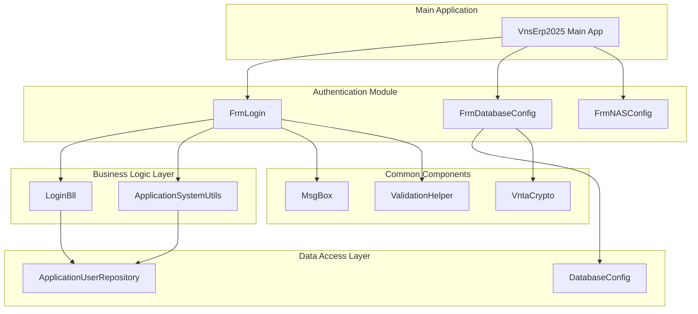
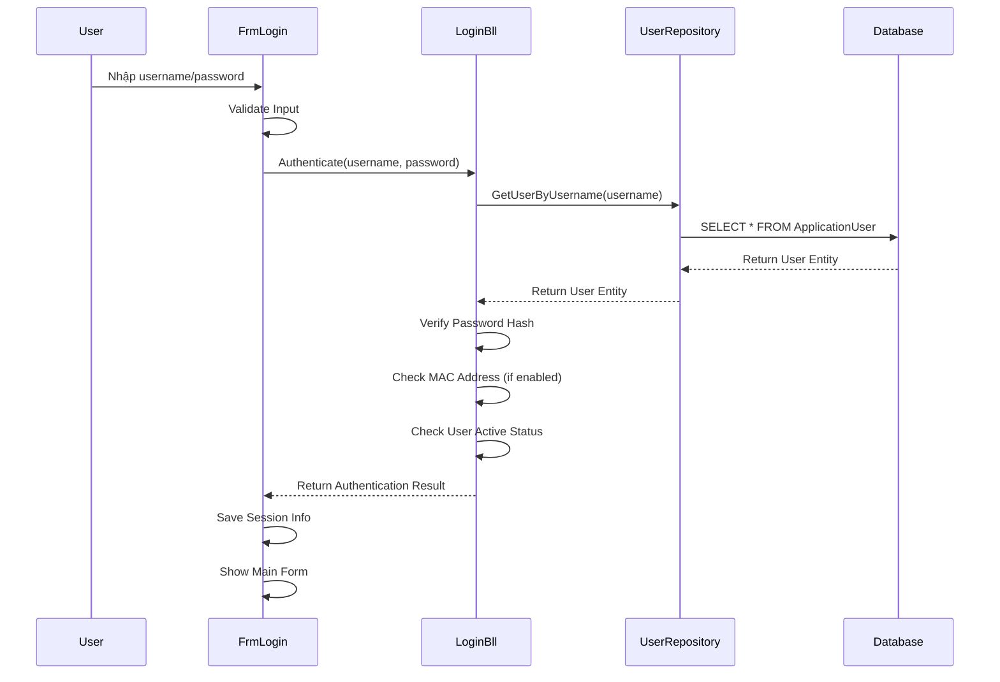
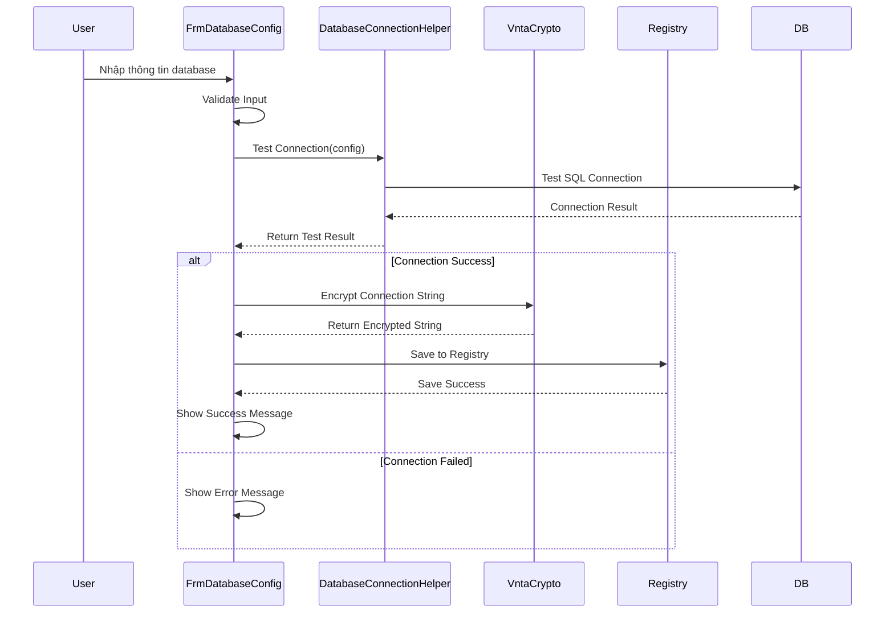

# Authentication - Authentication Module

## Tên Project & Mô Tả Ngắn

**Authentication** là **Authentication Module** (Module Xác Thực) của hệ thống VNS ERP 2025. Module này chịu trách nhiệm quản lý toàn bộ quy trình xác thực và cấu hình hệ thống, bao gồm:

- **User Authentication**: Đăng nhập/đăng xuất hệ thống
- **Database Configuration**: Cấu hình kết nối database
- **NAS Configuration**: Cấu hình lưu trữ trên NAS
- **Session Management**: Quản lý session người dùng
- **Security**: Bảo mật thông tin đăng nhập và cấu hình

Module này là một **Class Library (.dll)** chứa các Windows Forms được sử dụng bởi **Main Application (VnsErp2025)** để xử lý authentication và initial configuration.

---

## Giới Thiệu

### Mục Đích Của Authentication Module

Authentication Module được thiết kế để:

- **Secure Authentication**: Cung cấp hệ thống xác thực an toàn cho người dùng
- **Initial Configuration**: Cho phép cấu hình database và NAS khi khởi động lần đầu
- **Session Management**: Quản lý session và thông tin người dùng đã đăng nhập
- **User Experience**: Cung cấp trải nghiệm đăng nhập thân thiện với Remember Me
- **Security**: Bảo mật thông tin đăng nhập và cấu hình (mã hóa trong Registry)

### Vấn Đề Được Giải Quyết

- **First-Time Setup**: Hỗ trợ cấu hình database và NAS khi cài đặt lần đầu
- **Secure Login**: Xác thực người dùng an toàn với password hashing
- **Configuration Management**: Quản lý cấu hình database và NAS tập trung
- **User Convenience**: Remember Me để người dùng không cần nhập lại thông tin

### Phạm Vi Sử Dụng

- **Loại Project**: Class Library (.dll) với Windows Forms
- **Target Framework**: .NET Framework 4.8
- **UI Framework**: Windows Forms + DevExpress v25.2
- **Dependencies**: Bll, Common, Dal, DTO, Logger projects
- **Usage**: Được sử dụng bởi Main Application (VnsErp2025)

---

## Tính Năng Chính

### Authentication Forms

#### **1. FrmLogin (Form Đăng Nhập)**
- **Chức năng**:
  - Đăng nhập hệ thống với username và password
  - Remember Me để lưu thông tin đăng nhập
  - Validation tự động với DevExpress DXValidationProvider
  - Hiển thị thông báo lỗi thân thiện
  - Kiểm tra MAC address được phép (nếu có)
- **Tài liệu**:
  - [FrmLogin User Guide](./Form/FrmLogin_User_Guide.md)
  - [FrmLogin Developer Guide](./Form/FrmLogin_Developer_Guide.md)

#### **2. FrmDatabaseConfig (Form Cấu Hình Database)**
- **Chức năng**:
  - Cấu hình kết nối database (Server, Database, Authentication)
  - Test kết nối database
  - Lưu cấu hình vào Registry (mã hóa)
  - Hỗ trợ Windows Authentication và SQL Server Authentication
- **Tài liệu**:
  - [FrmDatabaseConfig User Guide](./Form/FrmDatabaseConfig_User_Guide.md)
  - [FrmDatabaseConfig Developer Guide](./Form/FrmDatabaseConfig_Developer_Guide.md)

#### **3. FrmNASConfig (Form Cấu Hình NAS)**
- **Chức năng**:
  - Cấu hình kết nối NAS storage
  - Test kết nối NAS
  - Lưu cấu hình NAS
  - Quản lý credentials cho NAS

### Authentication Features

- **Password Hashing**: Mật khẩu được hash trước khi lưu và so sánh
- **Session Management**: Quản lý session người dùng sau khi đăng nhập
- **MAC Address Control**: Kiểm tra MAC address được phép (nếu có)
- **Configuration Encryption**: Mã hóa thông tin cấu hình trong Registry
- **Remember Me**: Lưu thông tin đăng nhập (username) trong Settings

### Security Features

- **Secure Storage**: Thông tin cấu hình được mã hóa trong Registry
- **Password Security**: Password không được lưu plain text
- **Connection String Encryption**: Connection string được mã hóa
- **Access Control**: Kiểm tra quyền truy cập và MAC address

---

## Kiến Trúc Tổng Thể

### Mô Hình Kiến Trúc Authentication Module



### Luồng Đăng Nhập



### Luồng Cấu Hình Database



---

## Cài Đặt

### Yêu Cầu Hệ Thống

#### **Phần Mềm**
- **Visual Studio**: 2022 Enterprise hoặc Professional
- **.NET Framework**: 4.8 hoặc cao hơn
- **DevExpress**: v25.2 (cho UI components)

#### **Dependencies**
- **Bll Project**: Business logic cho authentication
- **Common Project**: Shared components và utilities
- **Dal Project**: Data access cho user management
- **DTO Project**: Data transfer objects
- **Logger Project**: Logging framework

### Các Bước Thiết Lập

#### **1. Restore NuGet Packages**
```bash
# Trong Visual Studio
Tools → NuGet Package Manager → Restore NuGet Packages
```

#### **2. Build Project**
```bash
# Trong Visual Studio
Build → Build Solution (Ctrl + Shift + B)
```

### Dependencies Configuration

#### **Project References**
```xml
<ProjectReference Include="..\Bll\Bll.csproj">
  <Project>{50f0876e-db49-4c11-9158-e3146ab3ad93}</Project>
  <Name>Bll</Name>
</ProjectReference>
<ProjectReference Include="..\Common\Common.csproj">
  <Project>{68e56ab6-1ada-40de-9edd-0be2b8f35c3a}</Project>
  <Name>Common</Name>
</ProjectReference>
<ProjectReference Include="..\Dal\Dal.csproj">
  <Project>{2A5A6A1E-6435-45E2-8F3D-62D70CB8FA76}</Project>
  <Name>Dal</Name>
</ProjectReference>
<ProjectReference Include="..\DTO\DTO.csproj">
  <Project>{77B6B4B6-D129-4A78-BD8D-9FCA5F9B4A1C}</Project>
  <Name>DTO</Name>
</ProjectReference>
<ProjectReference Include="..\Logger\Logger.csproj">
  <Project>{12f9fb39-92bf-45d5-bbb2-5353e33700f0}</Project>
  <Name>Logger</Name>
</ProjectReference>
```

---

## Chạy Dự Án

### Mở Project trong Visual Studio

1. **Mở Solution**: Mở `VnsErp2025.sln`
2. **Locate Authentication Project**: Tìm project `Authentication` trong Solution Explorer
3. **Set as Startup Project**: (Không cần, vì đây là Class Library)

### Build Project

#### **Build Authentication Project**
- **Phím tắt**: Click phải vào project → `Build`
- **Menu**: `Build → Build Authentication`
- **Command Line**: `msbuild Authentication\Authentication.csproj`

### Test Forms

#### **Test FrmLogin**
```csharp
// Trong Main Application hoặc Test Project
var loginForm = new Authentication.Form.FrmLogin();
loginForm.ShowDialog();
```

#### **Test FrmDatabaseConfig**
```csharp
var dbConfigForm = new Authentication.Form.FrmDatabaseConfig();
dbConfigForm.ShowDialog();
```

---

## Cấu Hình Môi Trường

### App.config

File `App.config` trong project Authentication có thể chứa:

```xml
<?xml version="1.0" encoding="utf-8"?>
<configuration>
  <appSettings>
    <!-- Authentication Configuration -->
    <add key="Authentication.EnableRememberMe" value="true" />
    <add key="Authentication.EnableMacAddressCheck" value="false" />
    <add key="Authentication.SessionTimeout" value="30" />
    
    <!-- Database Configuration (Optional - thường lưu trong Registry) -->
    <add key="Database.ServerName" value="localhost" />
    <add key="Database.DatabaseName" value="VnsErp2025Final" />
    <add key="Database.UseIntegratedSecurity" value="true" />
  </appSettings>
</configuration>
```

### Registry Storage

#### **Connection String Storage**
- **Registry Path**: `HKEY_CURRENT_USER\Software\Software\VietNhatSolutions\VnsErp2025`
- **Encryption**: Sử dụng VntaCrypto để mã hóa
- **Storage**: Connection string được mã hóa và lưu trong Registry

#### **Remember Me Storage**
- **Storage**: Properties.Settings (Application-scoped)
- **Data**: Username (không lưu password)

### Phân Biệt Cấu Hình Theo Môi Trường

#### **Development**
- Enable Remember Me
- Disable MAC address check
- Enable detailed error messages

#### **Test**
- Enable Remember Me
- Enable MAC address check (nếu cần)
- Standard error messages

#### **Production**
- Enable Remember Me
- Enable MAC address check
- Generic error messages (security)

---

## Cấu Trúc Thư Mục

### Tổng Quan Cấu Trúc

```
Authentication/
├── Form/                                 # Windows Forms
│   ├── FrmLogin.cs                      # Login form
│   ├── FrmLogin.Designer.cs             # Login form designer
│   ├── FrmLogin.resx                    # Login form resources
│   ├── FrmLogin_User_Guide.md           # Login user guide
│   ├── FrmLogin_Developer_Guide.md      # Login developer guide
│   │
│   ├── FrmDatabaseConfig.cs             # Database config form
│   ├── FrmDatabaseConfig.Designer.cs    # Database config designer
│   ├── FrmDatabaseConfig.resx           # Database config resources
│   ├── FrmDatabaseConfig_User_Guide.md  # Database config user guide
│   ├── FrmDatabaseConfig_Developer_Guide.md # Database config developer guide
│   │
│   ├── FrmNASConfig.cs                  # NAS config form
│   ├── FrmNASConfig.Designer.cs         # NAS config designer
│   └── FrmNASConfig.resx                # NAS config resources
│
├── Properties/                           # Project Properties
│   ├── AssemblyInfo.cs
│   ├── Resources.Designer.cs
│   ├── Resources.resx
│   ├── Settings.Designer.cs
│   ├── Settings.settings                # Application settings
│   └── DataSources/                     # Data sources
│
├── Resources/                            # Resource Files
│   ├── apply_16x16.png
│   ├── cancel_16x16.png
│   └── save_16x16.png
│
├── App.config                            # Application Configuration
├── Class1.cs                             # Placeholder class
├── XtraForm1.cs                          # Template form
└── Authentication.csproj                 # Project File
```

### Vai Trò Của Từng Thư Mục

#### **Form/**
- **Vai trò**: Windows Forms cho authentication và configuration
- **Trách nhiệm**:
  - FrmLogin: Xử lý đăng nhập người dùng
  - FrmDatabaseConfig: Cấu hình kết nối database
  - FrmNASConfig: Cấu hình kết nối NAS
  - Tài liệu user guide và developer guide cho từng form

#### **Properties/**
- **Vai trò**: Project properties và settings
- **Trách nhiệm**:
  - AssemblyInfo: Assembly information
  - Resources: Embedded resources
  - Settings: Application settings (Remember Me)

#### **Resources/**
- **Vai trò**: Image resources
- **Trách nhiệm**:
  - Icons và images cho forms

---

## Hướng Dẫn Sử Dụng

### Sử Dụng FrmLogin

#### **Trong Main Application**
```csharp
// File: VnsErp2025/Program.cs hoặc Main Form
using Authentication.Form;

public partial class Program
{
    [STAThread]
    static void Main()
    {
        Application.EnableVisualStyles();
        Application.SetCompatibleTextRenderingDefault(false);
        
        // Hiển thị form đăng nhập
        var loginForm = new FrmLogin();
        var result = loginForm.ShowDialog();
        
        if (result == DialogResult.OK)
        {
            // Đăng nhập thành công, hiển thị form chính
            var mainForm = new FrmMain();
            Application.Run(mainForm);
        }
        else
        {
            // Đăng nhập thất bại hoặc user cancel
            Application.Exit();
        }
    }
}
```

#### **Lấy Thông Tin User Đã Đăng Nhập**
```csharp
// Sau khi đăng nhập thành công
var currentUser = ApplicationSystemUtils.GetCurrentUser();
if (currentUser != null)
{
    var userName = currentUser.UserName;
    var userId = currentUser.Id;
    // Sử dụng thông tin user
}
```

### Sử Dụng FrmDatabaseConfig

#### **Hiển Thị Form Cấu Hình Database**
```csharp
// Khi cần cấu hình database (lần đầu hoặc thay đổi)
var dbConfigForm = new FrmDatabaseConfig();
var result = dbConfigForm.ShowDialog();

if (result == DialogResult.OK)
{
    // Cấu hình thành công
    MessageBox.Show("Cấu hình database thành công!");
    
    // Có thể restart application để áp dụng cấu hình mới
    Application.Restart();
}
```

#### **Kiểm Tra Cấu Hình Database**
```csharp
// Kiểm tra xem đã có cấu hình database chưa
var hasConfig = DatabaseConnectionHelper.HasConfiguration();

if (!hasConfig)
{
    // Hiển thị form cấu hình database
    var dbConfigForm = new FrmDatabaseConfig();
    dbConfigForm.ShowDialog();
}
```

### Sử Dụng FrmNASConfig

#### **Hiển Thị Form Cấu Hình NAS**
```csharp
// Khi cần cấu hình NAS storage
var nasConfigForm = new FrmNASConfig();
var result = nasConfigForm.ShowDialog();

if (result == DialogResult.OK)
{
    // Cấu hình NAS thành công
    MessageBox.Show("Cấu hình NAS thành công!");
}
```

### Authentication Flow trong Main Application

```csharp
// Flow đăng nhập trong Main Application
public partial class Program
{
    [STAThread]
    static void Main()
    {
        Application.EnableVisualStyles();
        Application.SetCompatibleTextRenderingDefault(false);
        
        // Bước 1: Kiểm tra cấu hình database
        if (!DatabaseConnectionHelper.HasConfiguration())
        {
            var dbConfigForm = new FrmDatabaseConfig();
            if (dbConfigForm.ShowDialog() != DialogResult.OK)
            {
                Application.Exit();
                return;
            }
        }
        
        // Bước 2: Đăng nhập
        var loginForm = new FrmLogin();
        if (loginForm.ShowDialog() != DialogResult.OK)
        {
            Application.Exit();
            return;
        }
        
        // Bước 3: Kiểm tra cấu hình NAS (nếu cần)
        if (!NASConfigHelper.HasConfiguration())
        {
            var nasConfigForm = new FrmNASConfig();
            nasConfigForm.ShowDialog(); // Optional
        }
        
        // Bước 4: Hiển thị form chính
        var mainForm = new FrmMain();
        Application.Run(mainForm);
    }
}
```

---

## Hướng Dẫn Đóng Góp Phát Triển

### Quy Ước Coding

#### **Naming Conventions**
- **Forms**: `Frm{Name}` (ví dụ: `FrmLogin`, `FrmDatabaseConfig`)
- **Methods**: PascalCase (ví dụ: `ValidateInput()`, `HandleLogin()`)
- **Event Handlers**: `{ControlName}_{EventName}` (ví dụ: `btnLogin_Click`)
- **Private Fields**: camelCase với prefix `_` (ví dụ: `_loginBll`, `_logger`)

#### **Code Organization**
```csharp
#region Fields & Properties
private readonly LoginBll _loginBll;
private readonly ILogger _logger;
#endregion

#region Constructors
public FrmLogin()
{
    InitializeComponent();
    InitializeServices();
    SetupValidation();
}
#endregion

#region Event Handlers
private void btnLogin_Click(object sender, EventArgs e)
{
    // Event handler code
}
#endregion

#region Private Methods
private void InitializeServices()
{
    // Initialization code
}
#endregion
```

#### **XML Documentation**
```csharp
/// <summary>
/// Xử lý sự kiện click nút đăng nhập
/// </summary>
/// <param name="sender">Sender object</param>
/// <param name="e">Event arguments</param>
private void btnLogin_Click(object sender, EventArgs e)
{
    // Implementation
}
```

### Quy Tắc Phân Tầng

#### **Được Phép**
- ✅ Gọi các service từ BLL layer
- ✅ Sử dụng DTO để truyền dữ liệu
- ✅ Sử dụng Common utilities (MsgBox, ValidationHelper)
- ✅ Sử dụng Logger để ghi log
- ✅ Validation ở mức UI (format, required fields)

#### **KHÔNG Được Phép**
- ❌ Chứa business logic (phải ở BLL layer)
- ❌ Truy cập database trực tiếp (phải qua DAL)
- ❌ Sử dụng Entity trực tiếp (phải dùng DTO)

### Cách Thêm Form Mới An Toàn

#### **Checklist**
1. ✅ Tạo form trong thư mục `Form/`
2. ✅ Sử dụng DevExpress XtraForm làm base class
3. ✅ Setup validation với DXValidationProvider (nếu cần)
4. ✅ Gọi BLL services thay vì DAL trực tiếp
5. ✅ Sử dụng DTO để truyền dữ liệu
6. ✅ Error handling và logging
7. ✅ Tạo User Guide và Developer Guide

### Quy Ước Branch và Commit

#### **Branch Strategy**
- **feature/**: Feature mới (ví dụ: `feature/add-two-factor-authentication`)
- **bugfix/**: Sửa lỗi (ví dụ: `bugfix/fix-login-validation`)
- **refactor/**: Refactor code (ví dụ: `refactor/improve-db-config-ui`)

#### **Commit Message Convention**
Format: `[Type]: [Short Description]`

**Types:**
- `feat`: Thêm form/feature mới
- `fix`: Sửa lỗi
- `refactor`: Refactor code
- `docs`: Cập nhật tài liệu

**Ví dụ:**
```
feat: Thêm FrmNASConfig để cấu hình NAS storage
fix: Sửa lỗi validation password trong FrmLogin
refactor: Tối ưu FrmDatabaseConfig để cải thiện UX
docs: Cập nhật FrmLogin_User_Guide với hướng dẫn Remember Me
```

---

## Best Practices

### Form Design Best Practices

#### **1. Validation Setup**
```csharp
// ✅ ĐÚNG: Setup validation trong constructor hoặc Load event
public FrmLogin()
{
    InitializeComponent();
    SetupValidation();
}

private void SetupValidation()
{
    // Setup validation rules
    dxValidationProvider1.SetValidationRule(txtUserName, userNameRule);
    dxValidationProvider1.SetValidationRule(txtPassword, passwordRule);
}

// ❌ SAI: Validation trong event handler
private void btnLogin_Click(object sender, EventArgs e)
{
    // Validation ở đây - không tốt
    if (string.IsNullOrEmpty(txtUserName.Text))
    {
        // ...
    }
}
```

#### **2. Error Handling**
```csharp
// ✅ ĐÚNG: Error handling đầy đủ
private void btnLogin_Click(object sender, EventArgs e)
{
    try
    {
        if (!dxValidationProvider1.Validate())
            return;
        
        var result = _loginBll.Authenticate(userName, password);
        if (result.Success)
        {
            DialogResult = DialogResult.OK;
            Close();
        }
        else
        {
            MsgBox.ShowError(result.ErrorMessage);
        }
    }
    catch (Exception ex)
    {
        _logger.Error("Lỗi khi đăng nhập", ex);
        MsgBox.ShowError("Có lỗi xảy ra khi đăng nhập. Vui lòng thử lại.");
    }
}
```

#### **3. Separation of Concerns**
```csharp
// ✅ ĐÚNG: Tách biệt UI logic và business logic
private void btnLogin_Click(object sender, EventArgs e)
{
    // UI logic: Validation, get input
    if (!ValidateInput())
        return;
    
    var userName = txtUserName.Text;
    var password = txtPassword.Text;
    
    // Business logic: Gọi BLL service
    var result = _loginBll.Authenticate(userName, password);
    
    // UI logic: Handle result
    HandleLoginResult(result);
}

// ❌ SAI: Trộn lẫn UI và business logic
private void btnLogin_Click(object sender, EventArgs e)
{
    // Business logic trực tiếp trong form
    var user = _userRepository.GetByUserName(txtUserName.Text);
    if (user != null && user.Password == txtPassword.Text) // ❌
    {
        // ...
    }
}
```

### Security Best Practices

#### **1. Password Handling**
```csharp
// ✅ ĐÚNG: Không lưu password, chỉ hash
// Password được hash trong BLL layer
var result = _loginBll.Authenticate(userName, password);

// ❌ SAI: Lưu password plain text
Properties.Settings.Default.Password = password; // ❌ KHÔNG BAO GIỜ làm vậy
```

#### **2. Configuration Encryption**
```csharp
// ✅ ĐÚNG: Mã hóa connection string trước khi lưu
var encrypted = VntaCrypto.Encrypt(connectionString, key);
Registry.SetValue(registryPath, "ConnectionString", encrypted);

// ❌ SAI: Lưu connection string plain text
Registry.SetValue(registryPath, "ConnectionString", connectionString); // ❌
```

#### **3. Remember Me**
```csharp
// ✅ ĐÚNG: Chỉ lưu username, không lưu password
if (chkRememberMe.Checked)
{
    Properties.Settings.Default.UserName = txtUserName.Text;
    Properties.Settings.Default.Save();
}

// ❌ SAI: Lưu password
Properties.Settings.Default.Password = txtPassword.Text; // ❌
```

---

## Tài Liệu Liên Quan

- **[FrmLogin User Guide](./Form/FrmLogin_User_Guide.md)**: Hướng dẫn sử dụng form đăng nhập
- **[FrmLogin Developer Guide](./Form/FrmLogin_Developer_Guide.md)**: Hướng dẫn phát triển form đăng nhập
- **[FrmDatabaseConfig User Guide](./Form/FrmDatabaseConfig_User_Guide.md)**: Hướng dẫn sử dụng form cấu hình database
- **[FrmDatabaseConfig Developer Guide](./Form/FrmDatabaseConfig_Developer_Guide.md)**: Hướng dẫn phát triển form cấu hình database
- **[Root README](../README.md)**: Tài liệu tổng quan hệ thống
- **[BLL README](../Bll/README.md)**: Tài liệu Business Logic Layer

---

## Liên Hệ & Hỗ Trợ

- **Development Team**: [Thông tin liên hệ]
- **Technical Lead**: [Thông tin liên hệ]

---

**Phiên bản tài liệu**: 1.0  
**Ngày cập nhật**: 27/01/2025  
**Trạng thái**: Đang phát triển

---

*Tài liệu này được tạo và duy trì bởi Development Team. Vui lòng cập nhật tài liệu khi có thay đổi quan trọng trong Authentication module.*
