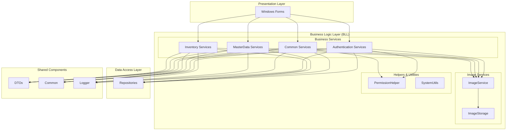
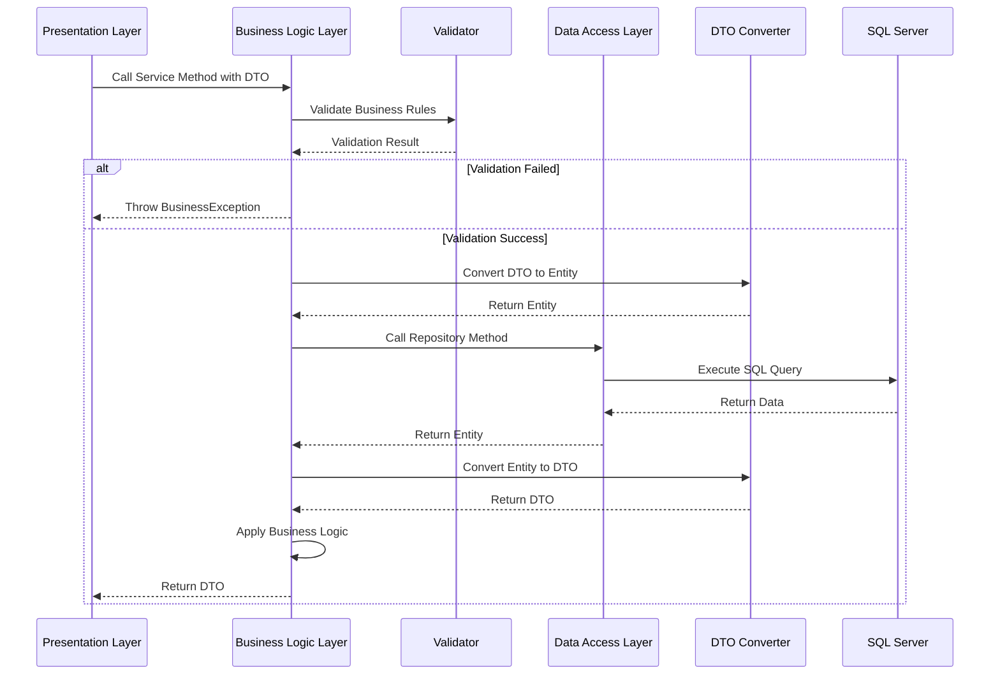
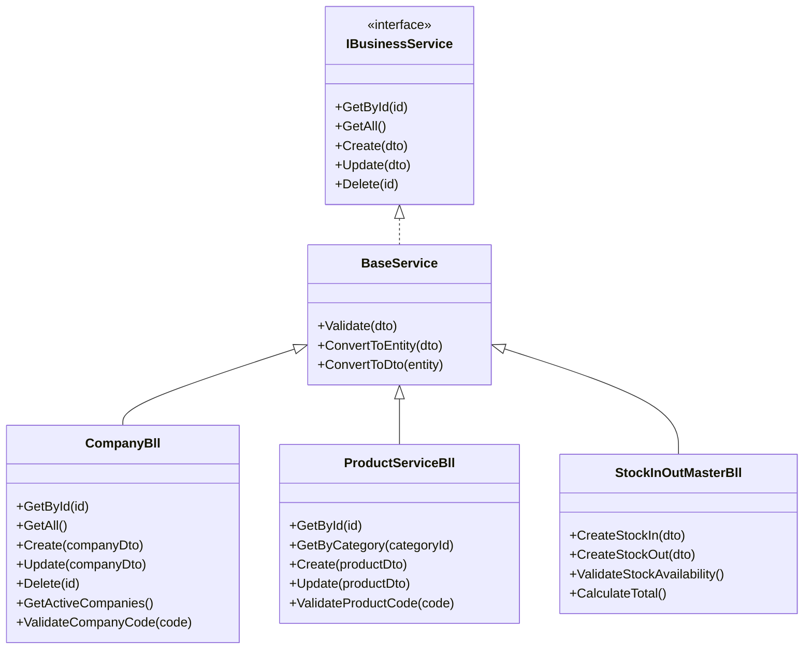
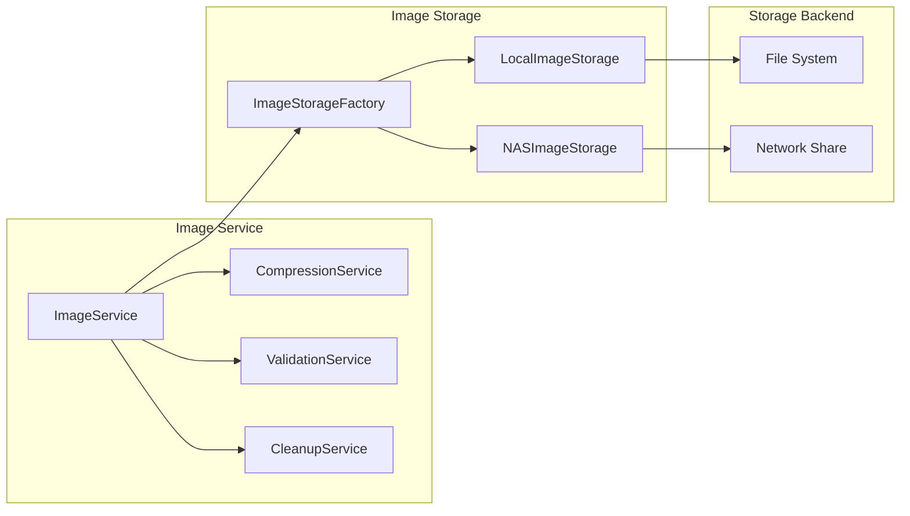

# Bll - Business Logic Layer

## Tên Project & Mô Tả Ngắn

**Bll** là **Business Logic Layer** (Lớp Logic Nghiệp Vụ) của hệ thống VNS ERP 2025. Project này chịu trách nhiệm xử lý tất cả logic nghiệp vụ và quy tắc kinh doanh của hệ thống, bao gồm:

- **Business Logic**: Xử lý các quy tắc nghiệp vụ phức tạp
- **Validation**: Validation dữ liệu ở tầng business logic
- **Workflow Management**: Quản lý các quy trình nghiệp vụ
- **Data Transformation**: Chuyển đổi giữa Entity (từ DAL) và DTO (cho UI)
- **Service Layer**: Cung cấp các service cho Presentation Layer

Project này là một **Class Library (.dll)** được sử dụng bởi **Presentation Layer (UI)** để xử lý logic nghiệp vụ và gọi **Data Access Layer (DAL)** để truy cập dữ liệu.

---

## Giới Thiệu

### Mục Đích Của BLL Layer

BLL Layer được thiết kế để:

- **Tách biệt Business Logic**: Tách biệt hoàn toàn logic nghiệp vụ khỏi Presentation Layer và Data Access Layer
- **Centralize Business Rules**: Tập trung hóa tất cả business rules tại một nơi
- **Reusability**: Tái sử dụng logic nghiệp vụ cho nhiều UI components
- **Testability**: Dễ dàng test business logic độc lập với UI và database
- **Maintainability**: Dễ dàng bảo trì và cập nhật business rules

### Vấn Đề Được Giải Quyết

- **Business Rules Scattered**: Tập trung hóa tất cả business rules vào BLL layer
- **Code Duplication**: Tái sử dụng logic nghiệp vụ thông qua service pattern
- **Tight Coupling**: Giảm coupling giữa UI và DAL thông qua BLL layer
- **Validation Inconsistency**: Đảm bảo validation nhất quán ở tầng business logic

### Phạm Vi Sử Dụng

- **Loại Project**: Class Library (.dll)
- **Target Framework**: .NET Framework 4.8
- **Dependencies**: Common, Dal, DTO, Logger projects
- **External Libraries**: DevExpress v25.2 (một số utilities)

---

## Tính Năng Chính

### Business Services theo Module

#### **1. Authentication Services**
- `LoginBll`: Xử lý logic đăng nhập, xác thực người dùng

#### **2. Common Services**

**User & Permission Management:**
- `ApplicationUserBll`: Quản lý người dùng hệ thống
- `ApplicationVersionBll`: Quản lý phiên bản ứng dụng
- `PermissionBll`: Quản lý quyền truy cập
- `PermissionHelper`: Helper cho phân quyền
- `AllowedMacAddressBll`: Quản lý MAC address được phép

**System Services:**
- `SettingBll`: Quản lý cài đặt hệ thống
- `ApplicationSecurityService`: Dịch vụ bảo mật ứng dụng
- `ApplicationSystemUtils`: Utilities hệ thống

**Image Services:**
- `ImageService`: Xử lý hình ảnh (compression, validation, cleanup)
  - `ImageCompressionService`: Nén hình ảnh
  - `ImageValidationService`: Validation hình ảnh
  - `ImageCleanupService`: Dọn dẹp hình ảnh
- `ImageStorage`: Lưu trữ hình ảnh (Local, NAS)
  - `LocalImageStorageService`: Lưu trữ local
  - `NASImageStorageService`: Lưu trữ trên NAS
  - `ImageStorageFactory`: Factory pattern cho image storage

#### **3. MasterData Services**

**Company Management:**
- `CompanyBll`: Quản lý công ty
- `CompanyBranchBll`: Quản lý chi nhánh
- `DepartmentBll`: Quản lý phòng ban
- `PositionBll`: Quản lý chức vụ
- `EmployeeBll`: Quản lý nhân viên

**Business Partner:**
- `BusinessPartnerBll`: Quản lý đối tác kinh doanh
- `BusinessPartnerCategoryBll`: Quản lý danh mục đối tác
- `BusinessPartnerContactBll`: Quản lý liên hệ đối tác
- `BusinessPartnerSiteBll`: Quản lý địa điểm đối tác

**Product & Service:**
- `ProductServiceBll`: Quản lý sản phẩm/dịch vụ
- `ProductServiceCategoryBll`: Quản lý danh mục sản phẩm
- `ProductVariantBll`: Quản lý biến thể sản phẩm
- `ProductImageBll`: Quản lý hình ảnh sản phẩm
- `AttributeBll`: Quản lý thuộc tính
- `UnitOfMeasureBll`: Quản lý đơn vị tính

#### **4. Inventory Services**

**Stock In/Out Management:**
- `StockInOutMasterBll`: Quản lý phiếu nhập/xuất (Master)
- `StockInOutDetailBll`: Quản lý chi tiết nhập/xuất
- `StockInOutDocumentBll`: Quản lý tài liệu nhập/xuất
- `StockInOutImageBll`: Quản lý hình ảnh nhập/xuất
- `StockInOutReportBll`: Báo cáo nhập/xuất
- `StockInOutBll`: Service tổng hợp nhập/xuất

**Inventory Management:**
- `InventoryBalanceBll`: Quản lý tồn kho
- `AssetBll`: Quản lý tài sản
- `DeviceBll`: Quản lý thiết bị
- `DeviceImageBll`: Quản lý hình ảnh thiết bị
- `DeviceTransactionHistoryBll`: Lịch sử giao dịch thiết bị
- `WarrantyBll`: Quản lý bảo hành
- `ProductVariantIdentifierBll`: Quản lý định danh biến thể
- `ProductVariantIdentifierHistoryBll`: Lịch sử định danh

**Stocktaking:**
- `StocktakingMasterBll`: Quản lý phiếu kiểm kê (Master)
- `StocktakingDetailBll`: Quản lý chi tiết kiểm kê
- `StocktakingAdjustmentBll`: Quản lý điều chỉnh kiểm kê
- `StocktakingImageBll`: Quản lý hình ảnh kiểm kê

### Business Rules & Validation

- **Business Rules**: Các quy tắc nghiệp vụ được implement trong các BLL classes
- **Validation**: Validation dữ liệu ở tầng business logic
- **Workflow Management**: Quản lý các quy trình nghiệp vụ phức tạp
- **Transaction Management**: Quản lý transaction cho các thao tác phức tạp

### Image Processing Services

- **Image Compression**: Nén hình ảnh để tối ưu storage
- **Image Validation**: Kiểm tra định dạng và kích thước hình ảnh
- **Image Cleanup**: Dọn dẹp hình ảnh không sử dụng
- **Multi-Storage Support**: Hỗ trợ lưu trữ Local và NAS

---

## Kiến Trúc Tổng Thể

### Mô Hình Kiến Trúc BLL



### Luồng Xử Lý Business Logic



### Cấu Trúc Service Pattern



### Image Service Architecture



---

## Cài Đặt

### Yêu Cầu Hệ Thống

#### **Phần Mềm**
- **Visual Studio**: 2022 Enterprise hoặc Professional
- **.NET Framework**: 4.8 hoặc cao hơn
- **DevExpress**: v25.2 (cho một số utilities)

#### **Dependencies**
- **Common Project**: Shared common components
- **Dal Project**: Data Access Layer
- **DTO Project**: Data Transfer Objects
- **Logger Project**: Logging framework

### Các Bước Thiết Lập

#### **1. Restore NuGet Packages**
```bash
# Trong Visual Studio
Tools → NuGet Package Manager → Restore NuGet Packages
```

#### **2. Cấu Hình App.config**
- Xem file `App.config` trong project Bll
- Cấu hình image storage settings (nếu cần)

#### **3. Build Project**
```bash
# Trong Visual Studio
Build → Build Solution (Ctrl + Shift + B)
```

### Dependencies Configuration

#### **Project References**
```xml
<ProjectReference Include="..\Common\Common.csproj">
  <Project>{68E56AB6-1ADA-40DE-9EDD-0BE2B8F35C3A}</Project>
  <Name>Common</Name>
</ProjectReference>
<ProjectReference Include="..\Dal\Dal.csproj">
  <Project>{2a5a6a1e-6435-45e2-8f3d-62d70cb8fa76}</Project>
  <Name>Dal</Name>
</ProjectReference>
<ProjectReference Include="..\DTO\DTO.csproj">
  <Project>{77B6B4B6-D129-4A78-BD8D-9FCA5F9B4A1C}</Project>
  <Name>DTO</Name>
</ProjectReference>
<ProjectReference Include="..\Logger\Logger.csproj">
  <Project>{12f9fb39-92bf-45d5-bbb2-5353e33700f0}</Project>
  <Name>Logger</Name>
</ProjectReference>
```

#### **System References**
```xml
<Reference Include="System" />
<Reference Include="System.ComponentModel.DataAnnotations" />
<Reference Include="System.Configuration" />
<Reference Include="System.Data" />
<Reference Include="System.Data.Linq" />
<Reference Include="System.Windows.Forms" />
```

---

## Chạy Dự Án

### Mở Project trong Visual Studio

1. **Mở Solution**: Mở `VnsErp2025.sln`
2. **Locate Bll Project**: Tìm project `Bll` trong Solution Explorer
3. **Set as Startup Project**: (Không cần, vì đây là Class Library)

### Build Project

#### **Build Bll Project**
- **Phím tắt**: Click phải vào project → `Build`
- **Menu**: `Build → Build Bll`
- **Command Line**: `msbuild Bll\Bll.csproj`

#### **Rebuild Project**
- Click phải vào project → `Rebuild`
- Hoặc `Build → Rebuild Bll`

### Test Business Logic

#### **Unit Testing (Nếu có)**
```csharp
// Ví dụ test service
[TestMethod]
public void Test_CreateCompany_ValidData()
{
    var service = new CompanyBll();
    var dto = new CompanyDto { CompanyCode = "COMP001", CompanyName = "Test Company" };
    var result = service.Create(dto);
    Assert.IsNotNull(result);
}
```

---

## Cấu Hình Môi Trường

### App.config

File `App.config` trong project Bll có thể chứa:

```xml
<?xml version="1.0" encoding="utf-8"?>
<configuration>
  <appSettings>
    <!-- Image Storage Configuration -->
    <add key="ImageStorage.StorageType" value="NAS" />
    <add key="ImageStorage.NAS.ServerName" value="\\192.168.1.100" />
    <add key="ImageStorage.NAS.ShareName" value="ERP_Images" />
    
    <!-- Image Processing Configuration -->
    <add key="ImageService.MaxFileSize" value="10485760" />
    <add key="ImageService.AllowedFormats" value="jpg,jpeg,png,gif" />
    <add key="ImageService.CompressionQuality" value="80" />
  </appSettings>
</configuration>
```

### Image Storage Configuration

#### **Local Storage**
```xml
<add key="ImageStorage.StorageType" value="Local" />
<add key="ImageStorage.Local.BasePath" value="C:\ERP_Images" />
```

#### **NAS Storage**
```xml
<add key="ImageStorage.StorageType" value="NAS" />
<add key="ImageStorage.NAS.ServerName" value="\\192.168.1.100" />
<add key="ImageStorage.NAS.ShareName" value="ERP_Images" />
<add key="ImageStorage.NAS.Username" value="erp_user" />
<add key="ImageStorage.NAS.Password" value="" />
```

### Phân Biệt Cấu Hình Theo Môi Trường

#### **Development**
- Enable detailed logging
- Use local storage for images
- Enable validation warnings

#### **Test**
- Enable logging
- Use test NAS storage
- Enable validation

#### **Production**
- Disable detailed logging
- Use production NAS storage
- Strict validation

---

## Cấu Trúc Thư Mục

### Tổng Quan Cấu Trúc

```
Bll/
├── Authentication/                      # Authentication Services
│   └── LoginBll.cs                      # Login business logic
│
├── Common/                              # Common Services
│   ├── ApplicationUserBll.cs            # User management
│   ├── ApplicationVersionBll.cs         # Version management
│   ├── PermissionBll.cs                 # Permission management
│   ├── PermissionHelper.cs              # Permission helper
│   ├── AllowedMacAddressBll.cs          # MAC address management
│   ├── SettingBll.cs                     # System settings
│   ├── ApplicationSecurityService.cs    # Security service
│   ├── ApplicationSystemUtils.cs       # System utilities
│   │
│   ├── ImageService/                    # Image Processing Services
│   │   ├── ImageCompressionService.cs   # Image compression
│   │   ├── ImageValidationService.cs    # Image validation
│   │   ├── ImageCleanupService.cs       # Image cleanup
│   │   ├── ImageServiceConfiguration.cs # Image service config
│   │   └── README.md                    # Image service docs
│   │
│   └── ImageStorage/                    # Image Storage Services
│       ├── IImageStorageService.cs     # Storage interface
│       ├── IFileStorageService.cs       # File storage interface
│       ├── LocalImageStorageService.cs  # Local storage
│       ├── NASImageStorageService.cs    # NAS storage
│       ├── ImageStorageFactory.cs       # Storage factory
│       ├── ImageStorageConfiguration.cs # Storage config
│       ├── ImageCategory.cs             # Image categories
│       ├── FileCategory.cs              # File categories
│       └── README.md                    # Storage docs
│
├── MasterData/                          # Master Data Services
│   ├── CompanyBll/                      # Company Management
│   │   ├── CompanyBll.cs                 # Company service
│   │   ├── CompanyBranchBll.cs        # Branch service
│   │   ├── DepartmentBll.cs             # Department service
│   │   ├── PositionBll.cs               # Position service
│   │   └── EmployeeBll.cs               # Employee service
│   │
│   ├── CustomerBll/                     # Customer Management
│   │   ├── BusinessPartnerBll.cs        # Business partner service
│   │   ├── BusinessPartnerCategoryBll.cs # Category service
│   │   ├── BusinessPartnerContactBll.cs # Contact service
│   │   └── BusinessPartnerSiteBll.cs    # Site service
│   │
│   └── ProductServiceBll/               # Product & Service Management
│       ├── ProductServiceBll.cs         # Product service
│       ├── ProductServiceCategoryBll.cs  # Category service
│       ├── ProductVariantBll.cs         # Variant service
│       ├── ProductImageBll.cs           # Image service
│       ├── AttributeBll.cs             # Attribute service
│       └── UnitOfMeasureBll.cs         # Unit of measure service
│
├── Inventory/                           # Inventory Services
│   ├── InventoryManagement/            # Inventory Management
│   │   ├── InventoryBalanceBll.cs      # Inventory balance
│   │   ├── StockInOutMasterBll.cs       # Stock in/out master
│   │   ├── StockInOutDetailBll.cs       # Stock in/out detail
│   │   ├── StockInOutDocumentBll.cs     # Stock in/out document
│   │   ├── StockInOutImageBll.cs        # Stock in/out image
│   │   ├── StockInOutReportBll.cs       # Stock in/out report
│   │   ├── AssetBll.cs                  # Asset management
│   │   ├── DeviceBll.cs                 # Device management
│   │   ├── DeviceImageBll.cs            # Device image
│   │   ├── DeviceTransactionHistoryBll.cs # Device history
│   │   ├── WarrantyBll.cs               # Warranty management
│   │   ├── ProductVariantIdentifierBll.cs # Variant identifier
│   │   └── ProductVariantIdentifierHistoryBll.cs # Identifier history
│   │
│   ├── StockInOut/                     # Stock In/Out Services
│   │   └── StockInOutBll.cs            # Stock in/out service
│   │
│   └── StockTakking/                   # Stocktaking Services
│       ├── StocktakingMasterBll.cs     # Stocktaking master
│       ├── StocktakingDetailBll.cs      # Stocktaking detail
│       ├── StocktakingAdjustmentBll.cs  # Stocktaking adjustment
│       └── StocktakingImageBll.cs       # Stocktaking image
│
├── Doc/                                 # Documentation
│   ├── BllFolderStructure.md           # Folder structure docs
│   └── Promt/                           # Prompt files
│
├── Properties/                          # Project Properties
│   ├── AssemblyInfo.cs
│   └── Resources.resx                  # Resources
│
├── Resources/                           # Resource Files
│   └── [SVG and image files]
│
├── App.config                           # Application Configuration
└── Bll.csproj                           # Project File
```

### Vai Trò Của Từng Thư Mục

#### **Authentication/**
- **Vai trò**: Xử lý logic đăng nhập và xác thực
- **Trách nhiệm**:
  - Xác thực người dùng
  - Quản lý session
  - Kiểm tra quyền truy cập

#### **Common/**
- **Vai trò**: Các service dùng chung cho toàn hệ thống
- **Trách nhiệm**:
  - Quản lý người dùng và phân quyền
  - Quản lý cài đặt hệ thống
  - Xử lý hình ảnh (compression, validation, storage)
  - Utilities hệ thống

#### **MasterData/**
- **Vai trò**: Business logic cho dữ liệu master
- **Trách nhiệm**:
  - Quản lý công ty, chi nhánh, phòng ban
  - Quản lý đối tác kinh doanh
  - Quản lý sản phẩm/dịch vụ
  - Validation và business rules cho master data

#### **Inventory/**
- **Vai trò**: Business logic cho quản lý kho
- **Trách nhiệm**:
  - Quản lý nhập/xuất kho
  - Quản lý tồn kho
  - Quản lý tài sản và thiết bị
  - Quản lý kiểm kê
  - Validation và business rules cho inventory

---

## Hướng Dẫn Sử Dụng

### Tạo BLL Service Mới

#### **Bước 1: Tạo BLL Class**
```csharp
// File: MasterData/NewEntityBll/NewEntityBll.cs
namespace Bll.MasterData.NewEntityBll
{
    public class NewEntityBll
    {
        private readonly INewEntityRepository _repository;
        private readonly ILogger _logger;
        
        public NewEntityBll(INewEntityRepository repository, ILogger logger)
        {
            _repository = repository;
            _logger = logger;
        }
        
        public NewEntityDto GetById(int id)
        {
            try
            {
                var entity = _repository.GetById(id);
                if (entity == null)
                {
                    throw new BusinessException($"Không tìm thấy entity với ID: {id}");
                }
                
                return NewEntityDtoConverter.ToDto(entity);
            }
            catch (Exception ex)
            {
                _logger.LogError(ex, $"Lỗi khi lấy entity với ID: {id}");
                throw;
            }
        }
        
        public List<NewEntityDto> GetAll()
        {
            try
            {
                var entities = _repository.GetAll();
                return entities.Select(e => NewEntityDtoConverter.ToDto(e)).ToList();
            }
            catch (Exception ex)
            {
                _logger.LogError(ex, "Lỗi khi lấy danh sách entity");
                throw;
            }
        }
        
        public NewEntityDto Create(NewEntityDto dto)
        {
            // Validation
            ValidateDto(dto);
            
            try
            {
                var entity = NewEntityDtoConverter.ToEntity(dto);
                _repository.Add(entity);
                
                return NewEntityDtoConverter.ToDto(entity);
            }
            catch (Exception ex)
            {
                _logger.LogError(ex, "Lỗi khi tạo entity mới");
                throw;
            }
        }
        
        private void ValidateDto(NewEntityDto dto)
        {
            if (string.IsNullOrEmpty(dto.Name))
            {
                throw new ValidationException("Tên entity không được để trống");
            }
            
            // Thêm các validation khác
        }
    }
}
```

### Sử Dụng BLL Service

#### **Trong Presentation Layer**
```csharp
// Trong Windows Form
public partial class FrmNewEntity : XtraForm
{
    private readonly NewEntityBll _service;
    
    public FrmNewEntity()
    {
        InitializeComponent();
        _service = new NewEntityBll(
            new NewEntityRepository(new DataContextFactory()),
            new Logger()
        );
    }
    
    private void btnLoad_Click(object sender, EventArgs e)
    {
        try
        {
            var entities = _service.GetAll();
            gridControl.DataSource = entities;
        }
        catch (BusinessException ex)
        {
            MessageBox.Show(ex.Message, "Lỗi nghiệp vụ", MessageBoxButtons.OK, MessageBoxIcon.Error);
        }
        catch (Exception ex)
        {
            MessageBox.Show("Có lỗi xảy ra", "Lỗi", MessageBoxButtons.OK, MessageBoxIcon.Error);
        }
    }
}
```

### Sử Dụng Image Service

```csharp
// Sử dụng ImageService để xử lý hình ảnh
var imageService = new ImageService();
var imageStorage = ImageStorageFactory.Create(ImageStorageType.NAS);

// Validate image
var validationResult = imageService.ValidateImage(imagePath);
if (!validationResult.IsValid)
{
    throw new ValidationException(validationResult.ErrorMessage);
}

// Compress image
var compressedImage = imageService.CompressImage(imagePath, quality: 80);

// Save image
var storageResult = imageStorage.SaveImage(compressedImage, ImageCategory.Product);
if (!storageResult.Success)
{
    throw new BusinessException($"Lỗi khi lưu hình ảnh: {storageResult.ErrorMessage}");
}
```

### Sử Dụng Permission Helper

```csharp
// Kiểm tra quyền truy cập
if (!PermissionHelper.HasPermission(currentUser, "Company", "Create"))
{
    throw new UnauthorizedException("Bạn không có quyền tạo công ty");
}

// Kiểm tra quyền với entity cụ thể
if (!PermissionHelper.HasEntityPermission(currentUser, companyId, "Company", "Update"))
{
    throw new UnauthorizedException("Bạn không có quyền cập nhật công ty này");
}
```

---

## Hướng Dẫn Đóng Góp Phát Triển

### Quy Ước Coding

#### **Naming Conventions**
- **BLL Classes**: `{EntityName}Bll` (ví dụ: `CompanyBll`, `ProductServiceBll`)
- **Methods**: PascalCase (ví dụ: `GetById`, `Create`, `Update`, `Delete`)
- **Private Fields**: camelCase với prefix `_` (ví dụ: `_repository`, `_logger`)

#### **Code Organization**
```csharp
#region Fields & Properties
private readonly INewEntityRepository _repository;
private readonly ILogger _logger;
#endregion

#region Constructors
public NewEntityBll(INewEntityRepository repository, ILogger logger)
{
    _repository = repository;
    _logger = logger;
}
#endregion

#region Public Methods
// Public methods here
#endregion

#region Private Methods
// Private methods here
#endregion
```

#### **XML Documentation**
```csharp
/// <summary>
/// Lấy entity theo ID
/// </summary>
/// <param name="id">ID của entity</param>
/// <returns>DTO của entity, null nếu không tìm thấy</returns>
/// <exception cref="BusinessException">Nếu có lỗi nghiệp vụ</exception>
public NewEntityDto GetById(int id)
{
    // Implementation
}
```

### Quy Tắc Phân Tầng

#### **Được Phép**
- ✅ Gọi các Repository từ DAL layer
- ✅ Sử dụng DTO để truyền dữ liệu
- ✅ Xử lý business logic và business rules
- ✅ Validation dữ liệu nghiệp vụ
- ✅ Chuyển đổi giữa Entity và DTO
- ✅ Sử dụng Common utilities và Logger

#### **KHÔNG Được Phép**
- ❌ Truy cập database trực tiếp (phải qua DAL)
- ❌ Chứa UI logic
- ❌ Sử dụng Windows Forms controls trực tiếp
- ❌ Trả về Entity trực tiếp (phải convert sang DTO)

### Cách Thêm BLL Service Mới An Toàn

#### **Checklist**
1. ✅ Tạo BLL class trong thư mục module tương ứng
2. ✅ Inject dependencies (Repository, Logger)
3. ✅ Implement các method cơ bản (GetById, GetAll, Create, Update, Delete)
4. ✅ Thêm validation logic
5. ✅ Thêm business rules
6. ✅ Convert giữa Entity và DTO
7. ✅ Error handling và logging
8. ✅ Test business logic

### Quy Ước Branch và Commit

#### **Branch Strategy**
- **feature/**: Feature mới (ví dụ: `feature/add-product-service-bll`)
- **bugfix/**: Sửa lỗi (ví dụ: `bugfix/fix-inventory-calculation`)
- **refactor/**: Refactor code (ví dụ: `refactor/optimize-image-service`)

#### **Commit Message Convention**
Format: `[Type]: [Short Description]`

**Types:**
- `feat`: Thêm BLL service/feature mới
- `fix`: Sửa lỗi business logic
- `refactor`: Refactor code
- `docs`: Cập nhật tài liệu

**Ví dụ:**
```
feat: Thêm ProductVariantIdentifierBll và business logic liên quan
fix: Sửa lỗi tính toán tồn kho khi nhập/xuất
refactor: Tối ưu ImageService để giảm memory usage
docs: Cập nhật README với hướng dẫn sử dụng ImageService
```

---

## Best Practices

### Business Logic Best Practices

#### **1. Separation of Concerns**
```csharp
// ✅ ĐÚNG: Tách biệt validation, business logic, và data access
public CompanyDto Create(CompanyDto dto)
{
    // Validation
    ValidateDto(dto);
    
    // Business rules
    CheckBusinessRules(dto);
    
    // Data access
    var entity = _repository.Add(ConvertToEntity(dto));
    
    // Return DTO
    return ConvertToDto(entity);
}

// ❌ SAI: Trộn lẫn tất cả trong một method
public CompanyDto Create(CompanyDto dto)
{
    // Validation, business rules, data access all mixed together
}
```

#### **2. Error Handling**
```csharp
// ✅ ĐÚNG: Sử dụng custom exceptions và logging
public CompanyDto GetById(int id)
{
    try
    {
        var entity = _repository.GetById(id);
        if (entity == null)
        {
            throw new BusinessException($"Không tìm thấy công ty với ID: {id}");
        }
        return ConvertToDto(entity);
    }
    catch (DataAccessException ex)
    {
        _logger.LogError(ex, $"Lỗi truy cập dữ liệu khi lấy công ty ID: {id}");
        throw new BusinessException("Lỗi khi truy cập dữ liệu", ex);
    }
    catch (Exception ex)
    {
        _logger.LogError(ex, $"Lỗi không xác định khi lấy công ty ID: {id}");
        throw;
    }
}
```

#### **3. Validation**
```csharp
// ✅ ĐÚNG: Validation ở tầng BLL
private void ValidateDto(CompanyDto dto)
{
    if (string.IsNullOrEmpty(dto.CompanyCode))
    {
        throw new ValidationException("Mã công ty không được để trống");
    }
    
    if (dto.CompanyCode.Length > 50)
    {
        throw new ValidationException("Mã công ty không được vượt quá 50 ký tự");
    }
    
    // Business rule validation
    if (_repository.ExistsByCode(dto.CompanyCode))
    {
        throw new BusinessException($"Mã công ty {dto.CompanyCode} đã tồn tại");
    }
}
```

### Image Service Best Practices

#### **1. Validate Before Processing**
```csharp
// ✅ ĐÚNG: Validate trước khi xử lý
var validationResult = _imageService.ValidateImage(imagePath);
if (!validationResult.IsValid)
{
    throw new ValidationException(validationResult.ErrorMessage);
}

// Sau đó mới compress và save
var compressed = _imageService.CompressImage(imagePath);
_storageService.SaveImage(compressed, ImageCategory.Product);
```

#### **2. Use Appropriate Storage Type**
```csharp
// ✅ ĐÚNG: Chọn storage type phù hợp
var storage = ImageStorageFactory.Create(ImageStorageType.NAS); // Cho production
// hoặc
var storage = ImageStorageFactory.Create(ImageStorageType.Local); // Cho development
```

### Performance Optimization

#### **1. Lazy Loading**
```csharp
// ✅ ĐÚNG: Chỉ load dữ liệu cần thiết
public List<CompanyDto> GetActiveCompanies()
{
    var entities = _repository.GetAll()
        .Where(c => c.IsActive)
        .ToList(); // Execute query
    
    return entities.Select(e => ConvertToDto(e)).ToList();
}
```

#### **2. Batch Operations**
```csharp
// ✅ ĐÚNG: Batch operations khi có thể
public void UpdateMultiple(List<CompanyDto> dtos)
{
    var entities = dtos.Select(d => ConvertToEntity(d)).ToList();
    _repository.UpdateBatch(entities); // Single database call
}
```

---

## Tài Liệu Liên Quan

- **[Bll Folder Structure](./Doc/BllFolderStructure.md)**: Cấu trúc chi tiết thư mục BLL
- **[Image Service README](./Common/ImageService/README.md)**: Tài liệu Image Service
- **[Image Storage README](./Common/ImageStorage/README.md)**: Tài liệu Image Storage
- **[Permission System README](./Common/PermissionSystem_README.md)**: Tài liệu hệ thống phân quyền

---

## Liên Hệ & Hỗ Trợ

- **Development Team**: [Thông tin liên hệ]
- **Technical Lead**: [Thông tin liên hệ]

---

**Phiên bản tài liệu**: 1.0  
**Ngày cập nhật**: 27/01/2025  
**Trạng thái**: Đang phát triển

---

*Tài liệu này được tạo và duy trì bởi Development Team. Vui lòng cập nhật tài liệu khi có thay đổi quan trọng trong BLL layer.*
