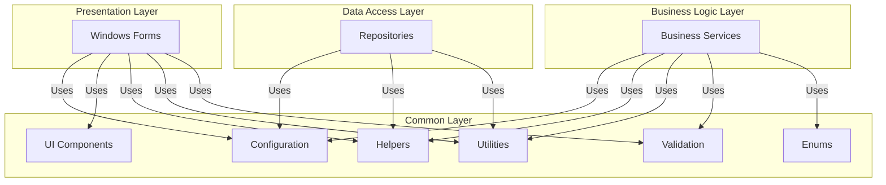
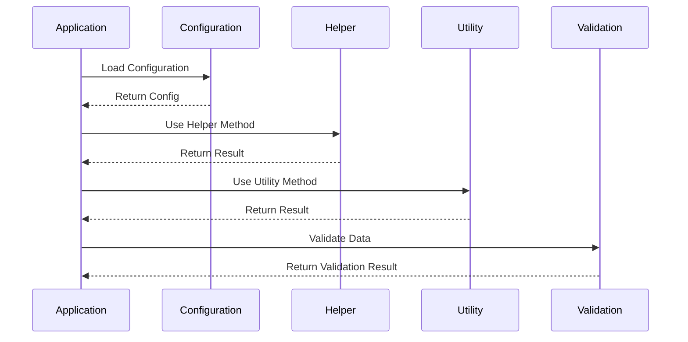
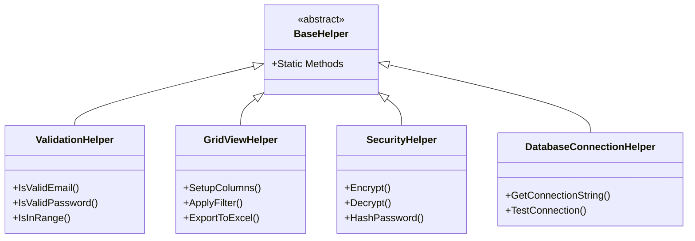

# Common - Shared Components

## Tên Project & Mô Tả Ngắn

**Common** là **Shared Components Library** (Thư Viện Component Dùng Chung) của hệ thống VNS ERP 2025. Project này chứa tất cả các component, helper classes, utilities và shared functionality được sử dụng chung bởi các layer khác trong hệ thống, bao gồm:

- **Configuration Management**: Quản lý cấu hình database, authentication, NAS
- **UI Components**: Splash screen, wait form, overlay manager
- **Helper Classes**: GridView helpers, validation helpers, XML helpers
- **Utilities**: Alert, message box, security, skin management, update checker
- **Validation Framework**: Validation helpers và utilities
- **Enums**: Các enum dùng chung trong hệ thống

Project này là một **Class Library (.dll)** được sử dụng bởi tất cả các layer khác (UI, BLL, DAL) để tái sử dụng code và đảm bảo tính nhất quán trong toàn hệ thống.

---

## Giới Thiệu

### Mục Đích Của Common Project

Common Project được thiết kế để:

- **Code Reusability**: Tái sử dụng code chung giữa các layer và modules
- **Consistency**: Đảm bảo tính nhất quán trong cách xử lý các tác vụ chung
- **Separation of Concerns**: Tách biệt shared functionality khỏi business logic
- **Maintainability**: Dễ dàng bảo trì và cập nhật các component chung
- **Reduced Duplication**: Giảm thiểu code duplication trong toàn hệ thống

### Vấn Đề Được Giải Quyết

- **Code Duplication**: Tập trung hóa các utility functions và helpers
- **Inconsistent Implementation**: Đảm bảo các component được implement nhất quán
- **Configuration Management**: Quản lý cấu hình tập trung
- **UI Consistency**: Đảm bảo UI components nhất quán trong toàn hệ thống

### Phạm Vi Sử Dụng

- **Loại Project**: Class Library (.dll)
- **Target Framework**: .NET Framework 4.8
- **Dependencies**: DevExpress v25.2 (cho UI components)
- **Usage**: Được sử dụng bởi UI, BLL, DAL và các module khác

---

## Tính Năng Chính

### Configuration Management

#### **Appconfig/**
- `DatabaseConfigDto`: DTO cho cấu hình database
- `DatabaseConnectionHelper`: Helper cho kết nối database
- `DatabaseConnectionManager`: Quản lý kết nối database
- `AuthenticationMethod`: Enum cho phương thức xác thực
- `NASConfigData`: Cấu hình NAS storage
- `VntaCrypto`: Utility mã hóa/giải mã

### UI Components

#### **Common/**
- `VnsSplashScreen`: Splash screen cho ứng dụng
- `WaitForm1`: Wait form hiển thị khi xử lý
- `SplashScreenHelper`: Helper cho splash screen
- `OverlayManager`: Quản lý overlay trên form
- `UserControlManager`: Quản lý user controls

### Helper Classes

#### **Helpers/**
- `AppConfigHelper`: Helper đọc cấu hình từ App.config
- `GridViewHelper`: Helper cho DevExpress GridView
- `GridViewColumnHelper`: Helper quản lý columns trong GridView
- `EmployeeInfoColumnFormatter`: Formatter cho cột thông tin nhân viên
- `LogTextBoxHelper`: Helper cho log text box
- `NumberToWordsHelper`: Chuyển đổi số thành chữ
- `SimpleValidationHelper`: Helper validation đơn giản
- `ValidationHelper`: Helper validation phức tạp
- `XmlHelper`: Helper xử lý XML

### Utilities

#### **Utils/**
- `AlertHelper`: Helper hiển thị alert messages
- `MsgBox`: Custom message box
- `InputBoxHelper`: Helper cho input box
- `RequiredFieldHelper`: Helper đánh dấu trường bắt buộc
- `SecurityHelper`: Helper bảo mật
- `SkinHelper`: Helper quản lý DevExpress skins
- `SuperToolTipHelper`: Helper cho super tooltip
- `ApplicationVersionService`: Service quản lý phiên bản ứng dụng
- `UpdateChecker`: Kiểm tra cập nhật ứng dụng
- `ApplicationIconHelper`: Helper quản lý icon ứng dụng
- `ApplicationEnumUtils`: Utilities cho enums

### Validation Framework

#### **Validation/**
- `ValidationHelper`: Framework validation tái sử dụng
- Validation methods cho string, email, password, number
- Utility methods cho validation

### Enums

#### **Enums/**
- `LoaiBaoHanhEnum`: Loại bảo hành
- `TrangThaiBaoHanhEnum`: Trạng thái bảo hành

### Constants

- `ApplicationConstants`: Các hằng số ứng dụng

---

## Kiến Trúc Tổng Thể

### Vai Trò Của Common trong Kiến Trúc



### Luồng Sử Dụng Common Components



### Cấu Trúc Common Components



---

## Cài Đặt

### Yêu Cầu Hệ Thống

#### **Phần Mềm**
- **Visual Studio**: 2022 Enterprise hoặc Professional
- **.NET Framework**: 4.8 hoặc cao hơn
- **DevExpress**: v25.2 (cho UI components)

#### **Dependencies**
- Không có project dependencies (standalone library)
- DevExpress v25.2 assemblies

### Các Bước Thiết Lập

#### **1. Restore NuGet Packages**
```bash
# Trong Visual Studio
Tools → NuGet Package Manager → Restore NuGet Packages
```

#### **2. Build Project**
```bash
# Trong Visual Studio
Build → Build Solution (Ctrl + Shift + B)
```

### Dependencies Configuration

#### **System References**
```xml
<Reference Include="System" />
<Reference Include="System.ComponentModel.DataAnnotations" />
<Reference Include="System.Configuration" />
<Reference Include="System.Core" />
<Reference Include="System.Drawing" />
<Reference Include="System.Windows.Forms" />
<Reference Include="System.Data" />
<Reference Include="System.Net.Http" />
<Reference Include="System.Runtime.Serialization" />
<Reference Include="System.Xml" />
```

#### **DevExpress References**
```xml
<Reference Include="DevExpress.Data.Desktop.v25.2" />
<Reference Include="DevExpress.XtraEditors.v25.2" />
<Reference Include="DevExpress.XtraGrid.v25.2" />
<Reference Include="DevExpress.XtraLayout.v25.2" />
<!-- ... other DevExpress references -->
```

---

## Chạy Dự Án

### Mở Project trong Visual Studio

1. **Mở Solution**: Mở `VnsErp2025.sln`
2. **Locate Common Project**: Tìm project `Common` trong Solution Explorer
3. **Set as Startup Project**: (Không cần, vì đây là Class Library)

### Build Project

#### **Build Common Project**
- **Phím tắt**: Click phải vào project → `Build`
- **Menu**: `Build → Build Common`
- **Command Line**: `msbuild Common\Common.csproj`

---

## Cấu Hình Môi Trường

### App.config

Common project có thể sử dụng App.config để cấu hình:

```xml
<?xml version="1.0" encoding="utf-8"?>
<configuration>
  <appSettings>
    <!-- Application Constants -->
    <add key="ApplicationName" value="VNS ERP 2025" />
    <add key="ApplicationVersion" value="1.0.0" />
    
    <!-- Security Settings -->
    <add key="EncryptionKey" value="" />
    
    <!-- UI Settings -->
    <add key="DefaultSkin" value="Office 2019 Colorful" />
  </appSettings>
</configuration>
```

### Application Constants

```csharp
// File: ApplicationConstants.cs
public static class ApplicationConstants
{
    public const string APPLICATION_NAME = "VNS ERP 2025";
    public const string APPLICATION_VERSION = "1.0.0";
    public const int DEFAULT_TIMEOUT = 30;
    // ... other constants
}
```

---

## Cấu Trúc Thư Mục

### Tổng Quan Cấu Trúc

```
Common/
├── Appconfig/                           # Configuration Management
│   ├── AuthenticationMethod.cs          # Authentication method enum
│   ├── DatabaseConfigDto.cs             # Database config DTO
│   ├── DatabaseConnectionHelper.cs     # Database connection helper
│   ├── DatabaseConnectionManager.cs    # Database connection manager
│   ├── NASConfigData.cs                # NAS configuration
│   └── VntaCrypto.cs                   # Encryption utility
│
├── Common/                              # UI Components
│   ├── VnsSplashScreen.cs              # Splash screen form
│   ├── VnsSplashScreen.Designer.cs     # Splash screen designer
│   ├── WaitForm1.cs                    # Wait form
│   ├── WaitForm1.Designer.cs           # Wait form designer
│   ├── SplashScreenHelper.cs           # Splash screen helper
│   ├── OverlayManager.cs               # Overlay manager
│   └── UserControlManager.cs           # User control manager
│
├── Enums/                               # Shared Enums
│   ├── LoaiBaoHanhEnum.cs              # Warranty type enum
│   └── TrangThaiBaoHanhEnum.cs         # Warranty status enum
│
├── Helpers/                             # Helper Classes
│   ├── AppConfigHelper.cs              # App.config helper
│   ├── GridViewHelper.cs               # GridView helper
│   ├── GridViewColumnHelper.cs         # GridView column helper
│   ├── EmployeeInfoColumnFormatter.cs  # Employee column formatter
│   ├── LogTextBoxHelper.cs             # Log text box helper
│   ├── NumberToWordsHelper.cs          # Number to words converter
│   ├── SimpleValidationHelper.cs       # Simple validation helper
│   ├── ValidationHelper.cs             # Validation helper
│   └── XmlHelper.cs                    # XML helper
│
├── Utils/                               # Utilities
│   ├── AlertHelper.cs                  # Alert helper
│   ├── MsgBox.cs                       # Custom message box
│   ├── InputBoxHelper.cs               # Input box helper
│   ├── RequiredFieldHelper.cs          # Required field helper
│   ├── SecurityHelper.cs               # Security helper
│   ├── SkinHelper.cs                   # Skin helper
│   ├── SuperToolTipHelper.cs           # Super tooltip helper
│   ├── ApplicationVersionService.cs    # Version service
│   ├── UpdateChecker.cs                # Update checker
│   ├── ApplicationIconHelper.cs        # Icon helper
│   └── ApplicationEnumUtils.cs         # Enum utilities
│
├── Validation/                          # Validation Framework
│   ├── ValidationHelper.cs             # Validation helper
│   └── README.md                       # Validation documentation
│
├── Properties/                          # Project Properties
│   ├── AssemblyInfo.cs
│   └── Resources.resx                  # Resources
│
├── Resources/                           # Resource Files
│   └── [SVG and image files]
│
├── ApplicationConstants.cs              # Application Constants
└── Common.csproj                        # Project File
```

### Vai Trò Của Từng Thư Mục

#### **Appconfig/**
- **Vai trò**: Quản lý cấu hình hệ thống
- **Trách nhiệm**:
  - Cấu hình database connection
  - Quản lý authentication methods
  - Cấu hình NAS storage
  - Mã hóa/giải mã dữ liệu

#### **Common/**
- **Vai trò**: UI components dùng chung
- **Trách nhiệm**:
  - Splash screen và wait forms
  - Overlay management
  - User control management

#### **Helpers/**
- **Vai trò**: Helper classes cho các tác vụ chung
- **Trách nhiệm**:
  - GridView operations
  - Validation helpers
  - XML processing
  - Configuration reading

#### **Utils/**
- **Vai trò**: Utility classes cho các chức năng tiện ích
- **Trách nhiệm**:
  - Message boxes và alerts
  - Security utilities
  - Skin management
  - Update checking

#### **Validation/**
- **Vai trò**: Validation framework
- **Trách nhiệm**:
  - Validation methods tái sử dụng
  - Validation utilities

#### **Enums/**
- **Vai trò**: Shared enums
- **Trách nhiệm**:
  - Định nghĩa các enum dùng chung

---

## Hướng Dẫn Sử Dụng

### Sử Dụng Configuration Helpers

#### **Database Configuration**
```csharp
// Sử dụng DatabaseConfigDto
var config = new DatabaseConfigDto
{
    ServerName = "localhost",
    DatabaseName = "VnsErp2025Final",
    AuthenticationMethod = AuthenticationMethod.WindowsAuthentication
};

// Sử dụng DatabaseConnectionHelper
var connectionString = DatabaseConnectionHelper.GetConnectionString(config);
var isValid = DatabaseConnectionHelper.TestConnection(connectionString);
```

#### **App.config Helper**
```csharp
// Đọc giá trị từ App.config
var appName = AppConfigHelper.GetValue("ApplicationName", "VNS ERP 2025");
var timeout = AppConfigHelper.GetIntValue("DefaultTimeout", 30);
var enableFeature = AppConfigHelper.GetBoolValue("EnableFeature", false);
```

### Sử Dụng UI Components

#### **Splash Screen**
```csharp
// Hiển thị splash screen
SplashScreenHelper.ShowSplashScreen("Đang khởi động ứng dụng...");

// Ẩn splash screen
SplashScreenHelper.HideSplashScreen();
```

#### **Wait Form**
```csharp
// Hiển thị wait form
WaitForm1.Show("Đang xử lý...");

// Ẩn wait form
WaitForm1.Hide();
```

### Sử Dụng Helper Classes

#### **GridView Helper**
```csharp
// Setup GridView columns
GridViewHelper.SetupColumns(gridView, columnDefinitions);

// Apply filter
GridViewHelper.ApplyFilter(gridView, filterCriteria);

// Export to Excel
GridViewHelper.ExportToExcel(gridView, "Report.xlsx");
```

#### **Validation Helper**
```csharp
// Validate email
if (!ValidationHelper.IsValidEmail(email))
{
    MessageBox.Show("Email không hợp lệ");
}

// Validate password
if (!ValidationHelper.IsPasswordComplex(password))
{
    MessageBox.Show("Mật khẩu không đủ phức tạp");
}

// Validate number range
if (!ValidationHelper.IsInRange(age, 18, 100))
{
    MessageBox.Show("Tuổi phải từ 18 đến 100");
}
```

#### **Number to Words**
```csharp
// Chuyển đổi số thành chữ
var words = NumberToWordsHelper.ConvertToWords(123456);
// Kết quả: "Một trăm hai mươi ba nghìn bốn trăm năm mươi sáu"
```

### Sử Dụng Utilities

#### **Message Box**
```csharp
// Custom message box
var result = MsgBox.Show("Bạn có chắc chắn muốn xóa?", 
    "Xác nhận", 
    MessageBoxButtons.YesNo, 
    MessageBoxIcon.Question);

if (result == DialogResult.Yes)
{
    // Xử lý xóa
}
```

#### **Alert Helper**
```csharp
// Hiển thị alert
AlertHelper.ShowSuccess("Lưu thành công!");
AlertHelper.ShowError("Có lỗi xảy ra!");
AlertHelper.ShowWarning("Cảnh báo!");
AlertHelper.ShowInfo("Thông tin");
```

#### **Security Helper**
```csharp
// Hash password
var hashedPassword = SecurityHelper.HashPassword(password);

// Encrypt data
var encrypted = SecurityHelper.Encrypt(data, key);

// Decrypt data
var decrypted = SecurityHelper.Decrypt(encrypted, key);
```

#### **Skin Helper**
```csharp
// Apply skin
SkinHelper.ApplySkin("Office 2019 Colorful");

// Get available skins
var skins = SkinHelper.GetAvailableSkins();
```

#### **Update Checker**
```csharp
// Kiểm tra cập nhật
var checker = new UpdateChecker();
var hasUpdate = await checker.CheckForUpdatesAsync();

if (hasUpdate)
{
    var latestVersion = checker.GetLatestVersion();
    // Hiển thị thông báo cập nhật
}
```

### Sử Dụng Validation Framework

Xem chi tiết trong **[Validation README](./Validation/README.md)**

```csharp
// Sử dụng ValidationHelper
using Common.Validation;

// Validate string
if (ValidationHelper.IsNullOrWhiteSpace(value))
{
    // Handle error
}

// Validate email
if (!ValidationHelper.IsValidEmail(email))
{
    // Handle error
}

// Validate password complexity
if (!ValidationHelper.IsPasswordComplex(password))
{
    // Handle error
}
```

---

## Hướng Dẫn Đóng Góp Phát Triển

### Quy Ước Coding

#### **Naming Conventions**
- **Helper Classes**: `{Purpose}Helper` (ví dụ: `GridViewHelper`, `ValidationHelper`)
- **Utility Classes**: `{Purpose}Helper` hoặc `{Purpose}Utils` (ví dụ: `SecurityHelper`, `ApplicationEnumUtils`)
- **Methods**: PascalCase (ví dụ: `IsValidEmail`, `GetConnectionString`)
- **Static Classes**: Tất cả helpers và utilities đều là static classes

#### **Code Organization**
```csharp
#region Public Methods
// Public methods here
#endregion

#region Private Methods
// Private methods here
#endregion

#region Constants
// Constants here
#endregion
```

#### **XML Documentation**
```csharp
/// <summary>
/// Kiểm tra email có hợp lệ không
/// </summary>
/// <param name="email">Email cần kiểm tra</param>
/// <returns>True nếu email hợp lệ, False nếu không</returns>
public static bool IsValidEmail(string email)
{
    // Implementation
}
```

### Quy Tắc Phân Tầng

#### **Được Phép**
- ✅ Chứa static utility methods
- ✅ Chứa helper classes không phụ thuộc business logic
- ✅ Chứa UI components dùng chung
- ✅ Chứa configuration management
- ✅ Sử dụng DevExpress components (cho UI helpers)

#### **KHÔNG Được Phép**
- ❌ Chứa business logic
- ❌ Truy cập database trực tiếp
- ❌ Phụ thuộc vào BLL hoặc DAL layers
- ❌ Chứa module-specific logic

### Cách Thêm Helper/Utility Mới An Toàn

#### **Checklist**
1. ✅ Xác định helper/utility có thể tái sử dụng không
2. ✅ Tạo class trong thư mục phù hợp (Helpers/ hoặc Utils/)
3. ✅ Implement như static class
4. ✅ Thêm XML documentation
5. ✅ Thêm error handling
6. ✅ Test helper/utility
7. ✅ Update documentation

### Quy Ước Branch và Commit

#### **Branch Strategy**
- **feature/**: Feature mới (ví dụ: `feature/add-excel-export-helper`)
- **bugfix/**: Sửa lỗi (ví dụ: `bugfix/fix-validation-email`)
- **refactor/**: Refactor code (ví dụ: `refactor/optimize-gridview-helper`)

#### **Commit Message Convention**
Format: `[Type]: [Short Description]`

**Types:**
- `feat`: Thêm helper/utility mới
- `fix`: Sửa lỗi helper/utility
- `refactor`: Refactor code
- `docs`: Cập nhật tài liệu

**Ví dụ:**
```
feat: Thêm ExcelExportHelper để export GridView ra Excel
fix: Sửa lỗi validation email không chấp nhận domain dài
refactor: Tối ưu GridViewHelper để cải thiện performance
docs: Cập nhật README với hướng dẫn sử dụng SecurityHelper
```

---

## Best Practices

### Helper Design Best Practices

#### **1. Static Classes**
```csharp
// ✅ ĐÚNG: Sử dụng static class cho helpers
public static class ValidationHelper
{
    public static bool IsValidEmail(string email)
    {
        // Implementation
    }
}

// ❌ SAI: Không cần instance cho utility class
public class ValidationHelper
{
    public bool IsValidEmail(string email) { }
}
```

#### **2. Error Handling**
```csharp
// ✅ ĐÚNG: Có error handling
public static bool IsValidEmail(string email)
{
    try
    {
        if (string.IsNullOrWhiteSpace(email))
            return false;
        
        // Validation logic
        return Regex.IsMatch(email, emailPattern);
    }
    catch
    {
        return false;
    }
}
```

#### **3. Null Safety**
```csharp
// ✅ ĐÚNG: Xử lý null safety
public static bool IsValidEmail(string email)
{
    if (string.IsNullOrWhiteSpace(email))
        return false;
    
    // Validation logic
}

// ❌ SAI: Không kiểm tra null
public static bool IsValidEmail(string email)
{
    return Regex.IsMatch(email, emailPattern); // Có thể throw NullReferenceException
}
```

#### **4. Documentation**
```csharp
// ✅ ĐÚNG: Có XML documentation đầy đủ
/// <summary>
/// Kiểm tra email có hợp lệ không
/// </summary>
/// <param name="email">Email cần kiểm tra</param>
/// <returns>True nếu email hợp lệ, False nếu không</returns>
/// <remarks>
/// Sử dụng regex pattern để validate email format
/// </remarks>
public static bool IsValidEmail(string email)
{
    // Implementation
}
```

### Performance Considerations

#### **1. Caching**
```csharp
// ✅ ĐÚNG: Cache kết quả nếu có thể
private static readonly Dictionary<string, bool> _emailCache = new Dictionary<string, bool>();

public static bool IsValidEmail(string email)
{
    if (_emailCache.ContainsKey(email))
        return _emailCache[email];
    
    var isValid = Regex.IsMatch(email, emailPattern);
    _emailCache[email] = isValid;
    return isValid;
}
```

#### **2. Lazy Initialization**
```csharp
// ✅ ĐÚNG: Lazy initialization cho expensive operations
private static Lazy<Regex> _emailRegex = new Lazy<Regex>(
    () => new Regex(emailPattern, RegexOptions.Compiled)
);

public static bool IsValidEmail(string email)
{
    return _emailRegex.Value.IsMatch(email);
}
```

---

## Tài Liệu Liên Quan

- **[Validation README](./Validation/README.md)**: Tài liệu Validation Framework
- **[Root README](../README.md)**: Tài liệu tổng quan hệ thống
- **[DAL README](../Dal/README.md)**: Tài liệu Data Access Layer
- **[BLL README](../Bll/README.md)**: Tài liệu Business Logic Layer

---

## Liên Hệ & Hỗ Trợ

- **Development Team**: [Thông tin liên hệ]
- **Technical Lead**: [Thông tin liên hệ]

---

**Phiên bản tài liệu**: 1.0  
**Ngày cập nhật**: 27/01/2025  
**Trạng thái**: Đang phát triển

---

*Tài liệu này được tạo và duy trì bởi Development Team. Vui lòng cập nhật tài liệu khi có thay đổi quan trọng trong Common layer.*
