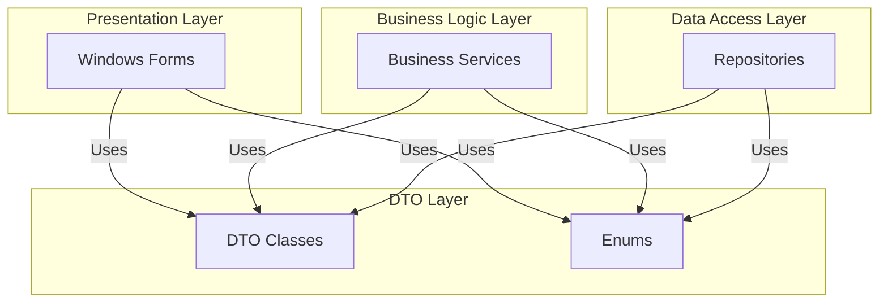
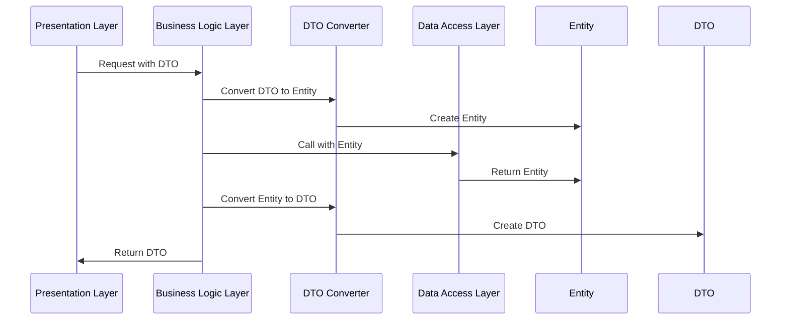
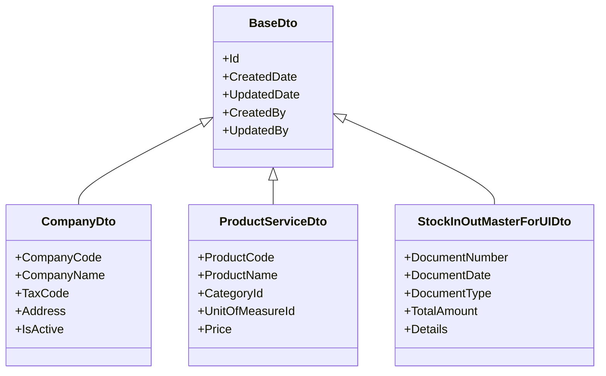
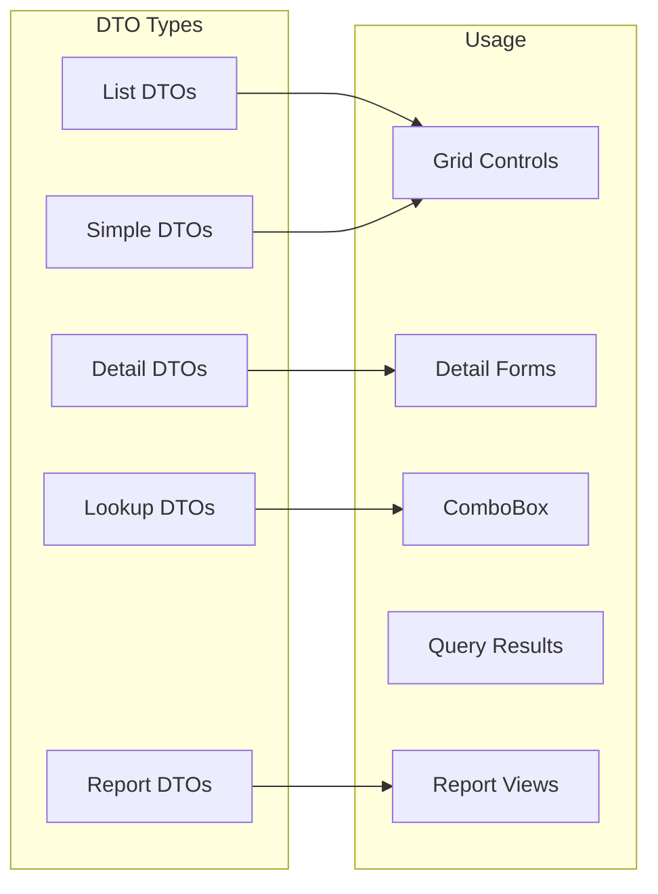

# DTO - Data Transfer Objects

## Tên Project & Mô Tả Ngắn

**DTO** là **Data Transfer Objects** (Đối Tượng Truyền Dữ Liệu) của hệ thống VNS ERP 2025. Project này chứa tất cả các DTO classes và Enums được sử dụng để truyền dữ liệu giữa các layer trong hệ thống, bao gồm:

- **DTO Classes**: Các đối tượng truyền dữ liệu giữa Presentation Layer, Business Logic Layer và Data Access Layer
- **Enums**: Các enum định nghĩa các giá trị cố định trong hệ thống
- **Lookup DTOs**: Các DTO đơn giản cho dropdown/lookup controls
- **Detail DTOs**: Các DTO chi tiết cho các form phức tạp

Project này là một **Class Library (.dll)** đơn giản, không có dependencies phức tạp, được sử dụng bởi tất cả các layer khác trong hệ thống.

---

## Giới Thiệu

### Mục Đích Của DTO Layer

DTO Layer được thiết kế để:

- **Tách Biệt Layers**: Giảm coupling giữa các layer bằng cách sử dụng DTO thay vì Entity trực tiếp
- **Data Transfer**: Truyền dữ liệu giữa UI, BLL và DAL một cách an toàn và nhất quán
- **API Contract**: Định nghĩa contract rõ ràng cho việc truyền dữ liệu
- **Serialization**: Hỗ trợ serialization cho các DTO khi cần
- **Type Safety**: Đảm bảo type safety khi truyền dữ liệu giữa các layer

### Vấn Đề Được Giải Quyết

- **Tight Coupling**: Giảm coupling giữa UI và DAL thông qua DTO
- **Data Exposure**: Chỉ expose dữ liệu cần thiết thông qua DTO
- **Versioning**: Dễ dàng versioning và backward compatibility
- **Performance**: Tối ưu dữ liệu truyền giữa các layer

### Phạm Vi Sử Dụng

- **Loại Project**: Class Library (.dll)
- **Target Framework**: .NET Framework 4.8
- **Dependencies**: Common project (minimal)
- **Usage**: Được sử dụng bởi UI, BLL và DAL layers

---

## Tính Năng Chính

### DTO Classes theo Module

#### **1. VersionAndUserManagementDto**
- `ApplicationUserDto`: DTO cho người dùng hệ thống
- `ApplicationVersionDto`: DTO cho phiên bản ứng dụng
- `RoleDto`: DTO cho vai trò
- `PermissionDto`: DTO cho quyền truy cập
- `RolePermissionDto`: DTO cho quyền của vai trò
- `UserRoleDto`: DTO cho vai trò của người dùng
- `UserPermissionDto`: DTO cho quyền của người dùng
- `UserPermissionSummaryDto`: DTO tổng hợp quyền của người dùng
- `AllowedMacAddressDto`: DTO cho MAC address được phép

#### **2. MasterData DTOs**

**Company Management:**
- `CompanyDto`: DTO cho công ty
- `CompanyBranchDto`: DTO cho chi nhánh
- `DepartmentDto`: DTO cho phòng ban
- `DepartmentLookupDto`: DTO lookup cho phòng ban
- `PositionDto`: DTO cho chức vụ
- `EmployeeDto`: DTO cho nhân viên

**Business Partner:**
- `BusinessPartnerListDto`: DTO danh sách đối tác
- `BusinessPartnerDetailDto`: DTO chi tiết đối tác
- `BusinessPartnerLookupDto`: DTO lookup cho đối tác
- `BusinessPartnerCategoryDto`: DTO cho danh mục đối tác
- `BusinessPartnerContactDto`: DTO cho liên hệ đối tác
- `BusinessPartnerSiteDto`: DTO cho địa điểm đối tác
- `BusinessPartnerSiteListDto`: DTO danh sách địa điểm

**Product & Service:**
- `ProductServiceDto`: DTO cho sản phẩm/dịch vụ
- `ProductServiceCategoryDto`: DTO cho danh mục sản phẩm
- `ProductVariantDto`: DTO cho biến thể sản phẩm
- `ProductVariantDetailDto`: DTO chi tiết biến thể
- `ProductVariantSimpleDto`: DTO đơn giản cho biến thể
- `ProductImageDto`: DTO cho hình ảnh sản phẩm
- `AttributeDto`: DTO cho thuộc tính
- `AttributeValueDto`: DTO cho giá trị thuộc tính
- `VariantAttributeDto`: DTO cho thuộc tính biến thể
- `ProductVariantAttributeDto`: DTO cho thuộc tính của biến thể
- `UnitOfMeasureDto`: DTO cho đơn vị tính

#### **3. Inventory DTOs**

**Inventory Management:**
- `InventoryBalanceDto`: DTO cho tồn kho
- `StockInOutMasterHistoryDto`: DTO lịch sử phiếu nhập/xuất
- `StockInOutProductHistoryDto`: DTO lịch sử sản phẩm nhập/xuất
- `StockInOutDocumentDto`: DTO cho tài liệu nhập/xuất
- `ProductVariantIdentifierDto`: DTO cho định danh biến thể
- `ProductVariantIdentifierHistoryDto`: DTO lịch sử định danh

**Stock In/Out:**
- `StockInOutMasterForUIDto`: DTO master nhập/xuất cho UI
- `StockInOutDetailForUIDto`: DTO chi tiết nhập/xuất cho UI

**Stocktaking:**
- `StocktakingMasterDto`: DTO cho phiếu kiểm kê (Master)
- `StocktakingDetailDto`: DTO cho chi tiết kiểm kê
- `StocktakingAdjustmentDto`: DTO cho điều chỉnh kiểm kê
- `StocktakingImageDto`: DTO cho hình ảnh kiểm kê

**Query & Report:**
- `StockInOutImageDto`: DTO cho hình ảnh nhập/xuất (query)
- `StockInOutReportDto`: DTO cho báo cáo nhập/xuất

#### **4. DeviceAssetManagement DTOs**
- `AssetDto`: DTO cho tài sản
- `DeviceDto`: DTO cho thiết bị
- `DeviceTransactionHistoryDto`: DTO lịch sử giao dịch thiết bị
- `WarrantyDto`: DTO cho bảo hành
- `WarrantyCheckListDto`: DTO danh sách kiểm tra bảo hành

### Enums

#### **Inventory Enums:**
- `DocumentTypeEnum`: Loại tài liệu
- `DocumentCategoryEnum`: Danh mục tài liệu
- `DocumentAccessLevelEnum`: Mức độ truy cập tài liệu
- `StocktakingTypeEnum`: Loại kiểm kê
- `StocktakingStatusEnum`: Trạng thái kiểm kê
- `AdjustmentTypeEnum`: Loại điều chỉnh

#### **DeviceAssetManagement Enums:**
- `DeviceIdentifierEnum`: Loại định danh thiết bị
- `DeviceOperationTypeEnum`: Loại thao tác thiết bị
- `DeviceReferenceTypeEnum`: Loại tham chiếu thiết bị

---

## Kiến Trúc Tổng Thể

### Vai Trò Của DTO trong Kiến Trúc



### Luồng Dữ Liệu với DTO



### Cấu Trúc DTO Pattern



### DTO Types



---

## Cài Đặt

### Yêu Cầu Hệ Thống

#### **Phần Mềm**
- **Visual Studio**: 2022 Enterprise hoặc Professional
- **.NET Framework**: 4.8 hoặc cao hơn

#### **Dependencies**
- **Common Project**: Shared common components (minimal dependency)

### Các Bước Thiết Lập

#### **1. Restore NuGet Packages**
```bash
# Trong Visual Studio
Tools → NuGet Package Manager → Restore NuGet Packages
```

#### **2. Build Project**
```bash
# Trong Visual Studio
Build → Build Solution (Ctrl + Shift + B)
```

### Dependencies Configuration

#### **Project References**
```xml
<ProjectReference Include="..\Common\Common.csproj">
  <Project>{68E56AB6-1ADA-40DE-9EDD-0BE2B8F35C3A}</Project>
  <Name>Common</Name>
</ProjectReference>
```

#### **System References**
```xml
<Reference Include="System" />
<Reference Include="System.ComponentModel.DataAnnotations" />
<Reference Include="System.Core" />
<Reference Include="System.Data.Linq" />
<Reference Include="System.Data" />
```

---

## Chạy Dự Án

### Mở Project trong Visual Studio

1. **Mở Solution**: Mở `VnsErp2025.sln`
2. **Locate DTO Project**: Tìm project `DTO` trong Solution Explorer
3. **Set as Startup Project**: (Không cần, vì đây là Class Library)

### Build Project

#### **Build DTO Project**
- **Phím tắt**: Click phải vào project → `Build`
- **Menu**: `Build → Build DTO`
- **Command Line**: `msbuild DTO\DTO.csproj`

#### **Rebuild Project**
- Click phải vào project → `Rebuild`
- Hoặc `Build → Rebuild DTO`

---

## Cấu Hình Môi Trường

### App.config

DTO project thường không cần `App.config` vì đây là pure data classes. Tuy nhiên, nếu cần cấu hình serialization hoặc validation, có thể thêm:

```xml
<?xml version="1.0" encoding="utf-8"?>
<configuration>
  <appSettings>
    <!-- Serialization settings (if needed) -->
    <add key="JsonSerializerSettings" value="" />
  </appSettings>
</configuration>
```

### Data Annotations

DTO classes có thể sử dụng Data Annotations cho validation:

```csharp
public class CompanyDto
{
    [Required(ErrorMessage = "Mã công ty không được để trống")]
    [StringLength(50, ErrorMessage = "Mã công ty không được vượt quá 50 ký tự")]
    public string CompanyCode { get; set; }
    
    [Required(ErrorMessage = "Tên công ty không được để trống")]
    [StringLength(255, ErrorMessage = "Tên công ty không được vượt quá 255 ký tự")]
    public string CompanyName { get; set; }
}
```

---

## Cấu Trúc Thư Mục

### Tổng Quan Cấu Trúc

```
DTO/
├── MasterData/                          # Master Data DTOs
│   ├── Company/                         # Company Management DTOs
│   │   ├── CompanyDto.cs                # Company DTO
│   │   ├── CompanyBranchDto.cs          # Branch DTO
│   │   ├── DepartmentDto.cs            # Department DTO
│   │   ├── DepartmentLookupDto.cs      # Department lookup DTO
│   │   ├── PositionDto.cs              # Position DTO
│   │   └── EmployeeDto.cs              # Employee DTO
│   │
│   ├── CustomerPartner/                # Business Partner DTOs
│   │   ├── BusinessPartnerListDto.cs   # Partner list DTO
│   │   ├── BusinessPartnerDetailDto.cs  # Partner detail DTO
│   │   ├── BusinessPartnerLookupDto.cs  # Partner lookup DTO
│   │   ├── BusinessPartnerCategoryDto.cs # Category DTO
│   │   ├── BusinessPartnerContactDto.cs # Contact DTO
│   │   ├── BusinessPartnerSiteDto.cs   # Site DTO
│   │   └── BusinessPartnerSiteListDto.cs # Site list DTO
│   │
│   └── ProductService/                 # Product & Service DTOs
│       ├── ProductServiceDto.cs        # Product service DTO
│       ├── ProductServiceCategoryDto.cs # Category DTO
│       ├── ProductVariantDto.cs        # Variant DTO
│       ├── ProductVariantDetailDto.cs  # Variant detail DTO
│       ├── ProductVariantSimpleDto.cs  # Variant simple DTO
│       ├── ProductImageDto.cs         # Image DTO
│       ├── AttributeDto.cs             # Attribute DTO
│       ├── AttributeValueDto.cs       # Attribute value DTO
│       ├── VariantAttributeDto.cs     # Variant attribute DTO
│       ├── ProductVariantAttributeDto.cs # Product variant attribute DTO
│       └── UnitOfMeasureDto.cs        # Unit of measure DTO
│
├── Inventory/                           # Inventory DTOs
│   ├── InventoryManagement/           # Inventory Management DTOs
│   │   ├── InventoryBalanceDto.cs     # Inventory balance DTO
│   │   ├── StockInOutMasterHistoryDto.cs # Stock in/out history DTO
│   │   ├── StockInOutProductHistoryDto.cs # Product history DTO
│   │   ├── StockInOutDocumentDto.cs   # Document DTO
│   │   ├── ProductVariantIdentifierDto.cs # Variant identifier DTO
│   │   ├── ProductVariantIdentifierHistoryDto.cs # Identifier history DTO
│   │   ├── DocumentTypeEnum.cs        # Document type enum
│   │   ├── DocumentCategoryEnum.cs     # Document category enum
│   │   ├── DocumentAccessLevelEnum.cs # Document access level enum
│   │   └── InventoryEnums.cs         # Inventory enums
│   │
│   ├── StockInOut/                     # Stock In/Out DTOs
│   │   ├── StockInOutMasterForUIDto.cs # Master DTO for UI
│   │   └── StockInOutDetailForUIDto.cs # Detail DTO for UI
│   │
│   ├── StockTakking/                   # Stocktaking DTOs
│   │   ├── StocktakingMasterDto.cs     # Stocktaking master DTO
│   │   ├── StocktakingDetailDto.cs     # Stocktaking detail DTO
│   │   ├── StocktakingAdjustmentDto.cs # Adjustment DTO
│   │   ├── StocktakingImageDto.cs     # Image DTO
│   │   ├── StocktakingTypeEnum.cs     # Type enum
│   │   ├── StocktakingStatusEnum.cs   # Status enum
│   │   └── AdjustmentTypeEnum.cs      # Adjustment type enum
│   │
│   ├── Query/                          # Query DTOs
│   │   └── StockInOutImageDto.cs      # Image query DTO
│   │
│   └── Report/                         # Report DTOs
│       └── StockInOutReportDto.cs     # Stock in/out report DTO
│
├── VersionAndUserManagementDto/        # User Management DTOs
│   ├── ApplicationUserDto.cs          # User DTO
│   ├── ApplicationVersionDto.cs       # Version DTO
│   ├── RoleDto.cs                     # Role DTO
│   ├── PermissionDto.cs               # Permission DTO
│   ├── RolePermissionDto.cs          # Role permission DTO
│   ├── UserRoleDto.cs                # User role DTO
│   ├── UserPermissionDto.cs           # User permission DTO
│   ├── UserPermissionSummaryDto.cs   # Permission summary DTO
│   └── AllowedMacAddressDto.cs       # MAC address DTO
│
├── DeviceAssetManagement/              # Device & Asset DTOs
│   ├── AssetDto.cs                    # Asset DTO
│   ├── DeviceDto.cs                   # Device DTO
│   ├── DeviceTransactionHistoryDto.cs # Device history DTO
│   ├── WarrantyDto.cs                 # Warranty DTO
│   ├── WarrantyCheckListDto.cs       # Warranty check list DTO
│   ├── DeviceIdentifierEnum.cs       # Device identifier enum
│   ├── DeviceOperationTypeEnum.cs    # Operation type enum
│   └── DeviceReferenceTypeEnum.cs    # Reference type enum
│
├── Properties/                         # Project Properties
│   ├── AssemblyInfo.cs
│   └── DataSources/                   # Data sources
│
└── DTO.csproj                          # Project File
```

### Vai Trò Của Từng Thư Mục

#### **MasterData/**
- **Vai trò**: DTOs cho dữ liệu master
- **Trách nhiệm**:
  - Định nghĩa DTOs cho Company, BusinessPartner, ProductService
  - Cung cấp Lookup DTOs cho dropdown controls
  - Cung cấp Detail DTOs cho detail forms

#### **Inventory/**
- **Vai trò**: DTOs cho quản lý kho
- **Trách nhiệm**:
  - Định nghĩa DTOs cho StockIn/Out, InventoryBalance, Stocktaking
  - Cung cấp Report DTOs cho báo cáo
  - Cung cấp Query DTOs cho tra cứu

#### **VersionAndUserManagementDto/**
- **Vai trò**: DTOs cho quản lý người dùng và phân quyền
- **Trách nhiệm**:
  - Định nghĩa DTOs cho User, Role, Permission
  - Cung cấp Summary DTOs cho tổng hợp quyền

#### **DeviceAssetManagement/**
- **Vai trò**: DTOs cho quản lý thiết bị và tài sản
- **Trách nhiệm**:
  - Định nghĩa DTOs cho Asset, Device, Warranty
  - Cung cấp Enums cho các loại định danh và thao tác

---

## Hướng Dẫn Sử Dụng

### Tạo DTO Mới

#### **Bước 1: Tạo DTO Class**
```csharp
// File: MasterData/NewEntity/NewEntityDto.cs
namespace DTO.MasterData.NewEntity
{
    /// <summary>
    /// DTO cho NewEntity
    /// </summary>
    public class NewEntityDto
    {
        /// <summary>
        /// ID của entity
        /// </summary>
        public Guid Id { get; set; }
        
        /// <summary>
        /// Mã entity
        /// </summary>
        [Required(ErrorMessage = "Mã không được để trống")]
        [StringLength(50, ErrorMessage = "Mã không được vượt quá 50 ký tự")]
        public string Code { get; set; }
        
        /// <summary>
        /// Tên entity
        /// </summary>
        [Required(ErrorMessage = "Tên không được để trống")]
        [StringLength(255, ErrorMessage = "Tên không được vượt quá 255 ký tự")]
        public string Name { get; set; }
        
        /// <summary>
        /// Mô tả
        /// </summary>
        [StringLength(1000, ErrorMessage = "Mô tả không được vượt quá 1000 ký tự")]
        public string Description { get; set; }
        
        /// <summary>
        /// Trạng thái hoạt động
        /// </summary>
        public bool IsActive { get; set; }
        
        /// <summary>
        /// Ngày tạo
        /// </summary>
        public DateTime CreatedDate { get; set; }
        
        /// <summary>
        /// Ngày cập nhật
        /// </summary>
        public DateTime? UpdatedDate { get; set; }
    }
}
```

#### **Bước 2: Tạo Lookup DTO (Nếu cần)**
```csharp
// File: MasterData/NewEntity/NewEntityLookupDto.cs
namespace DTO.MasterData.NewEntity
{
    /// <summary>
    /// DTO lookup cho NewEntity (dùng cho ComboBox, DropDown)
    /// </summary>
    public class NewEntityLookupDto
    {
        public Guid Id { get; set; }
        public string Code { get; set; }
        public string Name { get; set; }
    }
}
```

#### **Bước 3: Tạo Detail DTO (Nếu cần)**
```csharp
// File: MasterData/NewEntity/NewEntityDetailDto.cs
namespace DTO.MasterData.NewEntity
{
    /// <summary>
    /// DTO chi tiết cho NewEntity (dùng cho detail form)
    /// </summary>
    public class NewEntityDetailDto : NewEntityDto
    {
        // Thêm các properties bổ sung cho detail view
        public List<RelatedEntityDto> RelatedEntities { get; set; }
        public string Notes { get; set; }
    }
}
```

### Sử Dụng DTO trong BLL

```csharp
// Trong BLL Service
public class NewEntityBll
{
    public NewEntityDto GetById(Guid id)
    {
        var entity = _repository.GetById(id);
        return ConvertToDto(entity);
    }
    
    public List<NewEntityLookupDto> GetLookupList()
    {
        var entities = _repository.GetAll();
        return entities.Select(e => new NewEntityLookupDto
        {
            Id = e.Id,
            Code = e.Code,
            Name = e.Name
        }).ToList();
    }
    
    private NewEntityDto ConvertToDto(NewEntity entity)
    {
        return new NewEntityDto
        {
            Id = entity.Id,
            Code = entity.Code,
            Name = entity.Name,
            Description = entity.Description,
            IsActive = entity.IsActive,
            CreatedDate = entity.CreatedDate,
            UpdatedDate = entity.UpdatedDate
        };
    }
}
```

### Sử Dụng DTO trong UI

```csharp
// Trong Windows Form
public partial class FrmNewEntity : XtraForm
{
    private void LoadData()
    {
        var dtos = _service.GetAll();
        gridControl.DataSource = dtos;
    }
    
    private void LoadLookup()
    {
        var lookupList = _service.GetLookupList();
        comboBox.Properties.DataSource = lookupList;
        comboBox.Properties.DisplayMember = "Name";
        comboBox.Properties.ValueMember = "Id";
    }
    
    private void SaveData()
    {
        var dto = new NewEntityDto
        {
            Code = txtCode.Text,
            Name = txtName.Text,
            Description = txtDescription.Text,
            IsActive = chkActive.Checked
        };
        
        _service.Create(dto);
    }
}
```

### Sử Dụng Enums

```csharp
// Sử dụng enum trong code
var documentType = DocumentTypeEnum.StockIn;
var status = StocktakingStatusEnum.InProgress;

// Sử dụng enum trong DTO
public class StockInOutMasterForUIDto
{
    public DocumentTypeEnum DocumentType { get; set; }
    public StocktakingStatusEnum Status { get; set; }
}
```

---

## Hướng Dẫn Đóng Góp Phát Triển

### Quy Ước Coding

#### **Naming Conventions**
- **DTO Classes**: `{EntityName}Dto` (ví dụ: `CompanyDto`, `ProductServiceDto`)
- **Lookup DTOs**: `{EntityName}LookupDto` (ví dụ: `CompanyLookupDto`)
- **Detail DTOs**: `{EntityName}DetailDto` (ví dụ: `CompanyDetailDto`)
- **List DTOs**: `{EntityName}ListDto` (ví dụ: `CompanyListDto`)
- **Enums**: `{EnumName}Enum` (ví dụ: `DocumentTypeEnum`)

#### **Code Organization**
```csharp
#region Properties
// Properties here
#endregion

#region Constructors
// Constructors here (if needed)
#endregion

#region Methods
// Methods here (if needed)
#endregion
```

#### **XML Documentation**
```csharp
/// <summary>
/// DTO cho Company
/// </summary>
public class CompanyDto
{
    /// <summary>
    /// ID của công ty
    /// </summary>
    public Guid Id { get; set; }
    
    /// <summary>
    /// Mã công ty
    /// </summary>
    public string CompanyCode { get; set; }
}
```

### Quy Tắc Phân Tầng

#### **Được Phép**
- ✅ Chứa properties và simple methods
- ✅ Sử dụng Data Annotations cho validation
- ✅ Implement interfaces nếu cần (ISerializable, etc.)
- ✅ Sử dụng Common utilities (nếu cần)

#### **KHÔNG Được Phép**
- ❌ Chứa business logic
- ❌ Truy cập database
- ❌ Chứa UI logic
- ❌ Phụ thuộc vào BLL hoặc DAL layers

### Cách Thêm DTO Mới An Toàn

#### **Checklist**
1. ✅ Tạo DTO class trong thư mục module tương ứng
2. ✅ Thêm Data Annotations cho validation
3. ✅ Thêm XML documentation
4. ✅ Tạo Lookup DTO nếu cần (cho ComboBox)
5. ✅ Tạo Detail DTO nếu cần (cho detail form)
6. ✅ Tạo Enum nếu cần (cho các giá trị cố định)
7. ✅ Update converter trong DAL (nếu cần)

### Quy Ước Branch và Commit

#### **Branch Strategy**
- **feature/**: Feature mới (ví dụ: `feature/add-product-variant-dto`)
- **bugfix/**: Sửa lỗi (ví dụ: `bugfix/fix-dto-property-name`)
- **refactor/**: Refactor code (ví dụ: `refactor/rename-dto-properties`)

#### **Commit Message Convention**
Format: `[Type]: [Short Description]`

**Types:**
- `feat`: Thêm DTO/enum mới
- `fix`: Sửa lỗi DTO
- `refactor`: Refactor DTO structure
- `docs`: Cập nhật tài liệu

**Ví dụ:**
```
feat: Thêm ProductVariantIdentifierDto và ProductVariantIdentifierHistoryDto
fix: Sửa property name trong StockInOutMasterForUIDto
refactor: Tách BusinessPartnerDto thành ListDto và DetailDto
docs: Cập nhật XML documentation cho các DTO classes
```

---

## Best Practices

### DTO Design Best Practices

#### **1. Keep DTOs Simple**
```csharp
// ✅ ĐÚNG: DTO đơn giản, chỉ chứa properties
public class CompanyDto
{
    public Guid Id { get; set; }
    public string CompanyCode { get; set; }
    public string CompanyName { get; set; }
}

// ❌ SAI: DTO chứa business logic
public class CompanyDto
{
    public Guid Id { get; set; }
    public string CompanyCode { get; set; }
    
    public bool IsValid() // ❌ Business logic không nên ở DTO
    {
        return !string.IsNullOrEmpty(CompanyCode);
    }
}
```

#### **2. Use Appropriate DTO Types**
```csharp
// ✅ ĐÚNG: Sử dụng LookupDto cho ComboBox
public class CompanyLookupDto
{
    public Guid Id { get; set; }
    public string Code { get; set; }
    public string Name { get; set; }
}

// ✅ ĐÚNG: Sử dụng DetailDto cho detail form
public class CompanyDetailDto : CompanyDto
{
    public List<CompanyBranchDto> Branches { get; set; }
    public List<DepartmentDto> Departments { get; set; }
}
```

#### **3. Data Annotations for Validation**
```csharp
// ✅ ĐÚNG: Sử dụng Data Annotations
public class CompanyDto
{
    [Required(ErrorMessage = "Mã công ty không được để trống")]
    [StringLength(50)]
    public string CompanyCode { get; set; }
    
    [Required(ErrorMessage = "Tên công ty không được để trống")]
    [StringLength(255)]
    public string CompanyName { get; set; }
}
```

#### **4. Naming Consistency**
```csharp
// ✅ ĐÚNG: Naming nhất quán
public class CompanyDto { }
public class CompanyLookupDto { }
public class CompanyDetailDto { }
public class CompanyListDto { }

// ❌ SAI: Naming không nhất quán
public class CompanyDto { }
public class CompanyLookup { } // Thiếu "Dto"
public class CompanyDetails { } // Thiếu "Dto", sai số nhiều
```

### Performance Considerations

#### **1. Minimize DTO Size**
```csharp
// ✅ ĐÚNG: Chỉ include properties cần thiết
public class CompanyLookupDto
{
    public Guid Id { get; set; }
    public string Code { get; set; }
    public string Name { get; set; }
    // Không include các properties không cần thiết
}

// ❌ SAI: Include quá nhiều properties không cần thiết
public class CompanyLookupDto
{
    public Guid Id { get; set; }
    public string Code { get; set; }
    public string Name { get; set; }
    public string TaxCode { get; set; } // Không cần cho lookup
    public string Address { get; set; } // Không cần cho lookup
    // ... nhiều properties khác
}
```

#### **2. Use Appropriate Collections**
```csharp
// ✅ ĐÚNG: Sử dụng IList hoặc ICollection
public class CompanyDetailDto
{
    public IList<CompanyBranchDto> Branches { get; set; }
}

// ❌ SAI: Sử dụng concrete types
public class CompanyDetailDto
{
    public List<CompanyBranchDto> Branches { get; set; } // Nên dùng interface
}
```

---

## Tài Liệu Liên Quan

- **[Root README](../README.md)**: Tài liệu tổng quan hệ thống
- **[DAL README](../Dal/README.md)**: Tài liệu Data Access Layer
- **[BLL README](../Bll/README.md)**: Tài liệu Business Logic Layer

---

## Liên Hệ & Hỗ Trợ

- **Development Team**: [Thông tin liên hệ]
- **Technical Lead**: [Thông tin liên hệ]

---

**Phiên bản tài liệu**: 1.0  
**Ngày cập nhật**: 27/01/2025  
**Trạng thái**: Đang phát triển

---

*Tài liệu này được tạo và duy trì bởi Development Team. Vui lòng cập nhật tài liệu khi có thay đổi quan trọng trong DTO layer.*
