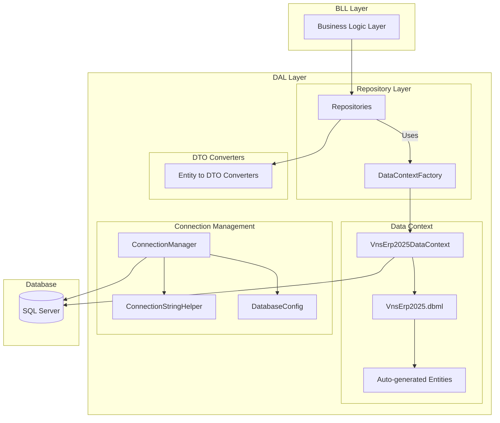
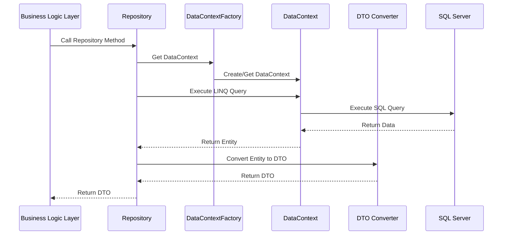
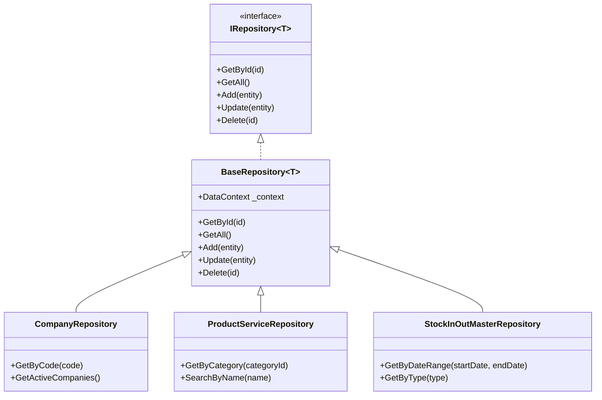
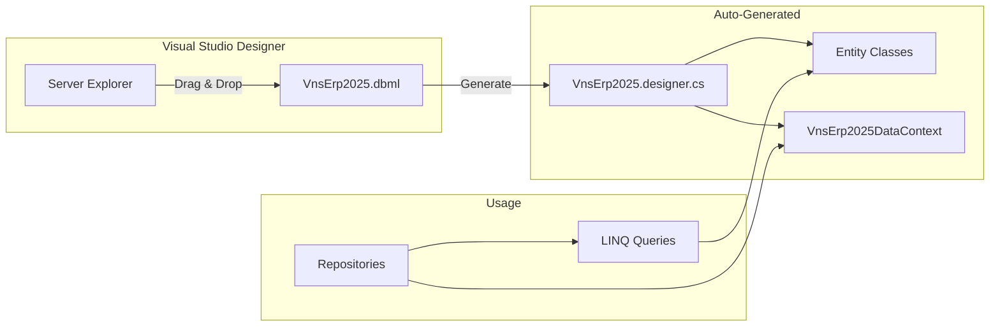

# Dal - Data Access Layer

## Tên Project & Mô Tả Ngắn

**Dal** là **Data Access Layer** (Lớp Truy Cập Dữ Liệu) của hệ thống VNS ERP 2025. Project này chịu trách nhiệm quản lý tất cả các thao tác truy cập cơ sở dữ liệu, bao gồm:

- **Truy cập Database**: Kết nối và thao tác với Microsoft SQL Server
- **ORM Framework**: Sử dụng LINQ to SQL (Drag & Drop Approach)
- **Repository Pattern**: Cung cấp các repository cho các entity trong hệ thống
- **Connection Management**: Quản lý kết nối database và connection pooling
- **Data Conversion**: Chuyển đổi giữa Entity và DTO

Project này là một **Class Library (.dll)** được sử dụng bởi **Business Logic Layer (BLL)** để truy cập dữ liệu từ database.

---

## Giới Thiệu

### Mục Đích Của DAL Layer

DAL Layer được thiết kế để:

- **Tách biệt Data Access Logic**: Tách biệt hoàn toàn logic truy cập dữ liệu khỏi Business Logic và Presentation Layer
- **Đơn giản hóa Data Access**: Sử dụng LINQ to SQL với phương pháp Drag & Drop để giảm thiểu code phức tạp
- **Quản lý Kết Nối Tập Trung**: Quản lý tất cả kết nối database tại một nơi
- **Bảo Mật**: Mã hóa connection string và quản lý bảo mật truy cập database
- **Performance**: Tối ưu queries và quản lý connection pooling

### Vấn Đề Được Giải Quyết

- **SQL Injection**: LINQ to SQL tự động parameterize queries, ngăn chặn SQL injection
- **Connection Management**: Quản lý connection pooling và lifecycle của connections
- **Code Duplication**: Tái sử dụng code thông qua Repository pattern và base classes
- **Maintainability**: Dễ dàng bảo trì và mở rộng khi database schema thay đổi

### Phạm Vi Sử Dụng

- **Loại Project**: Class Library (.dll)
- **Target Framework**: .NET Framework 4.8
- **Database**: Microsoft SQL Server 2016 trở lên
- **ORM**: LINQ to SQL (System.Data.Linq)
- **Dependencies**: Common, DTO, Logger projects

---

## Tính Năng Chính

### Repository Pattern Implementation

DAL layer cung cấp các Repository cho các module chính:

#### **VersionAndUserManagement Repositories**
- `ApplicationUserRepository`: Quản lý người dùng hệ thống
- `ApplicationVersionRepository`: Quản lý phiên bản ứng dụng
- `PermissionRepository`: Quản lý quyền truy cập
- `AllowedMacAddressRepository`: Quản lý MAC address được phép

#### **MasterData Repositories**

**Company Management:**
- `CompanyRepository`: Quản lý công ty
- `CompanyBranchRepository`: Quản lý chi nhánh
- `DepartmentRepository`: Quản lý phòng ban
- `PositionRepository`: Quản lý chức vụ
- `EmployeeRepository`: Quản lý nhân viên

**Business Partner:**
- `BusinessPartnerRepository`: Quản lý đối tác kinh doanh
- `BusinessPartnerCategoryRepository`: Quản lý danh mục đối tác
- `BusinessPartnerContactRepository`: Quản lý liên hệ đối tác
- `BusinessPartnerSiteRepository`: Quản lý địa điểm đối tác

**Product & Service:**
- `ProductServiceRepository`: Quản lý sản phẩm/dịch vụ
- `ProductServiceCategoryRepository`: Quản lý danh mục sản phẩm
- `ProductVariantRepository`: Quản lý biến thể sản phẩm
- `ProductImageRepository`: Quản lý hình ảnh sản phẩm
- `AttributeRepository`: Quản lý thuộc tính
- `UnitOfMeasureRepository`: Quản lý đơn vị tính

#### **Inventory Repositories**

**Stock In/Out Management:**
- `StockInOutMasterRepository`: Quản lý phiếu nhập/xuất (Master)
- `StockInOutDetailRepository`: Quản lý chi tiết nhập/xuất
- `StockInOutDocumentRepository`: Quản lý tài liệu nhập/xuất
- `StockInOutImageRepository`: Quản lý hình ảnh nhập/xuất
- `StockInRepository`: Quản lý nhập kho

**Inventory Management:**
- `InventoryBalanceRepository`: Quản lý tồn kho
- `AssetRepository`: Quản lý tài sản
- `DeviceRepository`: Quản lý thiết bị
- `DeviceImageRepository`: Quản lý hình ảnh thiết bị
- `DeviceTransactionHistoryRepository`: Lịch sử giao dịch thiết bị
- `WarrantyRepository`: Quản lý bảo hành

**Product Variant Identifier:**
- `ProductVariantIdentifierRepository`: Quản lý định danh biến thể
- `ProductVariantIdentifierHistoryRepository`: Lịch sử định danh

**Stocktaking:**
- `StocktakingMasterRepository`: Quản lý phiếu kiểm kê (Master)
- `StocktakingDetailRepository`: Quản lý chi tiết kiểm kê
- `StocktakingAdjustmentRepository`: Quản lý điều chỉnh kiểm kê
- `StocktakingImageRepository`: Quản lý hình ảnh kiểm kê

### Connection Management

- **ConnectionManager**: Quản lý kết nối database tập trung
- **ConnectionStringHelper**: Helper cho connection string (mã hóa/giải mã)
- **DatabaseConfig**: Cấu hình database settings
- **ApplicationStartupManager**: Quản lý khởi động ứng dụng

### Data Context Factory

- **DataContextFactory**: Factory pattern để tạo DataContext
- **IDataContextFactory**: Interface cho factory
- **UnitOfWork**: Quản lý transaction và unit of work pattern

### DTO Converters

Các converter để chuyển đổi giữa Entity và DTO:

- **VersionAndUserManagement Converters**: ApplicationUser, Role, Permission, etc.
- **MasterData Converters**: Company, BusinessPartner, ProductService, etc.
- **Inventory Converters**: StockInOut, InventoryBalance, Device, Asset, etc.

### Exception Handling

- **DataAccessException**: Base exception cho data access errors
- **ConnectionException**: Exception cho connection errors

---

## Kiến Trúc Tổng Thể

### Mô Hình Kiến Trúc DAL



### Luồng Truy Cập Dữ Liệu



### Cấu Trúc Repository Pattern



### LINQ to SQL Data Context



---

## Cài Đặt

### Yêu Cầu Hệ Thống

#### **Phần Mềm**
- **Visual Studio**: 2022 Enterprise hoặc Professional
- **.NET Framework**: 4.8 hoặc cao hơn
- **SQL Server**: 2016 trở lên (hoặc SQL Server Express)
- **SQL Server Management Studio (SSMS)**: Để quản lý database

#### **Dependencies**
- **Common Project**: Shared common components
- **DTO Project**: Data Transfer Objects
- **Logger Project**: Logging framework

### Các Bước Thiết Lập

#### **1. Restore NuGet Packages**
```bash
# Trong Visual Studio
Tools → NuGet Package Manager → Restore NuGet Packages
```

#### **2. Cấu Hình Connection String**
- Xem file `app.config` trong project Dal
- Hoặc sử dụng `ConnectionStringHelper` để lấy từ Registry

#### **3. Cập Nhật LINQ to SQL Data Context**
1. Mở file `DataContext/VnsErp2025.dbml` trong Visual Studio Designer
2. Kết nối database trong Server Explorer
3. Kéo thả các bảng cần thiết vào Designer
4. Build solution để generate entities

#### **4. Build Project**
```bash
# Trong Visual Studio
Build → Build Solution (Ctrl + Shift + B)
```

### Dependencies Configuration

#### **Project References**
```xml
<ProjectReference Include="..\Common\Common.csproj">
  <Project>{68e56ab6-1ada-40de-9edd-0be2b8f35c3a}</Project>
  <Name>Common</Name>
</ProjectReference>
<ProjectReference Include="..\DTO\DTO.csproj">
  <Project>{77b6b4b6-d129-4a78-bd8d-9fca5f9b4a1c}</Project>
  <Name>DTO</Name>
</ProjectReference>
<ProjectReference Include="..\Logger\Logger.csproj">
  <Project>{12f9fb39-92bf-45d5-bbb2-5353e33700f0}</Project>
  <Name>Logger</Name>
</ProjectReference>
```

#### **System References**
```xml
<Reference Include="System" />
<Reference Include="System.Configuration" />
<Reference Include="System.Core" />
<Reference Include="System.Data.Linq" />
<Reference Include="System.Data" />
<Reference Include="System.Net.Http" />
<Reference Include="System.Xml" />
```

---

## Chạy Dự Án

### Mở Project trong Visual Studio

1. **Mở Solution**: Mở `VnsErp2025.sln`
2. **Locate Dal Project**: Tìm project `Dal` trong Solution Explorer
3. **Set as Startup Project**: (Không cần, vì đây là Class Library)

### Build Project

#### **Build Dal Project**
- **Phím tắt**: Click phải vào project → `Build`
- **Menu**: `Build → Build Dal`
- **Command Line**: `msbuild Dal\Dal.csproj`

#### **Rebuild Project**
- Click phải vào project → `Rebuild`
- Hoặc `Build → Rebuild Dal`

### Test Data Access

#### **Unit Testing (Nếu có)**
```csharp
// Ví dụ test repository
[TestMethod]
public void Test_GetCompanyById()
{
    var repository = new CompanyRepository();
    var company = repository.GetById(companyId);
    Assert.IsNotNull(company);
}
```

#### **Integration Testing**
- Test kết nối database
- Test CRUD operations
- Test transaction management

---

## Cấu Hình Môi Trường

### App.config

File `app.config` trong project Dal chứa:

```xml
<?xml version="1.0" encoding="utf-8"?>
<configuration>
  <appSettings>
    <!-- Database Configuration -->
    <add key="DatabaseServer" value="localhost" />
    <add key="DatabaseName" value="VnsErp2025Final" />
    <add key="UseIntegratedSecurity" value="true" />
  </appSettings>
  
  <connectionStrings>
    <!-- Connection string có thể được lưu trong Registry -->
    <!-- Sử dụng ConnectionStringHelper để lấy connection string -->
  </connectionStrings>
</configuration>
```

### Connection String Management

#### **Registry-Based Storage**
- **Registry Path**: `HKEY_CURRENT_USER\Software\Software\VietNhatSolutions\VnsErp2025`
- **Encryption**: Sử dụng VntaCrypto để mã hóa/giải mã
- **Helper Class**: `ConnectionStringHelper`

#### **Sử dụng ConnectionStringHelper**
```csharp
// Lấy connection string từ Registry
string connectionString = ConnectionStringHelper.GetConnectionString();

// Hoặc tạo connection string mới
var config = new DatabaseConfigDto
{
    ServerName = "localhost",
    DatabaseName = "VnsErp2025Final",
    AuthenticationMethod = AuthenticationMethod.WindowsAuthentication
};
string connectionString = config.GetConnectionString();
```

### Database Configuration

#### **DatabaseConfig Class**
```csharp
var config = DatabaseConfig.Instance;
config.ServerName = "localhost";
config.DatabaseName = "VnsErp2025Final";
config.UseIntegratedSecurity = true;
config.ConnectionTimeout = 15;
config.CommandTimeout = 30;
```

#### **DatabaseSettings Class**
```csharp
var settings = new DatabaseSettings
{
    ConnectionString = connectionString,
    CommandTimeout = 30,
    ConnectionTimeout = 15,
    EnableRetryOnFailure = true,
    MaxRetryCount = 3
};
```

### Phân Biệt Cấu Hình Theo Môi Trường

#### **Development**
- Connection string trỏ đến database dev
- Enable SQL logging
- Enable detailed errors

#### **Test**
- Connection string trỏ đến database test
- Enable SQL logging
- Disable sensitive data logging

#### **Production**
- Connection string trỏ đến database production
- Disable SQL logging
- Disable sensitive data logging
- Enable performance monitoring

---

## Cấu Trúc Thư Mục

### Tổng Quan Cấu Trúc

```
Dal/
├── DataContext/                          # LINQ to SQL Data Context
│   ├── VnsErp2025.dbml                   # LINQ to SQL Designer file
│   ├── VnsErp2025.dbml.layout            # Layout file (auto-generated)
│   ├── VnsErp2025.designer.cs            # Auto-generated entities & DataContext
│   ├── VnsErp2025.md                     # Documentation
│   └── SeedData/                         # Seed data scripts
│       ├── MasterData/
│       │   ├── Company/                  # Company seed data
│       │   ├── Customer/                 # Customer seed data
│       │   └── ProductService/           # ProductService seed data
│       └── README files
│
├── DataAccess/                           # Repository Implementations
│   ├── Factories/
│   │   └── DataContextFactory.cs         # Factory for creating DataContext
│   ├── Interfaces/                       # Repository Interfaces
│   │   ├── IDataContextFactory.cs
│   │   ├── IUnitOfWork.cs
│   │   ├── IApplicationUserRepository.cs
│   │   ├── VersionAndUserManagementDal/   # User management interfaces
│   │   ├── MasterData/                   # MasterData interfaces
│   │   │   ├── CompanyRepository/
│   │   │   ├── PartnerRepository/
│   │   │   └── ProductServiceRepositories/
│   │   └── Inventory/                   # Inventory interfaces
│   │       ├── StockIn/
│   │       └── InventoryManagement/
│   └── Implementations/                  # Repository Implementations
│       ├── ApplicationUserRepository.cs
│       ├── UnitOfWork.cs
│       ├── SettingRepository.cs
│       ├── VersionAndUserManagementDal/   # User management repositories
│       ├── MasterData/                   # MasterData repositories
│       │   ├── CompanyRepository/
│       │   ├── PartnerRepository/
│       │   └── ProductServiceRepositories/
│       └── Inventory/                    # Inventory repositories
│           ├── StockIn/
│           └── InventoryManagement/
│
├── Connection/                           # Connection Management
│   ├── ConnectionManager.cs             # Main connection manager
│   ├── IConnectionManager.cs            # Connection manager interface
│   ├── ConnectionStringHelper.cs       # Connection string helper
│   ├── DatabaseConfig.cs                # Database configuration
│   └── ApplicationStartupManager.cs    # Application startup
│
├── Configuration/                       # Configuration Classes
│   ├── DatabaseSettings.cs             # Database settings
│   └── ConfigurationManager.cs          # Configuration manager
│
├── DtoConverter/                        # Entity to DTO Converters
│   ├── VersionAndUserManagement/        # User management converters
│   ├── MasterData/                      # MasterData converters
│   │   ├── Company/
│   │   ├── Customer/
│   │   └── ProductService/
│   ├── Inventory/                       # Inventory converters
│   ├── AssetConverters.cs
│   ├── DeviceDtoConverter.cs
│   └── WarrantyDtoConverter.cs
│
├── Exceptions/                          # Custom Exceptions
│   ├── DataAccessException.cs           # Base data access exception
│   └── ConnectionException.cs           # Connection exception
│
├── Extensions/                          # Extension Methods
│   └── CommonExtensions.cs              # Common extensions
│
├── Scripts/                             # SQL Scripts
│   ├── CreateAssetTable.sql
│   ├── CreateDeviceTable.sql
│   └── AlterWarrantyTable.sql
│
├── Doc/                                 # Documentation
│   ├── DalFolderStructure.md
│   ├── EntityPermissionMatrix.md
│   └── Promt/
│
├── Properties/                          # Project Properties
│   ├── AssemblyInfo.cs
│   └── Settings.settings
│
├── app.config                           # Application Configuration
└── Dal.csproj                           # Project File
```

### Vai Trò Của Từng Thư Mục

#### **DataContext/**
- **Vai trò**: LINQ to SQL Data Context và auto-generated entities
- **Trách nhiệm**:
  - Chứa file `.dbml` để design entities
  - Auto-generate entity classes từ database schema
  - Quản lý DataContext cho toàn bộ database
- **Lưu ý**: KHÔNG EDIT file `.designer.cs` (sẽ bị mất khi regenerate)

#### **DataAccess/**
- **Vai trò**: Repository implementations và interfaces
- **Trách nhiệm**:
  - Cung cấp CRUD operations cho các entity
  - Implement Repository pattern
  - Quản lý DataContext và transactions
- **Cấu trúc**:
  - `Interfaces/`: Định nghĩa interfaces cho repositories
  - `Implementations/`: Implementations của repositories
  - `Factories/`: Factory pattern cho tạo DataContext

#### **Connection/**
- **Vai trò**: Quản lý kết nối database
- **Trách nhiệm**:
  - Quản lý connection pooling
  - Mã hóa/giải mã connection string
  - Cấu hình database settings

#### **Configuration/**
- **Vai trò**: Cấu hình database và application settings
- **Trách nhiệm**:
  - Quản lý database settings
  - Cấu hình connection parameters
  - Performance settings

#### **DtoConverter/**
- **Vai trò**: Chuyển đổi giữa Entity và DTO
- **Trách nhiệm**:
  - Convert Entity → DTO
  - Convert DTO → Entity
  - Mapping giữa các loại object

#### **Exceptions/**
- **Vai trò**: Custom exceptions cho DAL layer
- **Trách nhiệm**:
  - Định nghĩa các exception cụ thể
  - Error handling và reporting

#### **Extensions/**
- **Vai trò**: Extension methods cho entities và DataContext
- **Trách nhiệm**:
  - Cung cấp extension methods tiện ích
  - Reusable query patterns

---

## Hướng Dẫn Sử Dụng

### Tạo Repository Mới

#### **Bước 1: Tạo Interface**
```csharp
// File: DataAccess/Interfaces/INewEntityRepository.cs
namespace Dal.DataAccess.Interfaces
{
    public interface INewEntityRepository
    {
        NewEntity GetById(int id);
        List<NewEntity> GetAll();
        void Add(NewEntity entity);
        void Update(NewEntity entity);
        void Delete(int id);
    }
}
```

#### **Bước 2: Tạo Implementation**
```csharp
// File: DataAccess/Implementations/NewEntityRepository.cs
namespace Dal.DataAccess.Implementations
{
    public class NewEntityRepository : INewEntityRepository
    {
        private readonly IDataContextFactory _dataContextFactory;
        
        public NewEntityRepository(IDataContextFactory dataContextFactory)
        {
            _dataContextFactory = dataContextFactory;
        }
        
        public NewEntity GetById(int id)
        {
            using (var context = _dataContextFactory.Create())
            {
                return context.NewEntities.FirstOrDefault(e => e.Id == id);
            }
        }
        
        public List<NewEntity> GetAll()
        {
            using (var context = _dataContextFactory.Create())
            {
                return context.NewEntities.ToList();
            }
        }
        
        public void Add(NewEntity entity)
        {
            using (var context = _dataContextFactory.Create())
            {
                context.NewEntities.InsertOnSubmit(entity);
                context.SubmitChanges();
            }
        }
        
        public void Update(NewEntity entity)
        {
            using (var context = _dataContextFactory.Create())
            {
                var existing = context.NewEntities.FirstOrDefault(e => e.Id == entity.Id);
                if (existing != null)
                {
                    // Update properties
                    existing.Property1 = entity.Property1;
                    // ... other properties
                    context.SubmitChanges();
                }
            }
        }
        
        public void Delete(int id)
        {
            using (var context = _dataContextFactory.Create())
            {
                var entity = context.NewEntities.FirstOrDefault(e => e.Id == id);
                if (entity != null)
                {
                    context.NewEntities.DeleteOnSubmit(entity);
                    context.SubmitChanges();
                }
            }
        }
    }
}
```

### Sử Dụng Repository

#### **Trong BLL Layer**
```csharp
// Trong BLL Service
public class NewEntityService
{
    private readonly INewEntityRepository _repository;
    
    public NewEntityService(INewEntityRepository repository)
    {
        _repository = repository;
    }
    
    public NewEntityDTO GetById(int id)
    {
        var entity = _repository.GetById(id);
        return NewEntityDtoConverter.ToDto(entity);
    }
}
```

### Sử Dụng UnitOfWork

```csharp
// Sử dụng UnitOfWork cho transaction
using (var unitOfWork = new UnitOfWork(_dataContextFactory))
{
    var repo1 = unitOfWork.GetRepository<ICompanyRepository>();
    var repo2 = unitOfWork.GetRepository<IProductServiceRepository>();
    
    // Multiple operations
    repo1.Add(company);
    repo2.Add(product);
    
    // Commit transaction
    unitOfWork.Commit();
}
```

### Thêm Entity Mới vào DataContext

#### **Bước 1: Thêm Bảng vào Database**
```sql
CREATE TABLE NewEntity (
    Id INT PRIMARY KEY IDENTITY(1,1),
    Name NVARCHAR(100) NOT NULL,
    CreatedDate DATETIME NOT NULL DEFAULT GETDATE()
);
```

#### **Bước 2: Cập Nhật LINQ to SQL Designer**
1. Mở file `DataContext/VnsErp2025.dbml` trong Visual Studio
2. Mở Server Explorer và kết nối database
3. Kéo thả bảng `NewEntity` từ Server Explorer vào Designer
4. Build solution để generate entity class

#### **Bước 3: Tạo Repository**
- Tạo interface và implementation như hướng dẫn ở trên

---

## Hướng Dẫn Đóng Góp Phát Triển

### Quy Ước Coding

#### **Naming Conventions**
- **Repository Interfaces**: `I{EntityName}Repository` (ví dụ: `ICompanyRepository`)
- **Repository Classes**: `{EntityName}Repository` (ví dụ: `CompanyRepository`)
- **DTO Converters**: `{EntityName}DtoConverter` (ví dụ: `CompanyDtoConverter`)
- **Methods**: PascalCase (ví dụ: `GetById`, `GetAll`, `Add`, `Update`, `Delete`)

#### **Code Organization**
```csharp
#region Fields & Properties
private readonly IDataContextFactory _dataContextFactory;
#endregion

#region Constructors
public CompanyRepository(IDataContextFactory dataContextFactory)
{
    _dataContextFactory = dataContextFactory;
}
#endregion

#region Public Methods
// Public methods here
#endregion

#region Private Methods
// Private methods here
#endregion
```

#### **XML Documentation**
```csharp
/// <summary>
/// Lấy công ty theo ID
/// </summary>
/// <param name="id">ID của công ty</param>
/// <returns>Công ty tương ứng, null nếu không tìm thấy</returns>
public Company GetById(int id)
{
    // Implementation
}
```

### Quy Tắc Phân Tầng

#### **Được Phép**
- ✅ Truy cập database trực tiếp thông qua DataContext
- ✅ Sử dụng LINQ to SQL queries
- ✅ Convert giữa Entity và DTO
- ✅ Sử dụng Common utilities và Logger
- ✅ Implement business-agnostic data access logic

#### **KHÔNG Được Phép**
- ❌ Chứa business logic (phải ở BLL layer)
- ❌ Chứa UI logic
- ❌ Trả về DTO trực tiếp (convert trong DtoConverter)
- ❌ Validation business rules (chỉ validation data format)

### Cách Thêm Repository Mới An Toàn

#### **Checklist**
1. ✅ Tạo interface trong `DataAccess/Interfaces/`
2. ✅ Tạo implementation trong `DataAccess/Implementations/`
3. ✅ Tạo DTO converter trong `DtoConverter/` (nếu cần)
4. ✅ Thêm entity vào DataContext (nếu entity mới)
5. ✅ Test CRUD operations
6. ✅ Update documentation

### Quy Ước Branch và Commit

#### **Branch Strategy**
- **feature/**: Feature mới (ví dụ: `feature/add-stocktaking-repository`)
- **bugfix/**: Sửa lỗi (ví dụ: `bugfix/fix-connection-pooling`)
- **refactor/**: Refactor code (ví dụ: `refactor/optimize-queries`)

#### **Commit Message Convention**
Format: `[Type]: [Short Description]`

**Types:**
- `feat`: Thêm repository/feature mới
- `fix`: Sửa lỗi
- `refactor`: Refactor code
- `docs`: Cập nhật tài liệu
- `perf`: Cải thiện performance

**Ví dụ:**
```
feat: Thêm StocktakingRepository và các interfaces liên quan
fix: Sửa lỗi connection pooling khi dispose DataContext
refactor: Tối ưu query trong InventoryBalanceRepository
docs: Cập nhật README với hướng dẫn sử dụng UnitOfWork
```

---

## Best Practices

### LINQ to SQL Best Practices

#### **1. Sử dụng Using Statement**
```csharp
// ✅ ĐÚNG: Dispose DataContext sau khi sử dụng
using (var context = _dataContextFactory.Create())
{
    var companies = context.Companies.ToList();
}

// ❌ SAI: Không dispose DataContext
var context = _dataContextFactory.Create();
var companies = context.Companies.ToList();
```

#### **2. Compiled Queries cho Queries Thường Xuyên**
```csharp
private static readonly Func<VnsErp2025DataContext, int, Company> GetCompanyById =
    CompiledQuery.Compile((VnsErp2025DataContext context, int id) =>
        context.Companies.FirstOrDefault(c => c.Id == id));

public Company GetById(int id)
{
    using (var context = _dataContextFactory.Create())
    {
        return GetCompanyById(context, id);
    }
}
```

#### **3. Lazy Loading vs Eager Loading**
```csharp
// ✅ Eager Loading: Load related data ngay
var options = new DataLoadOptions();
options.LoadWith<Company>(c => c.CompanyBranches);
context.LoadOptions = options;

// ❌ Lazy Loading: Load khi truy cập (có thể gây N+1 problem)
var company = context.Companies.First();
var branches = company.CompanyBranches; // Query thêm lần nữa
```

#### **4. Batch Operations**
```csharp
// ✅ ĐÚNG: Batch insert
var entities = new List<Company>();
// ... add entities
context.Companies.InsertAllOnSubmit(entities);
context.SubmitChanges();

// ❌ SAI: Insert từng cái một
foreach (var entity in entities)
{
    context.Companies.InsertOnSubmit(entity);
    context.SubmitChanges(); // Submit nhiều lần
}
```

### Error Handling

#### **Try-Catch trong Repository**
```csharp
public Company GetById(int id)
{
    try
    {
        using (var context = _dataContextFactory.Create())
        {
            return context.Companies.FirstOrDefault(c => c.Id == id);
        }
    }
    catch (SqlException ex)
    {
        throw new ConnectionException("Lỗi kết nối database", ex);
    }
    catch (Exception ex)
    {
        throw new DataAccessException("Lỗi truy cập dữ liệu", ex);
    }
}
```

### Performance Optimization

#### **1. Indexing Strategy**
- Đảm bảo database có indexes phù hợp
- Sử dụng indexes cho các cột thường xuyên query

#### **2. Query Optimization**
```csharp
// ✅ ĐÚNG: Chỉ select columns cần thiết
var companies = context.Companies
    .Select(c => new { c.Id, c.Name })
    .ToList();

// ❌ SAI: Select tất cả columns
var companies = context.Companies.ToList();
```

#### **3. Pagination**
```csharp
public List<Company> GetPaged(int pageIndex, int pageSize)
{
    using (var context = _dataContextFactory.Create())
    {
        return context.Companies
            .Skip(pageIndex * pageSize)
            .Take(pageSize)
            .ToList();
    }
}
```

---

## Tài Liệu Liên Quan

- **[Dal Folder Structure](./Doc/DalFolderStructure.md)**: Cấu trúc chi tiết thư mục DAL
- **[Entity Permission Matrix](./Doc/EntityPermissionMatrix.md)**: Ma trận phân quyền entity
- **[Data Context Documentation](./DataContext/VnsErp2025.md)**: Tài liệu DataContext

---

## Liên Hệ & Hỗ Trợ

- **Development Team**: [Thông tin liên hệ]
- **Technical Lead**: [Thông tin liên hệ]

---

**Phiên bản tài liệu**: 1.0  
**Ngày cập nhật**: 27/01/2025  
**Trạng thái**: Đang phát triển

---

*Tài liệu này được tạo và duy trì bởi Development Team. Vui lòng cập nhật tài liệu khi có thay đổi quan trọng trong DAL layer.*
