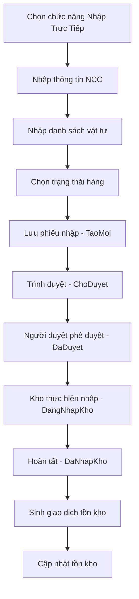

# UC-01: Nhập Kho Stock Đợi Bán (Stock For Sale)

**Version 1.0** – Dùng cho VNS-ERP 2025 & Cursor AI

---

## 1. Giới thiệu

Use Case này mô tả quy trình **Nhập Kho Stock Đợi Bán**, tức là nhập hàng về kho trước khi có đơn bán hoặc trước khi phát sinh nhu cầu xuất kho cho khách hàng. Đây là quy trình phổ biến trong các doanh nghiệp thương mại nhằm duy trì tồn kho tối thiểu, đón đầu nhu cầu hoặc tận dụng giá tốt.

## 2. Mục tiêu (Goal)

- Ghi nhận việc nhập kho không phụ thuộc đơn hàng.
- Tăng tồn kho phục vụ bán hàng.
- Hỗ trợ dự báo và tối ưu vòng quay hàng hóa.
- Cập nhật tồn kho theo thời gian thực theo đúng chuẩn VNS-ERP 2025.

## 3. Actors (Tác nhân)

| Actor | Vai trò |
|-------|---------|
| Kho Thủ | Thực hiện nhập hàng, kiểm đếm số lượng |
| Bộ phận Mua hàng | Tạo yêu cầu mua hoặc thực hiện mua trực tiếp |
| Hệ thống VNS-ERP | Kiểm tra hợp lệ, sinh chứng từ, cập nhật tồn kho |

## 4. Phạm vi áp dụng (Scope)

- Nhập hàng dạng thương mại không gắn với PO khách.
- Có hoặc không có PO Nhà Cung Cấp.
- Hình thức nhập: **Nhập trực tiếp**.

## 5. Mapping với Enum hệ thống

| Chức năng | Enum |
|-----------|------|
| Loại nhập kho | `LoaiNhapKhoEnum.ThuongMai` |
| Phương thức nhập | `PhuongThucNhapKhoEnum.NhapTrucTiep` |
| Trạng thái phiếu nhập | `TaoMoi` → `ChoDuyet` → `DaDuyet` → `DangNhapKho` → `DaNhapKho` |
| Giao dịch tồn kho | `LoaiGiaoDichTonKhoEnum.NhapKho` |
| Trạng thái hàng | `BinhThuong` / `BiLoi` / `CachLy` |

## 6. Preconditions (Tiền điều kiện)

- Người dùng có quyền nhập kho.
- Kho đã được định nghĩa trong hệ thống.
- Danh mục vật tư, đơn vị tính, nhà cung cấp (nếu có) đã tồn tại.

## 7. Postconditions (Hậu điều kiện)

- Phiếu nhập được tạo và lưu trữ.
- Tồn kho tăng theo đúng số lượng nhập.
- Sinh nhật ký tồn kho (Inventory Transaction).
- Lưu Log/Audit đầy đủ.

## 8. Main Flow (Luồng chính)

| Bước | Mô tả |
|------|-------|
| 1 | Kho Thủ chọn chức năng Nhập Kho Stock Đợi Bán |
| 2 | Chọn phương thức: `NhapTrucTiep` |
| 3 | Nhập thông tin NCC (tùy chọn), người giao, hóa đơn, số chứng từ |
| 4 | Nhập chi tiết vật tư: mã hàng, số lượng, đơn giá (tùy config) |
| 5 | Chọn tình trạng hàng: `BinhThuong` / `BiLoi` / `CachLy` |
| 6 | Hệ thống tính toán tồn tăng tạm thời |
| 7 | Lưu phiếu nhập → trạng thái: `TaoMoi` |
| 8 | Trình duyệt → `ChoDuyet` |
| 9 | Người duyệt xác nhận → `DaDuyet` |
| 10 | Kho thực hiện nhập vật lý → `DangNhapKho` → `DaNhapKho` |
| 11 | Hệ thống sinh giao dịch tồn kho: `NhapKho` |
| 12 | Cập nhật StockBalance |

## 9. Alternate Flow (Luồng thay thế)

### A1. Nhập hàng lỗi

- Người dùng chọn trạng thái hàng: `BiLoi`.
- Hệ thống yêu cầu chọn kho cách ly hoặc khu vực lỗi.

### A2. Hàng cách ly chờ kiểm tra

- Chọn trạng thái: `CachLy`.
- Yêu cầu nhập ghi chú.

### A3. Không nhập được vì thiếu quyền

- Hệ thống hiển thị thông báo lỗi phân quyền.

### A4. Thiếu danh mục vật tư

- Hệ thống báo lỗi: "Vật tư chưa tồn tại trong danh mục".

## 10. Business Rules (Quy tắc nghiệp vụ)

| Mã | Mô tả |
|----|-------|
| **BR1** | Không được nhập số lượng âm |
| **BR2** | Nếu hàng quản lý theo lô → bắt buộc nhập Batch/LOT |
| **BR3** | Nếu trạng thái hàng == `BiLoi` → kho phải là kho cách ly |
| **BR4** | Transaction phải bất biến: mọi thay đổi phải qua chứng từ mới |
| **BR5** | Người nhập phải có quyền tại Kho tương ứng |

## 11. Activity Diagram

## 12. Dữ liệu đầu vào (Input Model)

- Mã vật tư
- Số lượng
- Đơn vị tính
- Nhà cung cấp (optional)
- Trạng thái hàng
- Ghi chú

## 13. Dữ liệu đầu ra (Output Model)

- Số phiếu nhập (GR Number)
- Trạng thái phiếu nhập
- InventoryTransactionId
- Tồn kho cập nhật

## 14. Ghi chú cho Cursor AI

- Use Case này **KHÔNG** liên quan `SalesOrderId`.
- `POId` là optional.
- Giao dịch tồn kho luôn là `NhapKho`.
- Không yêu cầu đối chiếu số lượng PO.

---

*End of Document*
