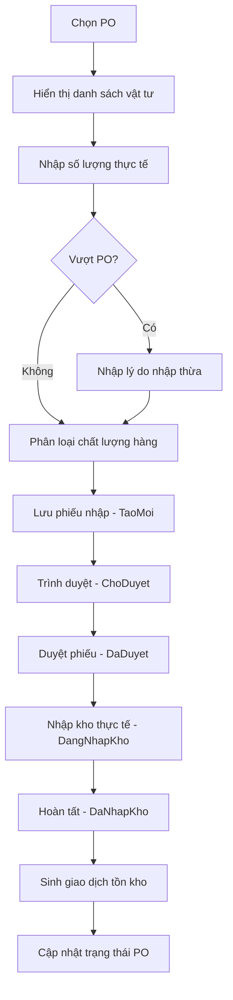

# UC-02: Nhập Kho Theo PO Nhà Cung Cấp (PO NCC)

**Version 1.0** – Dùng cho VNS-ERP 2025 & Cursor AI

---

## 1. Giới thiệu

Use Case này mô tả quy trình **Nhập Kho theo PO Nhà Cung Cấp** (Purchase Order – NCC). Đây là quy trình nhập kho chuẩn, phổ biến nhất trong doanh nghiệp thương mại và là nền tảng của module Inventory trong VNS-ERP 2025.

Quy trình này đảm bảo:

- Kiểm soát số lượng đặt – nhận – còn lại.
- Theo dõi trạng thái đơn mua.
- Đảm bảo nhập kho đúng hàng, đúng giá, đúng nhà cung cấp.

## 2. Mục tiêu (Goal)

- Ghi nhận việc nhập hàng theo đúng đơn mua hàng (PO).
- Đảm bảo sự nhất quán giữa đặt hàng và tồn kho.
- Giảm sai lệch do nhập thừa/thiếu.
- Tự động cập nhật trạng thái PO.

## 3. Actors (Tác nhân)

| Actor | Vai trò |
|-------|---------|
| Kho Thủ | Kiểm đếm, nhập kho |
| Bộ phận Mua hàng | Tạo & duyệt PO |
| Nhà Cung Cấp | Giao hàng theo PO |
| Hệ thống VNS-ERP | Kiểm tra – đối chiếu – cập nhật tồn – audit |

## 4. Phạm vi áp dụng (Scope)

- Nhập hàng thương mại theo PO đã được duyệt.
- Áp dụng cho các doanh nghiệp có quy trình mua hàng chuẩn hóa.
- Là Use Case trung tâm liên kết **Purchasing ↔ Inventory**.

## 5. Mapping với Enum hệ thống

| Chức năng | Enum |
|-----------|------|
| Loại nhập kho | `LoaiNhapKhoEnum.ThuongMai` |
| Phương thức nhập | `PhuongThucNhapKhoEnum.NhapTuDonHang` |
| Trạng thái phiếu nhập | `TaoMoi` → `ChoDuyet` → `DaDuyet` → `DangNhapKho` → `DaNhapKho` |
| Tình trạng hàng | `BinhThuong` / `BiLoi` / `CachLy` / `ChoTraNhaCungCap` |
| Trạng thái PO NCC | `DaGui`, `DaDuyet`, `DaNhanMotPhan`, `DaNhanDu` |
| Giao dịch tồn kho | `LoaiGiaoDichTonKhoEnum.NhapKho` |

## 6. Preconditions (Tiền điều kiện)

- PO đã được duyệt (`TrangThaiPOEnum.DaDuyet` hoặc `DaGui`).
- Người dùng có quyền nhập kho theo PO.
- Danh mục vật tư, PO Detail đầy đủ.
- Kho đã được định nghĩa.

## 7. Postconditions (Hậu điều kiện)

- Phiếu nhập được tạo và duyệt.
- Tồn kho tăng.
- PO cập nhật trạng thái: `DaNhanMotPhan` hoặc `DaNhanDu`.
- Sinh giao dịch tồn kho (Inventory Transaction).
- Lưu Log/Audit đầy đủ.

## 8. Main Flow (Luồng chính)

| Bước | Mô tả |
|------|-------|
| 1 | Kho Thủ mở chức năng Nhập kho theo PO NCC |
| 2 | Chọn PO → hệ thống hiển thị danh sách vật tư và số lượng PO |
| 3 | Kho kiểm đếm số lượng hàng thực tế NCC giao |
| 4 | Nhập số lượng thực nhận cho từng item |
| 5 | Nếu nhập thừa → hệ thống yêu cầu chọn `LyDoNhapThuaEnum` |
| 6 | Chọn tình trạng hàng (Bình thường, Lỗi, Cách ly…) |
| 7 | Lưu phiếu nhập → trạng thái `TaoMoi` |
| 8 | Trình duyệt → chuyển `ChoDuyet` |
| 9 | Người duyệt xác nhận → phiếu `DaDuyet` |
| 10 | Kho thực hiện nhập kho vật lý → `DangNhapKho` |
| 11 | Hoàn tất nhập kho → `DaNhapKho` |
| 12 | Hệ thống sinh giao dịch tồn kho: `NhapKho` |
| 13 | Cập nhật trạng thái PO |

## 9. Alternate Flow (Luồng thay thế)

### A1. Nhập thiếu so với PO

- Hệ thống cho phép lưu.
- PO chuyển `DaNhanMotPhan`.

### A2. Nhập thừa so với PO

- Yêu cầu chọn lý do: `LyDoNhapThuaEnum`.
- Có thể yêu cầu phê duyệt Over-Receive.

### A3. Hàng lỗi hoặc hư hỏng

- Chọn trạng thái: `BiLoi` hoặc `CachLy`.
- Cho phép nhập vào kho cách ly.

### A4. PO bị hủy

- Nếu PO == `DaHuy` → hệ thống chặn thao tác.

### A5. PO chưa duyệt

- Nếu PO == `TaoMoi` hoặc `ChoDuyet` → **BLOCK**.

## 10. Business Rules (Quy tắc nghiệp vụ)

| Mã | Mô tả |
|----|-------|
| **BR1** | Không cho nhập nếu PO chưa duyệt |
| **BR2** | Nếu nhập thừa → yêu cầu lý do và quyền OverReceive |
| **BR3** | Nếu vật tư quản lý theo lô → bắt buộc nhập Batch/LOT |
| **BR4** | Tất cả transactions phải bất biến |
| **BR5** | Không được nhập nhiều hơn PO trừ khi được duyệt |
| **BR6** | Hàng lỗi phải nhập vào kho cách ly |

## 11. Activity Diagram

## 12. Dữ liệu đầu vào (Input Model)

- `POId`
- `ItemId`
- `QuantityOrdered`
- `QuantityReceived`
- Batch/LOT (nếu có)
- Tình trạng hàng
- Lý do nhập thừa (optional)
- Kho nhận

## 13. Dữ liệu đầu ra (Output Model)

- GoodsReceiptId (GR)
- Trạng thái phiếu nhập
- InventoryTransactionId
- PO status updated
- Tồn kho cập nhật

## 14. Ghi chú cho Cursor AI

- **PO là trung tâm** → GoodsReceipt luôn phải có `POId`.
- Khi ghi nhận nhập kho, hệ thống phải cập nhật `QuantityReceived` của PO.
- Khi `QuantityReceived == QuantityOrdered` → PO → `DaNhanDu`.
- Giao dịch tồn kho luôn là `NhapKho`.
- Over-Receive yêu cầu xử lý logic quyền & lý do.

---

*End of Document*
