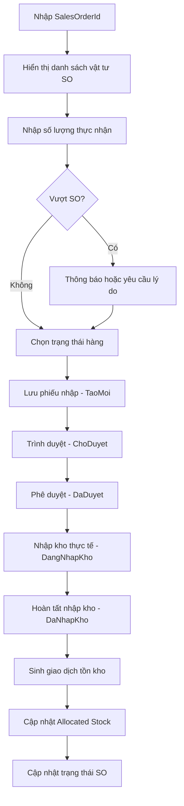

# UC-03: Nhập Kho Theo Đơn Đặt Hàng Khách (Sales Order / Customer PO)

**Version 1.0** – Dùng cho VNS-ERP 2025 & Cursor AI

---

## 1. Giới thiệu

Use Case này mô tả quy trình **Nhập Kho theo Đơn Đặt Hàng Khách** (Sales Order / Customer PO). Đây là nghiệp vụ quan trọng trong doanh nghiệp thương mại theo mô hình **Buy-to-Order**: khách đặt hàng trước → VNS nhập hàng về để phục vụ đơn hàng đó.

Quy trình này đảm bảo:

- Nhập hàng đúng theo số lượng khách đặt.
- Tránh nhập dư (trừ khi có phê duyệt).
- Quản lý tồn kho dạng **Allocated Stock** dành riêng cho đơn hàng.
- Kết nối chặt chẽ giữa phân hệ **Sales → Purchasing → Inventory**.

## 2. Mục tiêu (Goal)

- Nhập hàng về để phục vụ đơn đặt hàng khách hàng (SO).
- Đảm bảo đúng số lượng/đúng chủng loại theo SO.
- Liên kết dữ liệu giữa **SO ↔ PO NCC** (nếu có) ↔ **Inventory**.
- Cập nhật tồn kho dạng dành riêng cho đơn khách.

## 3. Actors (Tác nhân)

| Actor | Vai trò |
|-------|---------|
| Kho Thủ | Kiểm hàng và nhập kho |
| Bộ phận Kinh doanh | Tạo và duyệt Sales Order |
| Bộ phận Mua hàng | Tạo PO NCC tương ứng nếu cần |
| Nhà Cung Cấp | Giao hàng |
| Hệ thống VNS-ERP | Kiểm tra – liên kết – cập nhật tồn – audit |

## 4. Phạm vi áp dụng (Scope)

- Áp dụng khi khách hàng đặt đơn hàng trước.
- Có thể nhập qua PO NCC hoặc nhập trực tiếp.
- Dùng cho mô hình phân bổ tồn: **Allocated Stock**.

## 5. Mapping với Enum hệ thống

| Chức năng | Enum |
|-----------|------|
| Loại nhập kho | `LoaiNhapKhoEnum.ThuongMai` |
| Phương thức nhập | `PhuongThucNhapKhoEnum.NhapTheoDonKhachHang` (đề xuất) |
| Trạng thái phiếu nhập | `TaoMoi` → `ChoDuyet` → `DaDuyet` → `DangNhapKho` → `DaNhapKho` |
| Tình trạng hàng | `BinhThuong` / `BiLoi` / `CachLy` |
| Trạng thái Sales Order | `DaDuyet` → nhập được |
| Giao dịch tồn kho | `LoaiGiaoDichTonKhoEnum.NhapKho` |

## 6. Preconditions (Tiền điều kiện)

- SO (Sales Order) đã được duyệt (`DaDuyet`).
- Người dùng có quyền nhập kho theo đơn khách.
- Nếu nhập qua PO NCC → PO phải ở trạng thái `DaDuyet` hoặc `DaGui`.
- Danh mục vật tư trong SO phải tồn tại.
- SO có `QuantityOrdered` hợp lệ.

## 7. Postconditions (Hậu điều kiện)

- Phiếu nhập được tạo và liên kết `SalesOrderId`.
- Tồn kho cập nhật theo hai dạng:
  - **OnHand** (nếu cấu hình kho cho phép)
  - **AllocatedStock** (dành riêng cho SO)
- Hệ thống sinh giao dịch tồn kho.
- SO cập nhật trạng thái:
  - `DaNhapMotPhan`
  - `SanSangXuatKho`
- Audit log đầy đủ.

## 8. Main Flow (Luồng chính)

| Bước | Mô tả |
|------|-------|
| 1 | Kho Thủ chọn chức năng Nhập hàng theo đơn đặt hàng khách |
| 2 | Người dùng nhập hoặc chọn `SalesOrderId` |
| 3 | Hệ thống tải danh sách vật tư từ SO |
| 4 | Kho kiểm đếm hàng NCC giao |
| 5 | Nhập số lượng thực nhận |
| 6 | Nếu nhập thừa → hệ thống chặn hoặc yêu cầu lý do (theo cấu hình) |
| 7 | Chọn tình trạng hàng (Bình thường / Lỗi / Cách ly) |
| 8 | Lưu phiếu nhập → `TaoMoi` |
| 9 | Trình duyệt → `ChoDuyet` |
| 10 | Người duyệt xác nhận → `DaDuyet` |
| 11 | Thực hiện nhập kho vật lý → `DangNhapKho` |
| 12 | Hoàn tất nhập kho → `DaNhapKho` |
| 13 | Hệ thống sinh giao dịch `NhapKho` |
| 14 | Cập nhật tồn kho dạng `AllocatedStock` |
| 15 | Cập nhật trạng thái SO |

## 9. Alternate Flow (Luồng thay thế)

### A1. Nhập thiếu so với SO

- Phiếu nhập vẫn tạo.
- SO chuyển trạng thái: `DaNhapMotPhan`.

### A2. Nhập thừa so với SO

- Hệ thống chặn (theo mặc định).
- Hoặc yêu cầu lý do (nếu bật Over-Receive SO).

### A3. Hàng không trùng khớp SO

- Hệ thống báo lỗi: Item không thuộc Sales Order.

### A4. SO chưa duyệt

- **BLOCK** thao tác.

### A5. Hàng lỗi/chờ kiểm định

- Gán trạng thái: `BiLoi` hoặc `CachLy`.
- Hệ thống đề xuất nhập kho cách ly.

## 10. Business Rules (Quy tắc nghiệp vụ)

| Mã | Mô tả |
|----|-------|
| **BR1** | Không cho nhập nếu SO chưa duyệt |
| **BR2** | Không cho nhập thừa số lượng SO trừ khi được phê duyệt |
| **BR3** | Nếu item quản lý theo lô → bắt buộc nhập Batch/LOT |
| **BR4** | Tồn nhập vào có thể là AllocatedStock tùy cấu hình |
| **BR5** | Mỗi phiếu nhập phải gắn 1 `SalesOrderId` hợp lệ |
| **BR6** | Không được nhập item không nằm trong SO |

## 11. Activity Diagram

## 12. Dữ liệu đầu vào (Input Model)

- `SalesOrderId`
- `ItemId`
- `QuantityOrdered`
- `QuantityReceived`
- Batch/LOT
- `WarehouseId`
- Tình trạng hàng

## 13. Dữ liệu đầu ra (Output Model)

- GoodsReceiptId (GR)
- `SalesOrderId` linked
- AllocatedStock updated
- InventoryTransactionId
- Trạng thái SO cập nhật

## 14. Ghi chú cho Cursor AI

- Phiếu nhập **bắt buộc** phải gắn với `SalesOrderId`.
- Có thể có hoặc không có PO NCC.
- Logic cập nhật tồn kho gồm 2 loại:
  - **OnHand**
  - **AllocatedStock**
- Không được nhập item ngoài SO.
- Không được nhập thừa (trừ khi bật Over-Receive SO).

---

*End of Document*
