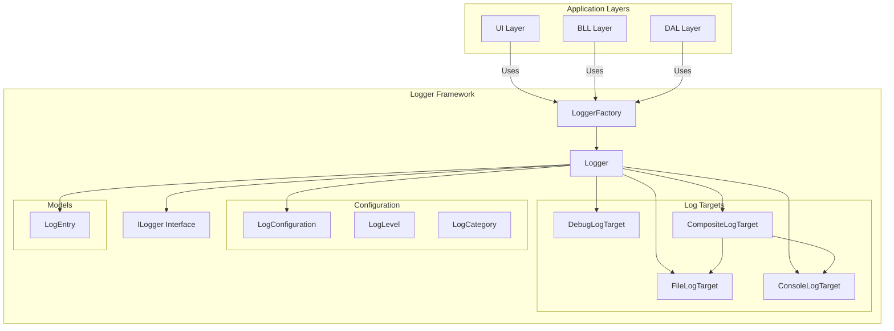
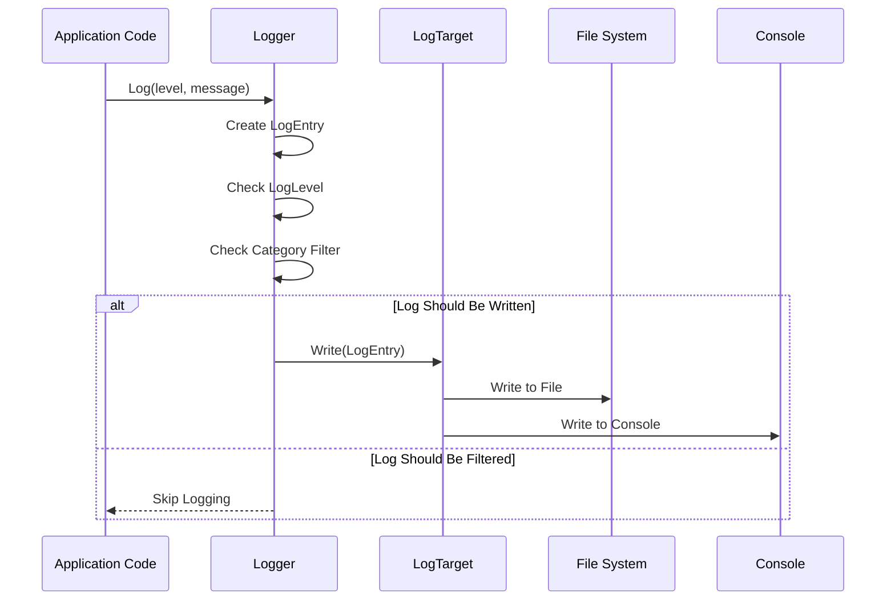
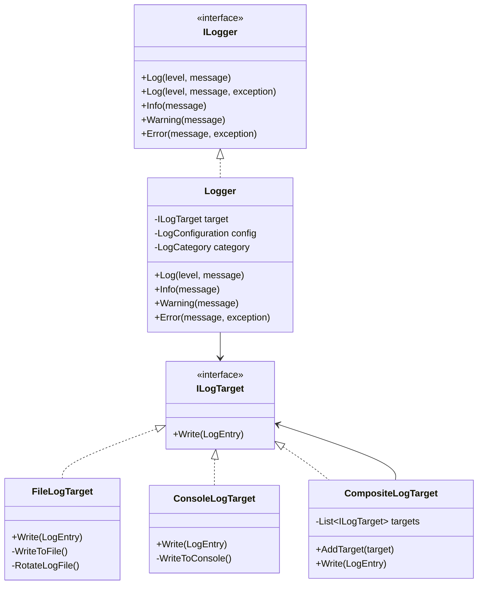

# Logger - Logging Framework

## Tên Project & Mô Tả Ngắn

**Logger** là **Logging Framework** (Framework Ghi Log) của hệ thống VNS ERP 2025. Project này cung cấp hệ thống logging linh hoạt và mạnh mẽ cho toàn bộ ứng dụng, bao gồm:

- **Multiple Log Targets**: Hỗ trợ ghi log ra file, console, debug output
- **Log Levels**: Trace, Debug, Info, Warning, Error, Fatal
- **Log Categories**: Phân loại log theo module/layer (UI, BLL, DAL, Security, etc.)
- **Thread-Safe**: Đảm bảo thread safety cho logging operations
- **Configurable**: Cấu hình linh hoạt thông qua App.config hoặc code
- **Performance Logging**: Hỗ trợ logging performance metrics
- **Extension Methods**: Các extension methods tiện ích cho logging

Project này là một **Class Library (.dll)** được sử dụng bởi tất cả các layer khác (UI, BLL, DAL) để ghi log các hoạt động và sự kiện trong hệ thống.

---

## Giới Thiệu

### Mục Đích Của Logger Framework

Logger Framework được thiết kế để:

- **Centralized Logging**: Tập trung hóa việc ghi log trong toàn hệ thống
- **Flexible Configuration**: Cấu hình linh hoạt theo môi trường (Dev, Test, Production)
- **Multiple Targets**: Hỗ trợ nhiều target logging (File, Console, Debug)
- **Performance Monitoring**: Theo dõi performance của các operations
- **Audit Trail**: Ghi nhận các thao tác quan trọng cho audit
- **Troubleshooting**: Hỗ trợ debug và troubleshooting khi có lỗi

### Vấn Đề Được Giải Quyết

- **Inconsistent Logging**: Đảm bảo logging nhất quán trong toàn hệ thống
- **Debugging Difficulties**: Dễ dàng debug và troubleshoot với logs chi tiết
- **Performance Monitoring**: Theo dõi performance của các operations
- **Audit Requirements**: Đáp ứng yêu cầu audit trail cho enterprise system

### Phạm Vi Sử Dụng

- **Loại Project**: Class Library (.dll)
- **Target Framework**: .NET Framework 4.8
- **Dependencies**: Common project
- **Usage**: Được sử dụng bởi UI, BLL, DAL và các module khác

---

## Tính Năng Chính

### Log Targets

#### **FileLogTarget**
- Ghi log ra file theo ngày
- Log rotation tự động khi file đạt kích thước tối đa
- Giữ lại số lượng file log cũ theo cấu hình
- Thread-safe file writing
- Format log với timestamp, level, category, thread ID

#### **ConsoleLogTarget**
- Hiển thị log real-time trên console
- Color coding theo log level
- Có thể bật/tắt theo cấu hình
- Format tùy chỉnh

#### **DebugLogTarget**
- Ghi log ra Debug output window
- Hữu ích cho development và debugging
- Không ảnh hưởng đến production

#### **CompositeLogTarget**
- Kết hợp nhiều log targets
- Ghi log đồng thời vào nhiều target
- Linh hoạt trong việc cấu hình

### Log Levels

- **Trace**: Chi tiết nhất, dùng cho debugging sâu
- **Debug**: Thông tin debug, dùng cho development
- **Info**: Thông tin chung về hoạt động hệ thống
- **Warning**: Cảnh báo, có thể gây vấn đề nhưng không nghiêm trọng
- **Error**: Lỗi xảy ra nhưng hệ thống vẫn hoạt động
- **Fatal**: Lỗi nghiêm trọng, có thể làm hệ thống dừng hoạt động

### Log Categories

- **UI**: User Interface layer
- **BLL**: Business Logic Layer
- **DAL**: Data Access Layer
- **Security**: Security và authentication
- **Configuration**: Cấu hình hệ thống
- **Database**: Database operations
- **Authentication**: Xác thực người dùng
- **Audit**: Audit trail

### Extension Methods

- **Performance Logging**: `LogPerformance()` - Log thời gian thực thi
- **Method Entry/Exit**: `LogMethodEntry()`, `LogMethodExit()` - Log khi vào/ra method
- **Database Operations**: `LogDatabaseOperation()` - Log database operations
- **Security Events**: `LogSecurityEvent()` - Log security events
- **Audit Trail**: `LogAudit()` - Log audit trail
- **Configuration Changes**: `LogConfigChange()` - Log thay đổi cấu hình
- **Structured Logging**: `LogStructured()` - Log với structured data

---

## Kiến Trúc Tổng Thể

### Mô Hình Kiến Trúc Logger



### Luồng Logging



### Cấu Trúc Logger Pattern



---

## Cài Đặt

### Yêu Cầu Hệ Thống

#### **Phần Mềm**
- **Visual Studio**: 2022 Enterprise hoặc Professional
- **.NET Framework**: 4.8 hoặc cao hơn

#### **Dependencies**
- **Common Project**: Shared common components

### Các Bước Thiết Lập

#### **1. Restore NuGet Packages**
```bash
# Trong Visual Studio
Tools → NuGet Package Manager → Restore NuGet Packages
```

#### **2. Build Project**
```bash
# Trong Visual Studio
Build → Build Solution (Ctrl + Shift + B)
```

### Dependencies Configuration

#### **Project References**
```xml
<ProjectReference Include="..\Common\Common.csproj">
  <Project>{68e56ab6-1ada-40de-9edd-0be2b8f35c3a}</Project>
  <Name>Common</Name>
</ProjectReference>
```

#### **System References**
```xml
<Reference Include="System" />
<Reference Include="System.Configuration" />
<Reference Include="System.Core" />
<Reference Include="System.Data" />
<Reference Include="System.Net.Http" />
<Reference Include="System.Xml" />
```

---

## Chạy Dự Án

### Mở Project trong Visual Studio

1. **Mở Solution**: Mở `VnsErp2025.sln`
2. **Locate Logger Project**: Tìm project `Logger` trong Solution Explorer
3. **Set as Startup Project**: (Không cần, vì đây là Class Library)

### Build Project

#### **Build Logger Project**
- **Phím tắt**: Click phải vào project → `Build`
- **Menu**: `Build → Build Logger`
- **Command Line**: `msbuild Logger\Logger.csproj`

---

## Cấu Hình Môi Trường

### App.config

File `App.config` trong project sử dụng Logger có thể chứa:

```xml
<?xml version="1.0" encoding="utf-8"?>
<configuration>
  <appSettings>
    <!-- Logging Configuration -->
    <add key="Logging.MinimumLevel" value="Info" />
    <add key="Logging.EnableConsole" value="true" />
    <add key="Logging.EnableFile" value="true" />
    <add key="Logging.LogDirectory" value="Logs" />
    <add key="Logging.LogFilePattern" value="VnsErp2025_{date}.log" />
    <add key="Logging.MaxFileSizeMB" value="10" />
    <add key="Logging.MaxFiles" value="30" />
    <add key="Logging.ShowTimestampOnConsole" value="true" />
    <add key="Logging.ShowCategoryOnConsole" value="true" />
    <add key="Logging.ShowThreadIdOnConsole" value="true" />
  </appSettings>
</configuration>
```

### Cấu Hình Theo Môi Trường

#### **Development**
```xml
<add key="Logging.MinimumLevel" value="Debug" />
<add key="Logging.EnableConsole" value="true" />
<add key="Logging.EnableFile" value="true" />
```

#### **Test**
```xml
<add key="Logging.MinimumLevel" value="Info" />
<add key="Logging.EnableConsole" value="false" />
<add key="Logging.EnableFile" value="true" />
```

#### **Production**
```xml
<add key="Logging.MinimumLevel" value="Warning" />
<add key="Logging.EnableConsole" value="false" />
<add key="Logging.EnableFile" value="true" />
```

### Programmatic Configuration

```csharp
// Tạo cấu hình programmatically
var config = new LogConfiguration
{
    MinimumLevel = LogLevel.Info,
    EnableConsole = true,
    EnableFile = true,
    LogDirectory = "Logs",
    LogFilePattern = "VnsErp2025_{date}.log",
    MaxFileSizeMB = 10,
    MaxFiles = 30,
    ShowTimestampOnConsole = true,
    ShowCategoryOnConsole = true,
    ShowThreadIdOnConsole = true
};

// Tạo logger với cấu hình tùy chỉnh
var logger = LoggerFactory.CreateLogger(config, LogCategory.BLL);
```

---

## Cấu Trúc Thư Mục

### Tổng Quan Cấu Trúc

```
Logger/
├── Configuration/                        # Configuration Classes
│   ├── LogCategory.cs                  # Log category enum
│   ├── LogLevel.cs                     # Log level enum
│   ├── LogConfiguration.cs             # Log configuration class
│   └── LogConfigurationData.cs         # Log configuration data
│
├── Interfaces/                          # Interfaces
│   ├── ILogger.cs                      # Logger interface
│   ├── ILogTarget.cs                   # Log target interface
│   └── ILogConfiguration.cs            # Log configuration interface
│
├── Implementations/                     # Implementations
│   ├── Logger.cs                       # Main logger implementation
│   ├── FileLogTarget.cs                # File log target
│   ├── ConsoleLogTarget.cs             # Console log target
│   ├── DebugLogTarget.cs               # Debug log target
│   └── CompositeLogTarget.cs           # Composite log target
│
├── Models/                              # Data Models
│   └── LogEntry.cs                     # Log entry model
│
├── Extensions/                          # Extension Methods
│   └── LoggerExtensions.cs             # Logger extension methods
│
├── Examples/                            # Usage Examples
│   └── LoggerUsageExample.cs           # Example usage code
│
├── Properties/                          # Project Properties
│   └── AssemblyInfo.cs
│
├── LoggerFactory.cs                     # Logger factory
└── Logger.csproj                        # Project File
```

### Vai Trò Của Từng Thư Mục

#### **Configuration/**
- **Vai trò**: Cấu hình logging
- **Trách nhiệm**:
  - Định nghĩa log levels và categories
  - Quản lý cấu hình logging
  - Load cấu hình từ App.config

#### **Interfaces/**
- **Vai trò**: Định nghĩa contracts
- **Trách nhiệm**:
  - ILogger: Contract cho logger
  - ILogTarget: Contract cho log targets
  - ILogConfiguration: Contract cho configuration

#### **Implementations/**
- **Vai trò**: Implementations của logger và targets
- **Trách nhiệm**:
  - Logger: Main logger implementation
  - FileLogTarget: Ghi log ra file
  - ConsoleLogTarget: Ghi log ra console
  - DebugLogTarget: Ghi log ra debug output
  - CompositeLogTarget: Kết hợp nhiều targets

#### **Models/**
- **Vai trò**: Data models
- **Trách nhiệm**:
  - LogEntry: Model cho log entry

#### **Extensions/**
- **Vai trò**: Extension methods
- **Trách nhiệm**:
  - Các extension methods tiện ích cho logging

#### **Examples/**
- **Vai trò**: Usage examples
- **Trách nhiệm**:
  - Ví dụ sử dụng logger

---

## Hướng Dẫn Sử Dụng

### Basic Usage

#### **Tạo Logger**
```csharp
// Tạo logger với category mặc định
var logger = LoggerFactory.CreateLogger();

// Tạo logger với category cụ thể
var uiLogger = LoggerFactory.CreateLogger(LogCategory.UI);
var bllLogger = LoggerFactory.CreateLogger(LogCategory.BLL);
var dalLogger = LoggerFactory.CreateLogger(LogCategory.DAL);
```

#### **Ghi Log Cơ Bản**
```csharp
var logger = LoggerFactory.CreateLogger(LogCategory.BLL);

// Log với các level khác nhau
logger.Trace("Trace message - chi tiết nhất");
logger.Debug("Debug message - thông tin debug");
logger.Info("Info message - thông tin chung");
logger.Warning("Warning message - cảnh báo");
logger.Error("Error message - lỗi");
logger.Fatal("Fatal message - lỗi nghiêm trọng");
```

#### **Log với Exception**
```csharp
var logger = LoggerFactory.CreateLogger(LogCategory.DAL);

try
{
    // Database operation
    var result = _repository.GetById(id);
}
catch (Exception ex)
{
    logger.Error("Lỗi khi lấy dữ liệu từ database", ex);
}
```

### Advanced Usage

#### **Performance Logging**
```csharp
var logger = LoggerFactory.CreateLogger(LogCategory.BLL);

// Log performance với Action
logger.LogPerformance("Load user data", () =>
{
    // Load data logic
    var users = _service.GetAllUsers();
});

// Log performance với Func<T>
var result = logger.LogPerformance("Calculate total", () =>
{
    return CalculateTotal();
});
```

#### **Method Entry/Exit Logging**
```csharp
var logger = LoggerFactory.CreateLogger(LogCategory.BLL);

public void ProcessOrder(OrderDto order)
{
    logger.LogMethodEntry("ProcessOrder", order);
    
    try
    {
        // Process order logic
        var result = ProcessOrderInternal(order);
        
        logger.LogMethodExit("ProcessOrder", result);
        return result;
    }
    catch (Exception ex)
    {
        logger.Error("Lỗi khi xử lý đơn hàng", ex);
        throw;
    }
}
```

#### **Database Operation Logging**
```csharp
var logger = LoggerFactory.CreateLogger(LogCategory.DAL);

logger.LogDatabaseOperation("SELECT", "SELECT * FROM Users WHERE Id = @Id", new { Id = userId });
```

#### **Security Event Logging**
```csharp
var securityLogger = LoggerFactory.CreateLogger(LogCategory.Security);

securityLogger.LogSecurityEvent("Login Attempt", $"User: {username}, IP: {ipAddress}");
securityLogger.LogSecurityEvent("Login Success", $"User: {username}");
securityLogger.LogSecurityEvent("Login Failed", $"User: {username}, Reason: Invalid password");
```

#### **Audit Trail Logging**
```csharp
var auditLogger = LoggerFactory.CreateLogger(LogCategory.Audit);

// Log CREATE operation
auditLogger.LogAudit("CREATE", "User", userId.ToString(), currentUser);

// Log UPDATE operation
auditLogger.LogAudit("UPDATE", "Company", companyId.ToString(), currentUser, oldValue, newValue);

// Log DELETE operation
auditLogger.LogAudit("DELETE", "Product", productId.ToString(), currentUser);
```

#### **Configuration Change Logging**
```csharp
var logger = LoggerFactory.CreateLogger(LogCategory.Configuration);

logger.LogConfigChange("Database.ConnectionString", oldConnectionString, newConnectionString);
```

#### **Structured Logging**
```csharp
var logger = LoggerFactory.CreateLogger(LogCategory.BLL);

var data = new
{
    UserId = 123,
    UserName = "admin",
    Action = "Create",
    Entity = "Company"
};

logger.LogStructured(LogLevel.Info, "User action performed", data);
```

### Sử Dụng Composite Target

```csharp
// Tạo composite target với nhiều targets
var fileTarget = new FileLogTarget(config);
var consoleTarget = new ConsoleLogTarget(config);
var debugTarget = new DebugLogTarget(config);

var compositeTarget = new CompositeLogTarget();
compositeTarget.AddTarget(fileTarget);
compositeTarget.AddTarget(consoleTarget);
compositeTarget.AddTarget(debugTarget);

// Tạo logger với composite target
var logger = new Logger(compositeTarget, config, LogCategory.BLL);
```

---

## Hướng Dẫn Đóng Góp Phát Triển

### Quy Ước Coding

#### **Naming Conventions**
- **Logger Classes**: `{Purpose}Logger` hoặc `Logger` (ví dụ: `Logger`, `FileLogTarget`)
- **Interfaces**: `I{Name}` (ví dụ: `ILogger`, `ILogTarget`)
- **Methods**: PascalCase (ví dụ: `Log()`, `LogPerformance()`, `Write()`)
- **Log Levels**: PascalCase (ví dụ: `Trace`, `Debug`, `Info`, `Warning`, `Error`, `Fatal`)

#### **Code Organization**
```csharp
#region Fields & Properties
private readonly ILogTarget _target;
private readonly LogConfiguration _config;
#endregion

#region Constructors
public Logger(ILogTarget target, LogConfiguration config, LogCategory category)
{
    // Implementation
}
#endregion

#region Public Methods
// Public methods here
#endregion

#region Private Methods
// Private methods here
#endregion
```

#### **XML Documentation**
```csharp
/// <summary>
/// Ghi log với level và message
/// </summary>
/// <param name="level">Log level</param>
/// <param name="message">Log message</param>
public void Log(LogLevel level, string message)
{
    // Implementation
}
```

### Quy Tắc Phân Tầng

#### **Được Phép**
- ✅ Chứa logging logic và implementations
- ✅ Sử dụng Common utilities
- ✅ Cấu hình thông qua App.config
- ✅ Extension methods cho tiện ích

#### **KHÔNG Được Phép**
- ❌ Chứa business logic
- ❌ Truy cập database trực tiếp
- ❌ Phụ thuộc vào BLL hoặc DAL layers
- ❌ Chứa UI-specific code (trừ console output)

### Cách Thêm Log Target Mới An Toàn

#### **Checklist**
1. ✅ Tạo class implement `ILogTarget`
2. ✅ Implement method `Write(LogEntry entry)`
3. ✅ Thêm vào `CompositeLogTarget` nếu cần
4. ✅ Test log target mới
5. ✅ Update documentation

#### **Ví dụ: Tạo Custom Log Target**
```csharp
public class DatabaseLogTarget : ILogTarget
{
    public void Write(LogEntry entry)
    {
        // Write log entry to database
        // Implementation
    }
}
```

### Quy Ước Branch và Commit

#### **Branch Strategy**
- **feature/**: Feature mới (ví dụ: `feature/add-database-log-target`)
- **bugfix/**: Sửa lỗi (ví dụ: `bugfix/fix-file-rotation`)
- **refactor/**: Refactor code (ví dụ: `refactor/optimize-log-writing`)

#### **Commit Message Convention**
Format: `[Type]: [Short Description]`

**Types:**
- `feat`: Thêm log target/feature mới
- `fix`: Sửa lỗi logging
- `refactor`: Refactor code
- `docs`: Cập nhật tài liệu

**Ví dụ:**
```
feat: Thêm DatabaseLogTarget để ghi log vào database
fix: Sửa lỗi file rotation không hoạt động đúng
refactor: Tối ưu FileLogTarget để cải thiện performance
docs: Cập nhật README với hướng dẫn sử dụng CompositeLogTarget
```

---

## Best Practices

### Logging Best Practices

#### **1. Sử Dụng Log Level Phù Hợp**
```csharp
// ✅ ĐÚNG: Sử dụng log level phù hợp
logger.Trace("Chi tiết debug - chỉ dùng khi cần thiết");
logger.Debug("Thông tin debug - dùng trong development");
logger.Info("Thông tin chung - hoạt động bình thường");
logger.Warning("Cảnh báo - có thể gây vấn đề");
logger.Error("Lỗi - cần xử lý", exception);
logger.Fatal("Lỗi nghiêm trọng - hệ thống có thể dừng", exception);

// ❌ SAI: Sử dụng log level không phù hợp
logger.Error("Thông tin bình thường"); // Nên dùng Info
logger.Info("Lỗi nghiêm trọng", exception); // Nên dùng Error hoặc Fatal
```

#### **2. Log với Context**
```csharp
// ✅ ĐÚNG: Log với đầy đủ context
logger.Error($"Lỗi khi lấy user với ID: {userId}, UserName: {userName}", ex);

// ❌ SAI: Log thiếu context
logger.Error("Lỗi", ex); // Không biết lỗi gì, ở đâu
```

#### **3. Exception Logging**
```csharp
// ✅ ĐÚNG: Luôn log exception với message
try
{
    // Operation
}
catch (Exception ex)
{
    logger.Error("Lỗi khi thực hiện operation", ex);
    throw; // Re-throw nếu cần
}

// ❌ SAI: Chỉ log message, không log exception
catch (Exception ex)
{
    logger.Error("Lỗi khi thực hiện operation"); // Thiếu exception details
}
```

#### **4. Performance Logging**
```csharp
// ✅ ĐÚNG: Log performance cho operations quan trọng
logger.LogPerformance("Load large dataset", () =>
{
    return LoadLargeDataset();
});

// ❌ SAI: Log performance cho mọi operation nhỏ
logger.LogPerformance("Simple calculation", () => 1 + 1); // Không cần thiết
```

#### **5. Security và Audit Logging**
```csharp
// ✅ ĐÚNG: Log tất cả security events
var securityLogger = LoggerFactory.CreateLogger(LogCategory.Security);
securityLogger.LogSecurityEvent("Login Attempt", $"User: {username}, IP: {ipAddress}");
securityLogger.LogSecurityEvent("Permission Denied", $"User: {username}, Resource: {resource}");

// ✅ ĐÚNG: Log tất cả audit events
var auditLogger = LoggerFactory.CreateLogger(LogCategory.Audit);
auditLogger.LogAudit("CREATE", "User", userId.ToString(), currentUser);
auditLogger.LogAudit("UPDATE", "Company", companyId.ToString(), currentUser, oldValue, newValue);
```

### Performance Considerations

#### **1. Async Logging (Nếu có)**
```csharp
// Sử dụng async logging cho operations không blocking
await logger.LogAsync(LogLevel.Info, "Async log message");
```

#### **2. Conditional Logging**
```csharp
// Chỉ log khi level được enable
if (logger.IsEnabled(LogLevel.Debug))
{
    logger.Debug(expensiveOperation()); // Chỉ thực hiện khi cần
}
```

#### **3. Structured Logging**
```csharp
// Sử dụng structured logging thay vì string concatenation
// ✅ ĐÚNG
logger.LogStructured(LogLevel.Info, "User created", new { UserId = 123, UserName = "admin" });

// ❌ SAI
logger.Info($"User created - UserId: {123}, UserName: admin"); // String concatenation
```

---

## Troubleshooting

### Log Không Hiển Thị

**Nguyên nhân có thể:**
1. Log level quá cao - kiểm tra `Logging.MinimumLevel` trong App.config
2. Console/File logging bị tắt - kiểm tra `Logging.EnableConsole` và `Logging.EnableFile`
3. Category filter - kiểm tra category có được enable không

**Giải pháp:**
```xml
<!-- Giảm minimum level -->
<add key="Logging.MinimumLevel" value="Debug" />

<!-- Bật console và file logging -->
<add key="Logging.EnableConsole" value="true" />
<add key="Logging.EnableFile" value="true" />
```

### File Log Không Được Tạo

**Nguyên nhân có thể:**
1. Không có quyền ghi thư mục
2. Đường dẫn thư mục không hợp lệ
3. File logging bị tắt

**Giải pháp:**
- Kiểm tra quyền ghi thư mục Logs
- Kiểm tra `Logging.LogDirectory` path
- Đảm bảo `Logging.EnableFile` = true

### Console Không Hiển Thị

**Nguyên nhân có thể:**
1. Console logging bị tắt
2. Ứng dụng không có console window
3. Console output bị redirect

**Giải pháp:**
- Kiểm tra `Logging.EnableConsole` setting
- Đảm bảo ứng dụng có console window (nếu cần)
- Kiểm tra console output redirection

---

## Tài Liệu Liên Quan

- **[Root README](../README.md)**: Tài liệu tổng quan hệ thống
- **[DAL README](../Dal/README.md)**: Tài liệu Data Access Layer
- **[BLL README](../Bll/README.md)**: Tài liệu Business Logic Layer
- **[Common README](../Common/README.md)**: Tài liệu Common components

---

## Liên Hệ & Hỗ Trợ

- **Development Team**: [Thông tin liên hệ]
- **Technical Lead**: [Thông tin liên hệ]

---

**Phiên bản tài liệu**: 1.0  
**Ngày cập nhật**: 27/01/2025  
**Trạng thái**: Đang phát triển

---

*Tài liệu này được tạo và duy trì bởi Development Team. Vui lòng cập nhật tài liệu khi có thay đổi quan trọng trong Logger framework.*
