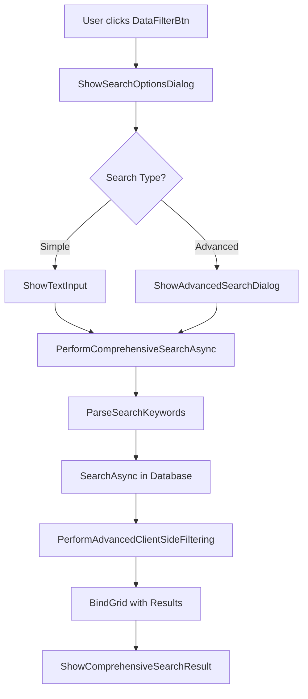

# Comprehensive Search Feature - VNS ERP 2025

## 🎯 **Tổng Quan Chức Năng**

Chức năng **Tìm Kiếm Toàn Diện** cho phép người dùng tìm kiếm dữ liệu trong tất cả các cột của bảng ProductService một cách chuyên nghiệp và hiệu quả.

## 🚀 **Cách Sử Dụng**

### **1. Truy Cập Chức Năng**
- Click vào nút **"Lọc dữ liệu"** trên toolbar
- Hoặc sử dụng phím tắt (nếu được cấu hình)

### **2. Chọn Loại Tìm Kiếm**

#### **🔍 Tìm Kiếm Đơn Giản**
- Nhập một từ khóa duy nhất
- Tìm kiếm trong tất cả các cột
- Kết quả hiển thị ngay lập tức

#### **🔍 Tìm Kiếm Nâng Cao**
- Nhập nhiều từ khóa (mỗi dòng một từ khóa)
- Tất cả từ khóa phải có trong cùng một dòng
- Phù hợp cho tìm kiếm phức tạp

## 📊 **Các Trường Được Tìm Kiếm**

### **Text Fields**
- ✅ **Mã sản phẩm/dịch vụ** (`Code`)
- ✅ **Tên sản phẩm/dịch vụ** (`Name`)
- ✅ **Mô tả** (`Description`)
- ✅ **Tên danh mục** (`CategoryName`)
- ✅ **Loại hiển thị** (`TypeDisplay`)
- ✅ **Trạng thái hiển thị** (`StatusDisplay`)

### **Numeric Fields**
- ✅ **Số lượng biến thể** (`VariantCount`)
- ✅ **Số lượng hình ảnh** (`ImageCount`)

### **Boolean Fields**
- ✅ **Trạng thái hoạt động** (`IsActive`)
- ✅ **Loại sản phẩm/dịch vụ** (`IsService`)

### **ID Fields**
- ✅ **ID sản phẩm** (`Id`)

## 🎯 **Ví Dụ Sử Dụng**

### **Tìm Kiếm Đơn Giản**

#### **Ví dụ 1: Tìm theo tên**
```
Từ khóa: "Laptop"
Kết quả: Tất cả sản phẩm có tên chứa "Laptop"
```

#### **Ví dụ 2: Tìm theo mã**
```
Từ khóa: "SP001"
Kết quả: Sản phẩm có mã "SP001"
```

#### **Ví dụ 3: Tìm theo danh mục**
```
Từ khóa: "Điện tử"
Kết quả: Tất cả sản phẩm trong danh mục "Điện tử"
```

### **Tìm Kiếm Nâng Cao**

#### **Ví dụ 1: Tìm sản phẩm cụ thể**
```
Từ khóa:
Laptop
Dell
Gaming
Kết quả: Sản phẩm có tên chứa "Laptop", "Dell", và "Gaming"
```

#### **Ví dụ 2: Tìm theo loại và trạng thái**
```
Từ khóa:
Sản phẩm
Hoạt động
Kết quả: Tất cả sản phẩm đang hoạt động
```

## 🔧 **Technical Implementation**

### **Architecture**



### **Key Methods**

#### **1. DataFilterBtn_ItemClick**
```csharp
private async void DataFilterBtn_ItemClick(object sender, ItemClickEventArgs e)
{
    // Hiển thị menu tùy chọn tìm kiếm
    var searchOption = ShowSearchOptionsDialog();
    
    // Thực hiện tìm kiếm dựa trên tùy chọn
    await PerformComprehensiveSearchAsync(searchKeyword);
}
```

#### **2. PerformComprehensiveSearchAsync**
```csharp
private async Task PerformComprehensiveSearchAsync(string searchKeyword)
{
    // Phân tích từ khóa
    var searchKeywords = ParseSearchKeywords(searchKeyword);
    
    // Tìm kiếm database
    var searchResults = await _productServiceBll.SearchAsync(primaryKeyword);
    
    // Lọc client-side
    var filteredResults = PerformAdvancedClientSideFiltering(dtoList, searchKeywords);
    
    // Hiển thị kết quả
    BindGrid(filteredResults);
}
```

#### **3. PerformAdvancedClientSideFiltering**
```csharp
private List<ProductServiceDto> PerformAdvancedClientSideFiltering(
    List<ProductServiceDto> dataList, 
    List<string> searchKeywords)
{
    // Tìm kiếm với nhiều từ khóa (tất cả phải match)
    return dataList.Where(dto => 
        searchKeywords.All(keyword => 
            IsKeywordMatch(dto, keyword.ToLower().Trim())
        )
    ).ToList();
}
```

## 🎨 **User Experience Features**

### **1. Professional UI**
- ✅ **InputBoxHelper Integration** - Sử dụng DevExpress Input Box
- ✅ **WaitingForm Display** - Hiển thị loading khi tìm kiếm
- ✅ **Rich Result Messages** - Thông báo kết quả chi tiết với emoji

### **2. Smart Search**
- ✅ **Case Insensitive** - Không phân biệt hoa thường
- ✅ **Trim Whitespace** - Tự động loại bỏ khoảng trắng
- ✅ **Multi-keyword Support** - Hỗ trợ nhiều từ khóa

### **3. Error Handling**
- ✅ **Graceful Degradation** - Xử lý lỗi mượt mà
- ✅ **Fallback Messages** - Thông báo dự phòng
- ✅ **Exception Logging** - Ghi log lỗi chi tiết

### **4. HTML Formatting Implementation**
```csharp
/// <summary>
/// Hiển thị message box với HTML formatting
/// </summary>
private void ShowHtmlMessageBox(string message, string title = "Thông báo", 
    MessageBoxIcon icon = MessageBoxIcon.Information)
{
    try
    {
        DevExpress.XtraEditors.XtraMessageBox.Show(
            message,
            title,
            MessageBoxButtons.OK,
            icon,
            DevExpress.Utils.DefaultBoolean.True // Enable HTML
        );
    }
    catch (Exception ex)
    {
        // Fallback về MsgBox thông thường nếu có lỗi
        MsgBox.ShowInfo(message.Replace("<br/>", "\n").Replace("<b>", "").Replace("</b>", ""));
    }
}
```

#### **HTML Tags Supported:**
- ✅ **`<b>`** - Bold text
- ✅ **`<br/>`** - Line breaks
- ✅ **Emoji support** - 🔍 📝 🔢 📊 🗃️ ✅ ❌ 💡 🎯

## 📈 **Performance Optimization**

### **1. Database Level**
- ✅ **Primary Search** - Tìm kiếm chính trong database
- ✅ **Optimized Queries** - Sử dụng SearchAsync method
- ✅ **Indexed Fields** - Tìm kiếm trên các trường có index

### **2. Client Level**
- ✅ **Client-side Filtering** - Lọc bổ sung phía client
- ✅ **Memory Efficient** - Xử lý dữ liệu trong memory
- ✅ **Lazy Evaluation** - Sử dụng LINQ lazy evaluation

### **3. UI Level**
- ✅ **Async Operations** - Tất cả operations đều async
- ✅ **Non-blocking UI** - UI không bị block
- ✅ **Progress Indication** - Hiển thị tiến trình

## 🧪 **Testing Scenarios**

### **1. Basic Search Tests**
- ✅ **Single Keyword** - Tìm kiếm với 1 từ khóa
- ✅ **Empty Keyword** - Xử lý từ khóa rỗng
- ✅ **Special Characters** - Xử lý ký tự đặc biệt

### **2. Advanced Search Tests**
- ✅ **Multiple Keywords** - Tìm kiếm với nhiều từ khóa
- ✅ **Mixed Case** - Từ khóa có hoa thường
- ✅ **Whitespace Handling** - Xử lý khoảng trắng

### **3. Edge Cases**
- ✅ **No Results** - Không có kết quả
- ✅ **All Results** - Tất cả dữ liệu match
- ✅ **Large Dataset** - Dữ liệu lớn

### **4. Error Handling Tests**
- ✅ **Database Errors** - Lỗi database
- ✅ **Network Issues** - Vấn đề mạng
- ✅ **Invalid Input** - Input không hợp lệ

## 🎯 **Best Practices**

### **1. Search Keywords**
```csharp
// ✅ Tốt: Từ khóa rõ ràng
"Laptop Dell Gaming"

// ✅ Tốt: Nhiều từ khóa
"Laptop
Dell
Gaming"

// ❌ Tránh: Từ khóa quá dài
"Laptop Dell Gaming XPS 15 9520 Intel Core i7 12th Gen"
```

### **2. Performance Tips**
```csharp
// ✅ Tốt: Sử dụng từ khóa ngắn
"Laptop"

// ✅ Tốt: Tìm kiếm theo mã
"SP001"

// ❌ Tránh: Từ khóa quá chung
"a"
```

### **3. Advanced Search**
```csharp
// ✅ Tốt: Kết hợp loại và trạng thái
"Sản phẩm
Hoạt động"

// ✅ Tốt: Tìm kiếm cụ thể
"Laptop
Dell
Gaming"
```

## 🔍 **Troubleshooting**

### **Nếu Không Tìm Thấy Kết Quả:**

1. **Kiểm tra từ khóa:**
   - Đảm bảo từ khóa đúng chính tả
   - Thử từ khóa ngắn hơn
   - Sử dụng từ khóa tiếng Việt không dấu

2. **Kiểm tra dữ liệu:**
   - Đảm bảo có dữ liệu trong database
   - Kiểm tra trạng thái dữ liệu (Active/Inactive)

3. **Kiểm tra tìm kiếm nâng cao:**
   - Đảm bảo tất cả từ khóa đều có trong dữ liệu
   - Thử giảm số lượng từ khóa

### **Nếu Tìm Kiếm Chậm:**

1. **Tối ưu từ khóa:**
   - Sử dụng từ khóa ngắn hơn
   - Tránh từ khóa quá chung

2. **Kiểm tra database:**
   - Đảm bảo có index trên các trường tìm kiếm
   - Kiểm tra performance của database

## 🎉 **Kết Quả**

### **✅ Thành Công**
- **Professional Search Experience** - Trải nghiệm tìm kiếm chuyên nghiệp
- **Comprehensive Coverage** - Tìm kiếm toàn diện tất cả trường
- **Advanced Features** - Tính năng tìm kiếm nâng cao
- **User-friendly Interface** - Giao diện thân thiện

### **🚀 Sẵn Sàng Production**
- **Robust Error Handling** - Xử lý lỗi mạnh mẽ
- **Performance Optimized** - Tối ưu hiệu suất
- **Scalable Architecture** - Kiến trúc có thể mở rộng
- **Maintainable Code** - Code dễ bảo trì

---

**Chức năng Tìm Kiếm Toàn Diện đã được triển khai thành công và sẵn sàng cho production!** 🎯
