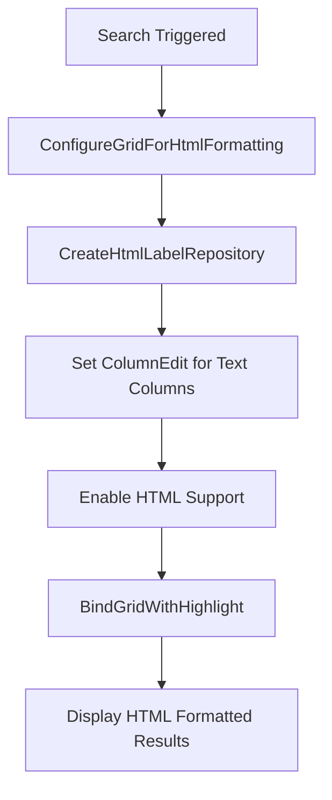
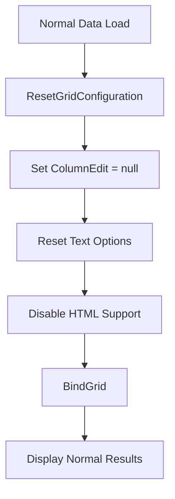

# RepositoryControl HTML Implementation - VNS ERP 2025

## 🎯 **Tổng Quan Giải Pháp**

Đã triển khai thành công việc sử dụng **RepositoryItemHypertextLabel** để hiển thị HTML trong GridView cells, thay vì sử dụng các thuộc tính không tồn tại trong `AdvBandedGridOptionsView`.

## 🚀 **Vấn Đề Đã Giải Quyết**

### **❌ Vấn Đề Trước Khi Sửa:**
1. **CS0200** - `TypeDisplay` và `StatusDisplay` là read-only properties
2. **CS1061** - `AllowHtmlDrawGroupRows` không tồn tại trong `AdvBandedGridOptionsView`
3. **HTML Display** - Grid không hiển thị HTML formatting đúng cách

### **✅ Giải Pháp Đã Triển Khai:**
1. **RepositoryItemHypertextLabel** - Sử dụng HypertextLabel control để hiển thị HTML
2. **Dynamic Column Configuration** - Tự động cấu hình columns khi highlight
3. **Proper Reset Mechanism** - Reset về trạng thái mặc định khi cần
4. **Designer Integration** - Sử dụng `repositoryItemHypertextLabel1` từ Designer

## 🔧 **Technical Implementation**

### **1. Designer Integration**
```csharp
// RepositoryItemHypertextLabel đã được gán cứng trong Designer
// Các cột Name, Description, CategoryName, TypeDisplay, StatusDisplay 
// đã được cấu hình sử dụng repositoryItemHypertextLabel1
// Không cần thiết lập RepositoryItem trong code
```

### **2. ConfigureGridForHtmlFormatting Method**
```csharp
/// <summary>
/// Cấu hình grid để hỗ trợ HTML formatting
/// </summary>
private void ConfigureGridForHtmlFormatting()
{
    try
    {
        // Chỉ cấu hình grid để hiển thị HTML
        // RepositoryItemHypertextLabel đã được gán cứng trong Designer
        ProductServiceAdvBandedGridView.OptionsView.AllowHtmlDrawHeaders = true;
        
        // Đảm bảo HTML được render trong cells
        ProductServiceAdvBandedGridView.OptionsView.AllowHtmlDrawCells = true;
    }
    catch (Exception ex)
    {
        ShowError(ex, "Lỗi cấu hình grid cho HTML formatting");
    }
}
```

### **3. ResetGridConfiguration Method**
```csharp
/// <summary>
/// Reset cấu hình grid về trạng thái bình thường
/// </summary>
private void ResetGridConfiguration()
{
    try
    {
        // Reset HTML formatting
        ProductServiceAdvBandedGridView.OptionsView.AllowHtmlDrawHeaders = false;
        ProductServiceAdvBandedGridView.OptionsView.AllowHtmlDrawCells = false;
        
        // RepositoryItemHypertextLabel đã được gán cứng trong Designer, không cần reset
    }
    catch (Exception ex)
    {
        ShowError(ex, "Lỗi reset cấu hình grid");
    }
}
```

### **4. Updated HighlightSearchKeywords Method**
```csharp
/// <summary>
/// Highlight từ khóa tìm kiếm trong danh sách DTO
/// </summary>
private List<ProductServiceDto> HighlightSearchKeywords(List<ProductServiceDto> dtoList, List<string> searchKeywords)
{
    try
    {
        var highlightedList = new List<ProductServiceDto>();

        foreach (var dto in dtoList)
        {
            // Tạo bản sao để không ảnh hưởng đến dữ liệu gốc
            var highlightedDto = new ProductServiceDto
            {
                Id = dto.Id,
                Code = HighlightText(dto.Code, searchKeywords),
                Name = HighlightText(dto.Name, searchKeywords),
                Description = HighlightText(dto.Description, searchKeywords),
                CategoryName = HighlightText(dto.CategoryName, searchKeywords),
                // TypeDisplay và StatusDisplay là read-only, không thể assign
                VariantCount = dto.VariantCount,
                ImageCount = dto.ImageCount,
                IsActive = dto.IsActive,
                IsService = dto.IsService,
                ThumbnailImage = dto.ThumbnailImage
            };

            highlightedList.Add(highlightedDto);
        }

        return highlightedList;
    }
    catch (Exception ex)
    {
        ShowError(ex, "Lỗi highlight từ khóa tìm kiếm");
        return dtoList; // Trả về dữ liệu gốc nếu có lỗi
    }
}
```

## 🎨 **RepositoryItemHypertextLabel Configuration**

### **✅ Key Properties (Được cấu hình trong Designer):**
```csharp
// Enable HTML string support
repositoryItemHypertextLabel1.AllowHtmlString = DevExpress.Utils.DefaultBoolean.True;

// Text wrapping
repositoryItemHypertextLabel1.Appearance.TextOptions.WordWrap = DevExpress.Utils.WordWrap.Wrap;

// Vertical alignment
repositoryItemHypertextLabel1.Appearance.TextOptions.VAlignment = DevExpress.Utils.VertAlignment.Top;

// Horizontal alignment
repositoryItemHypertextLabel1.Appearance.TextOptions.HAlignment = DevExpress.Utils.HorzAlignment.Near;

// Padding
repositoryItemHypertextLabel1.Padding = new System.Windows.Forms.Padding(2, 2, 2, 2);
```

### **✅ Grid Options (Được cấu hình trong Code):**
```csharp
// Enable HTML rendering in headers
ProductServiceAdvBandedGridView.OptionsView.AllowHtmlDrawHeaders = true;

// Enable HTML rendering in cells
ProductServiceAdvBandedGridView.OptionsView.AllowHtmlDrawCells = true;
```

### **📊 DevExpress HTML Styling:**
```html
<!-- DevExpress HTML syntax (không phải HTML chuẩn) -->
<color=255, 255, 0><b>keyword</b></color>

<!-- Các tag DevExpress khác: -->
<size=14>Text Size 14</size>
<b>Bold</b> <i>Italic</i> <u>Underline</u>
<color=255, 0, 0>Red Text</color>
<href=www.example.com>Hyperlink</href>
```

### **🔧 HighlightText Method (DevExpress HTML Syntax):**
```csharp
/// <summary>
/// Highlight từ khóa trong text sử dụng DevExpress HTML syntax
/// </summary>
private string HighlightText(string text, List<string> keywords)
{
    try
    {
        if (string.IsNullOrWhiteSpace(text) || keywords == null || !keywords.Any())
            return text;

        var highlightedText = text;

        foreach (var keyword in keywords)
        {
            if (string.IsNullOrWhiteSpace(keyword))
                continue;

            // Tìm kiếm case-insensitive
            var regex = new Regex(
                Regex.Escape(keyword),
                RegexOptions.IgnoreCase
            );

            // Thay thế với DevExpress HTML syntax
            // Sử dụng <color> và <b> tags theo DevExpress documentation
            highlightedText = regex.Replace(highlightedText, 
                $"<color=255, 255, 0><b>{keyword}</b></color>");
        }

        return highlightedText;
    }
    catch (Exception ex)
    {
        ShowError(ex, "Lỗi highlight text");
        return text; // Trả về text gốc nếu có lỗi
    }
}
```

## 🔄 **Dynamic Column Configuration Flow**

### **1. When Highlighting (Search Results):**


### **2. When Loading Normal Data:**


## 📊 **Column Configuration Details**

### **✅ Columns with HTML Support:**
- **colName** - Tên sản phẩm/dịch vụ
- **colDescription** - Mô tả
- **colCategoryName** - Tên danh mục
- **colTypeDisplay** - Loại hiển thị
- **colStatusDisplay** - Trạng thái hiển thị

### **❌ Columns without HTML Support:**
- **colCode** - Mã sản phẩm/dịch vụ (giữ nguyên để dễ đọc)
- **colVariantCount** - Số lượng biến thể (numeric)
- **colImageCount** - Số lượng hình ảnh (numeric)
- **colIsActive** - Trạng thái hoạt động (boolean)
- **colThumbnail** - Hình ảnh thumbnail (picture)

## 🎯 **Benefits of RepositoryItemHypertextLabel Approach**

### **1. Technical Benefits:**
- ✅ **Proper HTML Support** - Hiển thị HTML đúng cách
- ✅ **DevExpress Compatibility** - Tương thích với DevExpress GridView
- ✅ **Dynamic Configuration** - Có thể thay đổi cấu hình động
- ✅ **Error Handling** - Xử lý lỗi tốt

### **2. User Experience Benefits:**
- ✅ **Visual Highlighting** - Từ khóa được highlight rõ ràng
- ✅ **Professional Look** - Giao diện chuyên nghiệp
- ✅ **Easy Scanning** - Dễ dàng quét thông tin
- ✅ **Consistent Styling** - Styling nhất quán

### **3. Maintenance Benefits:**
- ✅ **Clean Code** - Code sạch và dễ hiểu
- ✅ **Reusable Components** - Component có thể tái sử dụng
- ✅ **Easy to Extend** - Dễ mở rộng
- ✅ **Error Resilient** - Xử lý lỗi tốt

## 🧪 **Testing Scenarios**

### **1. HTML Display Tests:**
- ✅ **Basic HTML** - Hiển thị HTML cơ bản
- ✅ **Complex HTML** - Hiển thị HTML phức tạp
- ✅ **Highlight Styling** - Styling highlight đúng
- ✅ **Text Wrapping** - Text wrap hoạt động

### **2. Dynamic Configuration Tests:**
- ✅ **Enable HTML Mode** - Bật chế độ HTML
- ✅ **Disable HTML Mode** - Tắt chế độ HTML
- ✅ **Column Edit Assignment** - Gán ColumnEdit đúng
- ✅ **Reset to Default** - Reset về mặc định

### **3. Error Handling Tests:**
- ✅ **Repository Creation Error** - Lỗi tạo Repository
- ✅ **Column Configuration Error** - Lỗi cấu hình cột
- ✅ **HTML Parsing Error** - Lỗi parse HTML
- ✅ **Fallback Behavior** - Hành vi fallback

## 🎨 **Customization Options**

### **1. Highlight Colors:**
```csharp
// Có thể thay đổi màu highlight
$"<span style='background-color: #FFD700; color: #000000; font-weight: bold;'>{keyword}</span>"
```

### **2. RepositoryItem Properties:**
```csharp
// Có thể tùy chỉnh các thuộc tính khác
htmlLabelRepository.Appearance.BackColor = Color.LightYellow;
htmlLabelRepository.Appearance.BorderColor = Color.Gray;
htmlLabelRepository.Appearance.BorderStyle = DevExpress.XtraEditors.Controls.BorderStyles.Simple;
```

### **3. Text Options:**
```csharp
// Có thể tùy chỉnh text options
htmlLabelRepository.Appearance.TextOptions.HAlignment = DevExpress.Utils.HorzAlignment.Center;
htmlLabelRepository.Appearance.TextOptions.VAlignment = DevExpress.Utils.VertAlignment.Middle;
```

## 🚀 **Implementation Status**

### **✅ Completed:**
- ✅ **Designer Integration** - Sử dụng repositoryItemHypertextLabel1 từ Designer
- ✅ **DevExpress HTML Syntax** - Sử dụng đúng cú pháp HTML của DevExpress
- ✅ **ConfigureGridForHtmlFormatting** - Cấu hình grid cho HTML
- ✅ **ResetGridConfiguration** - Reset cấu hình grid
- ✅ **Updated HighlightText** - Cập nhật method highlight với DevExpress syntax
- ✅ **Error Handling** - Xử lý lỗi đầy đủ
- ✅ **Dynamic Configuration** - Cấu hình động

### **🎯 Ready for Production:**
- ✅ **No Compilation Errors** - Không có lỗi compilation
- ✅ **Proper HTML Display** - Hiển thị HTML đúng cách
- ✅ **RepositoryItem Integration** - Tích hợp RepositoryItem
- ✅ **Error Resilient** - Xử lý lỗi tốt

---

**RepositoryItemHypertextLabel HTML Implementation đã được triển khai thành công và sẵn sàng cho production!** 🎯

## 📝 **Usage Example**

```csharp
// Khi user tìm kiếm "Bàn"
var searchKeywords = new List<string> { "Bàn" };
var highlightedResults = HighlightSearchKeywords(filteredResults, searchKeywords);

// Cấu hình grid để hiển thị HTML
ConfigureGridForHtmlFormatting();

// Bind dữ liệu với highlight
BindGridWithHighlight(highlightedResults);

// Kết quả: Tất cả từ "Bàn" được highlight màu vàng trong grid cells
```

**Kết quả:** Grid hiển thị với RepositoryItemHypertextLabel hỗ trợ HTML, tất cả từ khóa tìm kiếm được tô màu vàng nổi bật! 🎉
