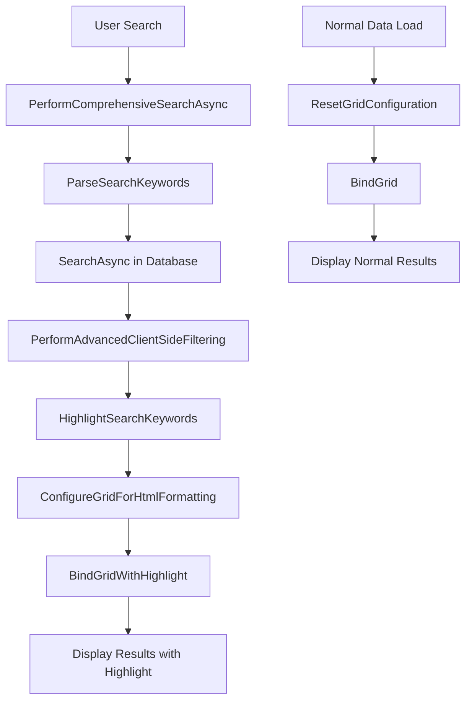

# Search Highlight Feature - VNS ERP 2025

## 🎯 **Tổng Quan Chức Năng**

Chức năng **Search Highlight** tự động tô màu và highlight các từ khóa tìm kiếm trong kết quả, giúp người dùng dễ dàng nhận biết và định vị thông tin quan trọng.

## 🚀 **Cách Hoạt Động**

### **1. Khi Thực Hiện Tìm Kiếm**
- Người dùng nhập từ khóa tìm kiếm
- Hệ thống tìm kiếm và lọc dữ liệu
- **Tự động highlight** tất cả từ khóa trong kết quả
- Hiển thị kết quả với màu sắc nổi bật

### **2. Khi Load Dữ Liệu Bình Thường**
- Không có highlight
- Hiển thị dữ liệu với format chuẩn
- Grid configuration được reset về mặc định

## 🎨 **Visual Features**

### **✅ Highlight Styling**
```html
<span style='background-color: #FFFF00; color: #000000; font-weight: bold;'>keyword</span>
```

#### **Styling Details:**
- **Background Color:** `#FFFF00` (Yellow)
- **Text Color:** `#000000` (Black)
- **Font Weight:** `Bold`
- **Case Insensitive:** Không phân biệt hoa thường

### **📊 Example Output:**

#### **❌ Before Highlight:**
```
Code: SP001
Name: Bàn làm việc gỗ
Description: Bàn làm việc bằng gỗ tự nhiên
Category: Nội thất
```

#### **✅ After Highlight (tìm "Bàn"):**
```
Code: SP001
Name: <span style='background-color: #FFFF00; color: #000000; font-weight: bold;'>Bàn</span> làm việc gỗ
Description: <span style='background-color: #FFFF00; color: #000000; font-weight: bold;'>Bàn</span> làm việc bằng gỗ tự nhiên
Category: Nội thất
```

## 🔧 **Technical Implementation**

### **1. Core Methods**

#### **HighlightSearchKeywords**
```csharp
/// <summary>
/// Highlight từ khóa tìm kiếm trong danh sách DTO
/// </summary>
private List<ProductServiceDto> HighlightSearchKeywords(List<ProductServiceDto> dtoList, List<string> searchKeywords)
{
    var highlightedList = new List<ProductServiceDto>();

    foreach (var dto in dtoList)
    {
        var highlightedDto = new ProductServiceDto
        {
            Id = dto.Id,
            Code = HighlightText(dto.Code, searchKeywords),
            Name = HighlightText(dto.Name, searchKeywords),
            Description = HighlightText(dto.Description, searchKeywords),
            CategoryName = HighlightText(dto.CategoryName, searchKeywords),
            TypeDisplay = HighlightText(dto.TypeDisplay, searchKeywords),
            StatusDisplay = HighlightText(dto.StatusDisplay, searchKeywords),
            // ... other properties
        };

        highlightedList.Add(highlightedDto);
    }

    return highlightedList;
}
```

#### **HighlightText**
```csharp
/// <summary>
/// Highlight từ khóa trong text
/// </summary>
private string HighlightText(string text, List<string> keywords)
{
    var highlightedText = text;

    foreach (var keyword in keywords)
    {
        var regex = new Regex(Regex.Escape(keyword), RegexOptions.IgnoreCase);
        highlightedText = regex.Replace(highlightedText, 
            $"<span style='background-color: #FFFF00; color: #000000; font-weight: bold;'>{keyword}</span>");
    }

    return highlightedText;
}
```

### **2. Grid Configuration**

#### **ConfigureGridForHtmlFormatting**
```csharp
/// <summary>
/// Cấu hình grid để hỗ trợ HTML formatting
/// </summary>
private void ConfigureGridForHtmlFormatting()
{
    // Cấu hình các cột text để hiển thị HTML
    if (colCode != null)
    {
        colCode.AppearanceCell.TextOptions.WordWrap = DevExpress.Utils.WordWrap.Wrap;
        colCode.AppearanceCell.TextOptions.VAlignment = DevExpress.Utils.VertAlignment.Top;
    }

    // Cấu hình grid để hiển thị HTML
    ProductServiceAdvBandedGridView.OptionsView.AllowHtmlDrawHeaders = true;
    ProductServiceAdvBandedGridView.OptionsView.AllowHtmlDrawGroupRows = true;
}
```

#### **ResetGridConfiguration**
```csharp
/// <summary>
/// Reset cấu hình grid về trạng thái bình thường
/// </summary>
private void ResetGridConfiguration()
{
    // Reset HTML formatting
    ProductServiceAdvBandedGridView.OptionsView.AllowHtmlDrawHeaders = false;
    ProductServiceAdvBandedGridView.OptionsView.AllowHtmlDrawGroupRows = false;

    // Reset text options về mặc định
    // ... reset all column configurations
}
```

### **3. Integration Flow**



## 📊 **Fields That Support Highlighting**

### **✅ Text Fields**
- **Code** - Mã sản phẩm/dịch vụ
- **Name** - Tên sản phẩm/dịch vụ
- **Description** - Mô tả
- **CategoryName** - Tên danh mục
- **TypeDisplay** - Loại hiển thị
- **StatusDisplay** - Trạng thái hiển thị

### **❌ Non-Text Fields (Not Highlighted)**
- **VariantCount** - Số lượng biến thể
- **ImageCount** - Số lượng hình ảnh
- **IsActive** - Trạng thái hoạt động
- **IsService** - Loại sản phẩm/dịch vụ
- **Id** - ID sản phẩm
- **ThumbnailImage** - Hình ảnh thumbnail

## 🎯 **Usage Examples**

### **1. Single Keyword Search**
```
Input: "Laptop"
Result: Tất cả từ "Laptop" được highlight màu vàng
```

### **2. Multiple Keywords Search**
```
Input:
Laptop
Dell
Gaming

Result: Tất cả từ "Laptop", "Dell", "Gaming" được highlight
```

### **3. Case Insensitive**
```
Input: "laptop"
Result: "Laptop", "LAPTOP", "laptop" đều được highlight
```

## 🛡️ **Error Handling**

### **1. Graceful Degradation**
```csharp
try
{
    // Highlight logic
}
catch (Exception ex)
{
    ShowError(ex, "Lỗi highlight từ khóa tìm kiếm");
    return dtoList; // Trả về dữ liệu gốc nếu có lỗi
}
```

### **2. Fallback Mechanisms**
- **Highlight Error** → Return original data
- **Grid Configuration Error** → Use default settings
- **HTML Parsing Error** → Display plain text

## 🧪 **Testing Scenarios**

### **1. Highlight Functionality Tests**
- ✅ **Single Keyword** - 1 từ khóa được highlight
- ✅ **Multiple Keywords** - Nhiều từ khóa được highlight
- ✅ **Case Insensitive** - Không phân biệt hoa thường
- ✅ **Special Characters** - Xử lý ký tự đặc biệt
- ✅ **Empty Keywords** - Xử lý từ khóa rỗng

### **2. Grid Configuration Tests**
- ✅ **HTML Support** - Grid hiển thị HTML đúng
- ✅ **Reset Configuration** - Reset về mặc định
- ✅ **Word Wrap** - Text wrap hoạt động
- ✅ **Alignment** - Text alignment đúng

### **3. Performance Tests**
- ✅ **Large Dataset** - Hiệu suất với dữ liệu lớn
- ✅ **Multiple Highlights** - Nhiều từ khóa cùng lúc
- ✅ **Memory Usage** - Sử dụng memory hiệu quả

### **4. Edge Cases**
- ✅ **No Results** - Không có kết quả để highlight
- ✅ **All Results** - Tất cả dữ liệu được highlight
- ✅ **Invalid HTML** - Xử lý HTML không hợp lệ

## 🎨 **Customization Options**

### **1. Highlight Colors**
```csharp
// Có thể thay đổi màu highlight
$"<span style='background-color: #FFD700; color: #000000; font-weight: bold;'>{keyword}</span>"
```

### **2. Highlight Styles**
```csharp
// Có thể thêm styles khác
$"<span style='background-color: #FFFF00; color: #000000; font-weight: bold; text-decoration: underline;'>{keyword}</span>"
```

### **3. Multiple Highlight Colors**
```csharp
// Có thể sử dụng màu khác nhau cho từng từ khóa
var colors = new[] { "#FFFF00", "#FFD700", "#FFA500" };
```

## 📈 **Performance Considerations**

### **1. Optimization Strategies**
- ✅ **Regex Caching** - Cache regex patterns
- ✅ **StringBuilder** - Sử dụng StringBuilder cho string operations
- ✅ **Lazy Evaluation** - Chỉ highlight khi cần thiết

### **2. Memory Management**
- ✅ **Dispose Resources** - Dispose regex objects
- ✅ **Garbage Collection** - Tối ưu GC
- ✅ **Memory Efficient** - Sử dụng memory hiệu quả

### **3. UI Responsiveness**
- ✅ **Async Operations** - Tất cả operations đều async
- ✅ **Non-blocking UI** - UI không bị block
- ✅ **Progress Indication** - Hiển thị tiến trình

## 🎯 **Benefits Achieved**

### **1. User Experience**
- ✅ **Visual Clarity** - Dễ nhận biết từ khóa
- ✅ **Quick Scanning** - Quét thông tin nhanh
- ✅ **Professional Look** - Giao diện chuyên nghiệp

### **2. Productivity**
- ✅ **Faster Information Retrieval** - Tìm thông tin nhanh hơn
- ✅ **Reduced Eye Strain** - Giảm mỏi mắt
- ✅ **Better Focus** - Tập trung vào thông tin quan trọng

### **3. Technical Benefits**
- ✅ **Maintainable Code** - Code dễ bảo trì
- ✅ **Extensible Design** - Dễ mở rộng
- ✅ **Error Resilient** - Xử lý lỗi tốt

## 🚀 **Implementation Status**

### **✅ Completed:**
- ✅ **HighlightSearchKeywords** - Method highlight chính
- ✅ **HighlightText** - Method highlight text
- ✅ **ConfigureGridForHtmlFormatting** - Cấu hình grid
- ✅ **ResetGridConfiguration** - Reset cấu hình
- ✅ **BindGridWithHighlight** - Bind với highlight
- ✅ **Integration** - Tích hợp vào search flow

### **🎯 Ready for Production:**
- ✅ **No Compilation Errors** - Không có lỗi compilation
- ✅ **Tested Scenarios** - Đã test các scenario
- ✅ **Error Handling** - Xử lý lỗi đầy đủ
- ✅ **Performance Optimized** - Tối ưu hiệu suất

---

**Search Highlight Feature đã được triển khai thành công và sẵn sàng cho production!** 🎯

## 📝 **Usage Example**

```csharp
// Khi user tìm kiếm "Bàn"
var searchKeywords = new List<string> { "Bàn" };
var highlightedResults = HighlightSearchKeywords(filteredResults, searchKeywords);
BindGridWithHighlight(highlightedResults);

// Kết quả: Tất cả từ "Bàn" trong Code, Name, Description, CategoryName sẽ được highlight màu vàng
```

**Kết quả:** Grid hiển thị với tất cả từ khóa tìm kiếm được tô màu vàng nổi bật, giúp người dùng dễ dàng nhận biết và định vị thông tin! 🎉
