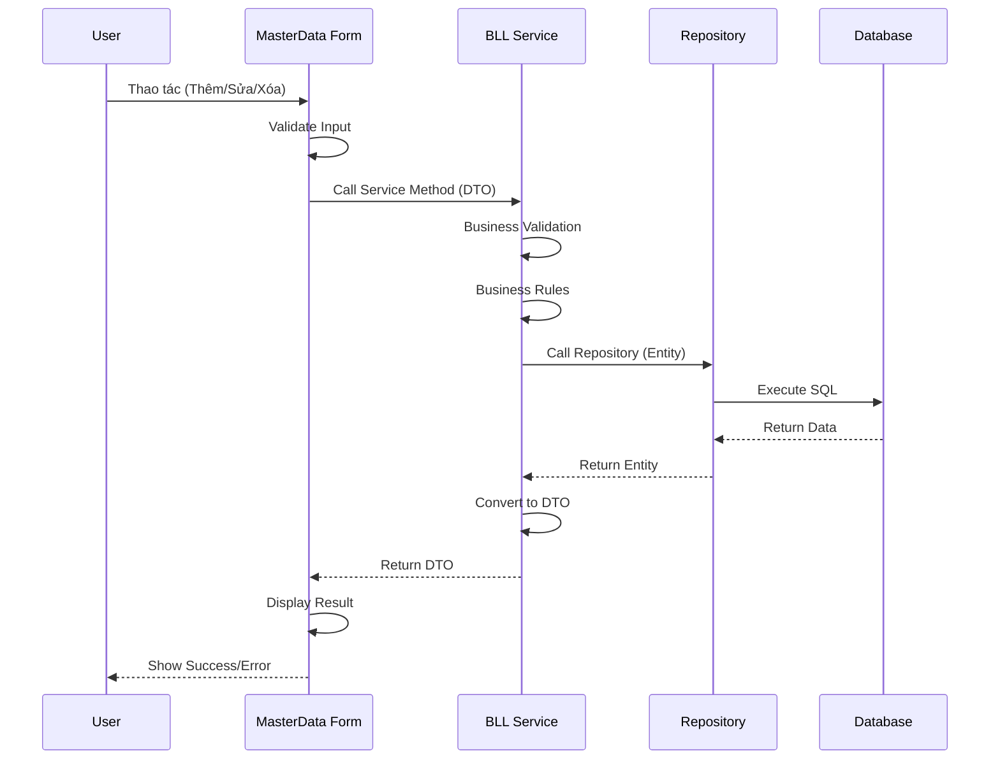
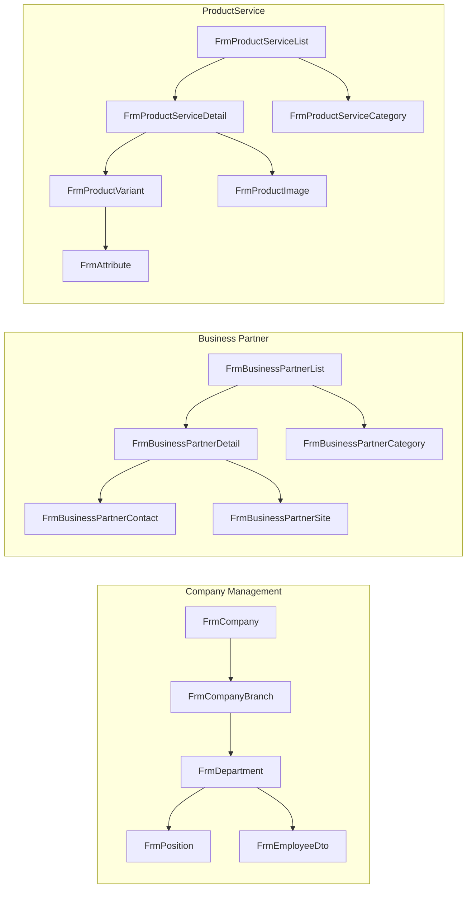

# MasterData - Master Data Module

## Tên Project & Mô Tả Ngắn

**MasterData** là **Master Data Module** (Module Dữ Liệu Master) của hệ thống VNS ERP 2025. Module này chứa tất cả các Windows Forms và User Controls để quản lý dữ liệu master (dữ liệu cơ bản) của hệ thống, bao gồm:

- **Company Management**: Quản lý công ty, chi nhánh, phòng ban, chức vụ, nhân viên
- **Business Partner Management**: Quản lý đối tác kinh doanh (khách hàng, nhà cung cấp), danh mục đối tác, liên hệ, địa điểm
- **Product & Service Management**: Quản lý sản phẩm/dịch vụ, danh mục, biến thể, thuộc tính, đơn vị tính, hình ảnh

Module này là một **Class Library (.dll)** chứa các Windows Forms được sử dụng bởi **Main Application (VnsErp2025)** để quản lý dữ liệu master của hệ thống.

---

## Giới Thiệu

### Mục Đích Của MasterData Module

MasterData Module được thiết kế để:

- **Centralized Master Data Management**: Tập trung hóa quản lý dữ liệu master trong một module
- **Data Consistency**: Đảm bảo tính nhất quán của dữ liệu master trong toàn hệ thống
- **User-Friendly Interface**: Cung cấp giao diện thân thiện cho người dùng quản lý dữ liệu master
- **Data Integrity**: Đảm bảo tính toàn vẹn dữ liệu thông qua validation và business rules
- **Extensibility**: Dễ dàng mở rộng thêm các loại master data mới

### Vấn Đề Được Giải Quyết

- **Data Scattered**: Tập trung hóa quản lý dữ liệu master
- **Inconsistent Data**: Đảm bảo dữ liệu master nhất quán
- **Complex Relationships**: Quản lý các mối quan hệ phức tạp giữa các master data
- **User Experience**: Cung cấp giao diện dễ sử dụng cho quản lý master data

### Phạm Vi Sử Dụng

- **Loại Project**: Class Library (.dll) với Windows Forms
- **Target Framework**: .NET Framework 4.8
- **UI Framework**: Windows Forms + DevExpress v25.2
- **Dependencies**: Bll, Common, DTO, Logger projects
- **Usage**: Được sử dụng bởi Main Application (VnsErp2025)

---

## Tính Năng Chính

### Company Management Forms

#### **1. FrmCompany (Quản Lý Công Ty)**
- Quản lý thông tin công ty
- Quản lý logo công ty
- Đảm bảo chỉ có một công ty trong hệ thống
- **Tài liệu**:
  - [FrmCompany User Guide](./Company/FrmCompany_User_Guide.md)
  - [FrmCompany Developer Guide](./Company/FrmCompany_Developer_Guide.md)

#### **2. FrmCompanyBranch (Quản Lý Chi Nhánh)**
- Quản lý danh sách chi nhánh
- Liên kết chi nhánh với công ty
- **Tài liệu**:
  - [FrmCompanyBranch User Guide](./Company/FrmCompanyBranch_User_Guide.md)
  - [FrmCompanyBranch Developer Guide](./Company/FrmCompanyBranch_Developer_Guide.md)

#### **3. FrmCompanyBranchDetail (Chi Tiết Chi Nhánh)**
- Form chi tiết để thêm/sửa chi nhánh
- Quản lý thông tin chi tiết chi nhánh

#### **4. FrmDepartment (Quản Lý Phòng Ban)**
- Quản lý phòng ban dạng cây (TreeList)
- Quản lý cấu trúc phòng ban phân cấp
- **Tài liệu**:
  - [DepartmentTreeList Implementation](./Company/DepartmentTreeList_Implementation.md)

#### **5. FrmDepartmentDetail (Chi Tiết Phòng Ban)**
- Form chi tiết để thêm/sửa phòng ban
- Quản lý thông tin chi tiết phòng ban
- **Tài liệu**:
  - [FrmDepartmentDetail User Guide](./Company/FrmDepartmentDetail_User_Guide.md)
  - [FrmDepartmentDetail Developer Guide](./Company/FrmDepartmentDetail_Developer_Guide.md)

#### **6. FrmPosition (Quản Lý Chức Vụ)**
- Quản lý danh sách chức vụ
- Liên kết chức vụ với phòng ban

#### **7. FrmPositionDetail (Chi Tiết Chức Vụ)**
- Form chi tiết để thêm/sửa chức vụ

#### **8. FrmEmployeeDto (Quản Lý Nhân Viên)**
- Quản lý danh sách nhân viên
- Hiển thị thông tin nhân viên dạng grid

#### **9. FrmEmployeeDtoDetail (Chi Tiết Nhân Viên)**
- Form chi tiết để thêm/sửa nhân viên
- Quản lý thông tin đầy đủ của nhân viên

### Business Partner Management Forms

#### **1. FrmBusinessPartnerList (Danh Sách Đối Tác)**
- Quản lý danh sách đối tác kinh doanh
- Hiển thị danh sách khách hàng và nhà cung cấp
- Tìm kiếm và lọc đối tác

#### **2. FrmBusinessPartnerDetail (Chi Tiết Đối Tác)**
- Form chi tiết để thêm/sửa đối tác
- Quản lý thông tin đầy đủ của đối tác
- Quản lý logo và avatar đối tác

#### **3. FrmBusinessPartnerCategory (Danh Mục Đối Tác)**
- Quản lý danh mục đối tác
- Phân loại đối tác theo danh mục
- **Tài liệu**:
  - [FrmBusinessPartnerCategory User Guide](./Company/FrmBusinessPartnerCategory_User_Guide.md)
  - [FrmBusinessPartnerCategory Developer Guide](./Company/FrmBusinessPartnerCategory_Developer_Guide.md)

#### **4. FrmBusinessPartnerCategoryDetail (Chi Tiết Danh Mục)**
- Form chi tiết để thêm/sửa danh mục đối tác

#### **5. FrmBusinessPartnerContact (Liên Hệ Đối Tác)**
- Quản lý danh sách liên hệ của đối tác
- Quản lý thông tin liên hệ (tên, chức vụ, phone, email)

#### **6. FrmBusinessPartnerContactDetail (Chi Tiết Liên Hệ)**
- Form chi tiết để thêm/sửa liên hệ đối tác

#### **7. FrmBusinessPartnerSite (Địa Điểm Đối Tác)**
- Quản lý danh sách địa điểm của đối tác
- Quản lý địa chỉ giao hàng và thanh toán

#### **8. FrmBusinessPartnerSiteDetail (Chi Tiết Địa Điểm)**
- Form chi tiết để thêm/sửa địa điểm đối tác

### Product & Service Management Forms

#### **1. FrmProductServiceList (Danh Sách Sản Phẩm/Dịch Vụ)**
- Quản lý danh sách sản phẩm/dịch vụ
- Hiển thị dạng grid và card view
- Tìm kiếm và lọc sản phẩm

#### **2. FrmProductServiceDetail (Chi Tiết Sản Phẩm/Dịch Vụ)**
- Form chi tiết để thêm/sửa sản phẩm/dịch vụ
- Quản lý thông tin đầy đủ của sản phẩm
- Quản lý danh mục và đơn vị tính

#### **3. FrmProductServiceCategory (Danh Mục Sản Phẩm)**
- Quản lý danh mục sản phẩm/dịch vụ dạng cây
- Phân loại sản phẩm theo danh mục

#### **4. FrmProductServiceCategoryDetail (Chi Tiết Danh Mục)**
- Form chi tiết để thêm/sửa danh mục sản phẩm

#### **5. FrmProductVariant (Biến Thể Sản Phẩm)**
- Quản lý biến thể sản phẩm
- Quản lý các biến thể của một sản phẩm

#### **6. FrmProductVariantDetail (Chi Tiết Biến Thể)**
- Form chi tiết để thêm/sửa biến thể sản phẩm
- Quản lý thuộc tính của biến thể

#### **7. FrmAttribute (Thuộc Tính)**
- Quản lý thuộc tính sản phẩm
- Định nghĩa các thuộc tính dùng cho biến thể

#### **8. FrmUnitOfMeasure (Đơn Vị Tính)**
- Quản lý đơn vị tính
- Định nghĩa các đơn vị tính cho sản phẩm

#### **9. FrmProductImage (Hình Ảnh Sản Phẩm)**
- Quản lý hình ảnh sản phẩm
- Upload, xóa, xem hình ảnh sản phẩm

#### **10. FrmProductImageAdd (Thêm Hình Ảnh)**
- Form để thêm hình ảnh cho sản phẩm

#### **11. FrmProductImageDetail (Chi Tiết Hình Ảnh)**
- Form chi tiết để xem và quản lý hình ảnh

#### **12. UcProductServiceListCardView (User Control Card View)**
- User control hiển thị sản phẩm dạng card view
- Tái sử dụng trong các form khác

---

## Kiến Trúc Tổng Thể

### Mô Hình Kiến Trúc MasterData Module

```mermaid
graph TB
    subgraph "Main Application"
        MAIN[VnsErp2025 Main App]
    end
    
    subgraph "MasterData Module"
        subgraph "Company Forms"
            F_COMPANY[FrmCompany]
            F_BRANCH[FrmCompanyBranch]
            F_DEPT[FrmDepartment]
            F_POS[FrmPosition]
            F_EMP[FrmEmployeeDto]
        end
        
        subgraph "Business Partner Forms"
            F_BP_LIST[FrmBusinessPartnerList]
            F_BP_DETAIL[FrmBusinessPartnerDetail]
            F_BP_CAT[FrmBusinessPartnerCategory]
            F_BP_CONTACT[FrmBusinessPartnerContact]
            F_BP_SITE[FrmBusinessPartnerSite]
        end
        
        subgraph "ProductService Forms"
            F_PS_LIST[FrmProductServiceList]
            F_PS_DETAIL[FrmProductServiceDetail]
            F_PS_CAT[FrmProductServiceCategory]
            F_VARIANT[FrmProductVariant]
            F_ATTR[FrmAttribute]
            F_UOM[FrmUnitOfMeasure]
            F_IMG[FrmProductImage]
        end
    end
    
    subgraph "Business Logic Layer"
        COMPANY_BLL[CompanyBll]
        BP_BLL[BusinessPartnerBll]
        PS_BLL[ProductServiceBll]
    end
    
    subgraph "Data Access Layer"
        COMPANY_REPO[CompanyRepository]
        BP_REPO[BusinessPartnerRepository]
        PS_REPO[ProductServiceRepository]
    end
    
    MAIN --> F_COMPANY
    MAIN --> F_BP_LIST
    MAIN --> F_PS_LIST
    
    F_COMPANY --> COMPANY_BLL
    F_BRANCH --> COMPANY_BLL
    F_DEPT --> COMPANY_BLL
    F_POS --> COMPANY_BLL
    F_EMP --> COMPANY_BLL
    
    F_BP_LIST --> BP_BLL
    F_BP_DETAIL --> BP_BLL
    F_BP_CAT --> BP_BLL
    
    F_PS_LIST --> PS_BLL
    F_PS_DETAIL --> PS_BLL
    F_PS_CAT --> PS_BLL
    F_VARIANT --> PS_BLL
    
    COMPANY_BLL --> COMPANY_REPO
    BP_BLL --> BP_REPO
    PS_BLL --> PS_REPO
```



### Luồng Xử Lý Master Data



### Quan Hệ Giữa Các Forms



---

## Cài Đặt

### Yêu Cầu Hệ Thống

#### **Phần Mềm**
- **Visual Studio**: 2022 Enterprise hoặc Professional
- **.NET Framework**: 4.8 hoặc cao hơn
- **DevExpress**: v25.2 (cho UI components)

#### **Dependencies**
- **Bll Project**: Business logic cho master data
- **Common Project**: Shared components và utilities
- **DTO Project**: Data transfer objects
- **Logger Project**: Logging framework

### Các Bước Thiết Lập

#### **1. Restore NuGet Packages**
```bash
# Trong Visual Studio
Tools → NuGet Package Manager → Restore NuGet Packages
```

#### **2. Build Project**
```bash
# Trong Visual Studio
Build → Build Solution (Ctrl + Shift + B)
```

### Dependencies Configuration

#### **Project References**
```xml
<ProjectReference Include="..\Bll\Bll.csproj">
  <Project>{50f0876e-db49-4c11-9158-e3146ab3ad93}</Project>
  <Name>Bll</Name>
</ProjectReference>
<ProjectReference Include="..\Common\Common.csproj">
  <Project>{68E56AB6-1ADA-40DE-9EDD-0BE2B8F35C3A}</Project>
  <Name>Common</Name>
</ProjectReference>
<ProjectReference Include="..\DTO\DTO.csproj">
  <Project>{77b6b4b6-d129-4a78-bd8d-9fca5f9b4a1c}</Project>
  <Name>DTO</Name>
</ProjectReference>
<ProjectReference Include="..\Logger\Logger.csproj">
  <Project>{12f9fb39-92bf-45d5-bbb2-5353e33700f0}</Project>
  <Name>Logger</Name>
</ProjectReference>
```

---

## Chạy Dự Án

### Mở Project trong Visual Studio

1. **Mở Solution**: Mở `VnsErp2025.sln`
2. **Locate MasterData Project**: Tìm project `MasterData` trong Solution Explorer
3. **Set as Startup Project**: (Không cần, vì đây là Class Library)

### Build Project

#### **Build MasterData Project**
- **Phím tắt**: Click phải vào project → `Build`
- **Menu**: `Build → Build MasterData`
- **Command Line**: `msbuild MasterData\MasterData.csproj`

---

## Cấu Hình Môi Trường

### App.config

File `App.config` trong project MasterData có thể chứa:

```xml
<?xml version="1.0" encoding="utf-8"?>
<configuration>
  <appSettings>
    <!-- MasterData Configuration -->
    <add key="MasterData.EnableImageUpload" value="true" />
    <add key="MasterData.MaxImageSize" value="10485760" />
    <add key="MasterData.AllowedImageFormats" value="jpg,jpeg,png,gif" />
    
    <!-- Grid Configuration -->
    <add key="MasterData.DefaultPageSize" value="50" />
    <add key="MasterData.EnableExport" value="true" />
  </appSettings>
</configuration>
```

---

## Cấu Trúc Thư Mục

### Tổng Quan Cấu Trúc

```
MasterData/
├── Company/                              # Company Management Forms
│   ├── FrmCompany.cs                    # Company management form
│   ├── FrmCompany.Designer.cs           # Company form designer
│   ├── FrmCompany.resx                  # Company form resources
│   ├── FrmCompany_User_Guide.md        # Company user guide
│   ├── FrmCompany_Developer_Guide.md   # Company developer guide
│   │
│   ├── FrmCompanyBranch.cs              # Company branch list form
│   ├── FrmCompanyBranch.Designer.cs    # Branch form designer
│   ├── FrmCompanyBranch.resx           # Branch form resources
│   ├── FrmCompanyBranch_User_Guide.md  # Branch user guide
│   ├── FrmCompanyBranch_Developer_Guide.md # Branch developer guide
│   ├── FrmCompanyBranchDetail.cs       # Branch detail form
│   ├── FrmCompanyBranchDetail.Designer.cs
│   └── FrmCompanyBranchDetail.resx
│   │
│   ├── FrmDepartment.cs                # Department tree form
│   ├── FrmDepartment.Designer.cs
│   ├── FrmDepartment.resx
│   ├── FrmDepartmentDetail.cs          # Department detail form
│   ├── FrmDepartmentDetail.Designer.cs
│   ├── FrmDepartmentDetail.resx
│   ├── FrmDepartmentDetail_User_Guide.md
│   ├── FrmDepartmentDetail_Developer_Guide.md
│   ├── DepartmentTreeList_Implementation.md
│   │
│   ├── FrmPosition.cs                  # Position list form
│   ├── FrmPosition.Designer.cs
│   ├── FrmPosition.resx
│   ├── FrmPositionDetail.cs            # Position detail form
│   ├── FrmPositionDetail.Designer.cs
│   └── FrmPositionDetail.resx
│   │
│   ├── FrmEmployeeDto.cs               # Employee list form
│   ├── FrmEmployeeDto.Designer.cs
│   ├── FrmEmployeeDto.resx
│   ├── FrmEmployeeDtoDetail.cs        # Employee detail form
│   ├── FrmEmployeeDtoDetail.Designer.cs
│   └── FrmEmployeeDtoDetail.resx
│   │
│   ├── FrmBusinessPartnerCategory.cs    # Business partner category (moved)
│   ├── FrmBusinessPartnerCategory_User_Guide.md
│   └── FrmBusinessPartnerCategory_Developer_Guide.md
│
├── Customer/                            # Business Partner Management Forms
│   ├── FrmBusinessPartnerList.cs       # Business partner list form
│   ├── FrmBusinessPartnerList.Designer.cs
│   ├── FrmBusinessPartnerList.resx
│   │
│   ├── FrmBusinessPartnerDetail.cs     # Business partner detail form
│   ├── FrmBusinessPartnerDetail.Designer.cs
│   ├── FrmBusinessPartnerDetail.resx
│   │
│   ├── FrmBusinessPartnerCategory.cs   # Category list form
│   ├── FrmBusinessPartnerCategory.Designer.cs
│   ├── FrmBusinessPartnerCategory.resx
│   ├── FrmBusinessPartnerCategoryDetail.cs # Category detail form
│   ├── FrmBusinessPartnerCategoryDetail.Designer.cs
│   └── FrmBusinessPartnerCategoryDetail.resx
│   │
│   ├── FrmBusinessPartnerContact.cs    # Contact list form
│   ├── FrmBusinessPartnerContact.Designer.cs
│   ├── FrmBusinessPartnerContact.resx
│   ├── FrmBusinessPartnerContactDetail.cs # Contact detail form
│   ├── FrmBusinessPartnerContactDetail.Designer.cs
│   └── FrmBusinessPartnerContactDetail.resx
│   │
│   ├── FrmBusinessPartnerSite.cs       # Site list form
│   ├── FrmBusinessPartnerSite.Designer.cs
│   ├── FrmBusinessPartnerSite.resx
│   ├── FrmBusinessPartnerSiteDetail.cs # Site detail form
│   ├── FrmBusinessPartnerSiteDetail.Designer.cs
│   └── FrmBusinessPartnerSiteDetail.resx
│
├── ProductService/                      # Product & Service Management Forms
│   ├── FrmProductServiceList.cs        # Product service list form
│   ├── FrmProductServiceList.Designer.cs
│   ├── FrmProductServiceList.resx
│   │
│   ├── FrmProductServiceDetail.cs      # Product service detail form
│   ├── FrmProductServiceDetail.Designer.cs
│   ├── FrmProductServiceDetail.resx
│   │
│   ├── FrmProductServiceCategory.cs    # Category tree form
│   ├── FrmProductServiceCategory.Designer.cs
│   ├── FrmProductServiceCategory.resx
│   ├── FrmProductServiceCategoryDetail.cs # Category detail form
│   ├── FrmProductServiceCategoryDetail.Designer.cs
│   └── FrmProductServiceCategoryDetail.resx
│   │
│   ├── FrmProductVariant.cs            # Variant list form
│   ├── FrmProductVariant.Designer.cs
│   ├── FrmProductVariant.resx
│   ├── FrmProductVariantDetail.cs      # Variant detail form
│   ├── FrmProductVariantDetail.Designer.cs
│   └── FrmProductVariantDetail.resx
│   │
│   ├── FrmAttribute.cs                 # Attribute list form
│   ├── FrmAttribute.Designer.cs
│   ├── FrmAttribute.resx
│   │
│   ├── FrmUnitOfMeasure.cs            # Unit of measure form
│   ├── FrmUnitOfMeasure.Designer.cs
│   ├── FrmUnitOfMeasure.resx
│   │
│   ├── FrmProductImage.cs              # Product image list form
│   ├── FrmProductImage.Designer.cs
│   ├── FrmProductImage.resx
│   ├── FrmProductImageAdd.cs          # Add image form
│   ├── FrmProductImageAdd.Designer.cs
│   ├── FrmProductImageAdd.resx
│   ├── FrmProductImageDetail.cs       # Image detail form
│   ├── FrmProductImageDetail.Designer.cs
│   └── FrmProductImageDetail.resx
│   │
│   └── UcProductServiceListCardView.cs # Card view user control
│   ├── UcProductServiceListCardView.Designer.cs
│   └── UcProductServiceListCardView.resx
│
├── Doc/                                 # Documentation
│   ├── BusinessPartner_Database_Schema.md
│   └── [Prompt files]
│
├── Properties/                          # Project Properties
│   ├── AssemblyInfo.cs
│   ├── Resources.Designer.cs
│   ├── Resources.resx
│   └── DataSources/                    # Data sources
│
├── Resources/                           # Resource Files
│   └── [PNG icons]
│
├── App.config                           # Application Configuration
└── MasterData.csproj                    # Project File
```

### Vai Trò Của Từng Thư Mục

#### **Company/**
- **Vai trò**: Forms quản lý thông tin công ty
- **Trách nhiệm**:
  - Quản lý công ty, chi nhánh, phòng ban, chức vụ, nhân viên
  - Hiển thị và chỉnh sửa thông tin công ty
  - Quản lý cấu trúc phòng ban dạng cây

#### **Customer/**
- **Vai trò**: Forms quản lý đối tác kinh doanh
- **Trách nhiệm**:
  - Quản lý khách hàng và nhà cung cấp
  - Quản lý danh mục đối tác
  - Quản lý liên hệ và địa điểm đối tác

#### **ProductService/**
- **Vai trò**: Forms quản lý sản phẩm/dịch vụ
- **Trách nhiệm**:
  - Quản lý sản phẩm/dịch vụ và danh mục
  - Quản lý biến thể và thuộc tính
  - Quản lý hình ảnh sản phẩm
  - Quản lý đơn vị tính

---

## Hướng Dẫn Sử Dụng

### Sử Dụng Company Forms

#### **FrmCompany**
```csharp
// Hiển thị form quản lý công ty
var companyForm = new MasterData.Company.FrmCompany();
companyForm.ShowDialog();
```

#### **FrmCompanyBranch**
```csharp
// Hiển thị form quản lý chi nhánh
var branchForm = new MasterData.Company.FrmCompanyBranch();
branchForm.ShowDialog();
```

#### **FrmDepartment**
```csharp
// Hiển thị form quản lý phòng ban (dạng cây)
var deptForm = new MasterData.Company.FrmDepartment();
deptForm.ShowDialog();
```

### Sử Dụng Business Partner Forms

#### **FrmBusinessPartnerList**
```csharp
// Hiển thị form danh sách đối tác
var bpListForm = new MasterData.Customer.FrmBusinessPartnerList();
bpListForm.ShowDialog();
```

#### **FrmBusinessPartnerDetail**
```csharp
// Hiển thị form chi tiết đối tác
var bpDetailForm = new MasterData.Customer.FrmBusinessPartnerDetail();
bpDetailForm.ShowDialog();
```

### Sử Dụng ProductService Forms

#### **FrmProductServiceList**
```csharp
// Hiển thị form danh sách sản phẩm
var psListForm = new MasterData.ProductService.FrmProductServiceList();
psListForm.ShowDialog();
```

#### **FrmProductServiceDetail**
```csharp
// Hiển thị form chi tiết sản phẩm
var psDetailForm = new MasterData.ProductService.FrmProductServiceDetail();
psDetailForm.ShowDialog();
```

### Pattern Sử Dụng Chung

#### **List Form Pattern**
```csharp
// Pattern chung cho các list forms
public partial class FrmEntityList : XtraForm
{
    private readonly IEntityBll _service;
    
    private void LoadData()
    {
        var dtos = _service.GetAll();
        gridControl.DataSource = dtos;
    }
    
    private void btnAdd_Click(object sender, EventArgs e)
    {
        var detailForm = new FrmEntityDetail();
        if (detailForm.ShowDialog() == DialogResult.OK)
        {
            LoadData(); // Refresh
        }
    }
}
```

#### **Detail Form Pattern**
```csharp
// Pattern chung cho các detail forms
public partial class FrmEntityDetail : XtraForm
{
    private readonly IEntityBll _service;
    private EntityDto _dto;
    
    public FrmEntityDetail(Guid? id = null)
    {
        InitializeComponent();
        if (id.HasValue)
        {
            LoadEntity(id.Value);
        }
    }
    
    private void LoadEntity(Guid id)
    {
        _dto = _service.GetById(id);
        BindDataToControls();
    }
    
    private void btnSave_Click(object sender, EventArgs e)
    {
        if (!ValidateInput())
            return;
        
        if (_dto == null)
        {
            _service.Create(_dto);
        }
        else
        {
            _service.Update(_dto);
        }
        
        DialogResult = DialogResult.OK;
        Close();
    }
}
```

---

## Hướng Dẫn Đóng Góp Phát Triển

### Quy Ước Coding

#### **Naming Conventions**
- **List Forms**: `Frm{EntityName}` (ví dụ: `FrmCompany`, `FrmBusinessPartnerList`)
- **Detail Forms**: `Frm{EntityName}Detail` (ví dụ: `FrmCompanyBranchDetail`, `FrmProductServiceDetail`)
- **User Controls**: `Uc{Name}` (ví dụ: `UcProductServiceListCardView`)
- **Methods**: PascalCase (ví dụ: `LoadData()`, `ValidateInput()`)
- **Event Handlers**: `{ControlName}_{EventName}` (ví dụ: `btnSave_Click`)

#### **Code Organization**
```csharp
#region Fields & Properties
private readonly IEntityBll _service;
private readonly ILogger _logger;
private EntityDto _currentDto;
#endregion

#region Constructors
public FrmEntityDetail(Guid? id = null)
{
    InitializeComponent();
    InitializeServices();
    if (id.HasValue)
        LoadEntity(id.Value);
}
#endregion

#region Event Handlers
private void btnSave_Click(object sender, EventArgs e)
{
    // Event handler code
}
#endregion

#region Public Methods
// Public methods here
#endregion

#region Private Methods
private void LoadData()
{
    // Private methods here
}
#endregion
```

### Quy Tắc Phân Tầng

#### **Được Phép**
- ✅ Gọi các service từ BLL layer
- ✅ Sử dụng DTO để truyền dữ liệu
- ✅ Sử dụng Common utilities (MsgBox, ValidationHelper, GridViewHelper)
- ✅ Sử dụng Logger để ghi log
- ✅ Validation ở mức UI (format, required fields)

#### **KHÔNG Được Phép**
- ❌ Chứa business logic (phải ở BLL layer)
- ❌ Truy cập database trực tiếp (phải qua DAL)
- ❌ Sử dụng Entity trực tiếp (phải dùng DTO)

### Cách Thêm Form Mới An Toàn

#### **Checklist**
1. ✅ Tạo form trong thư mục module tương ứng (Company/Customer/ProductService)
2. ✅ Sử dụng DevExpress XtraForm làm base class
3. ✅ Setup validation với DXValidationProvider (nếu cần)
4. ✅ Gọi BLL services thay vì DAL trực tiếp
5. ✅ Sử dụng DTO để truyền dữ liệu
6. ✅ Error handling và logging
7. ✅ Tạo User Guide và Developer Guide (nếu cần)

### Quy Ước Branch và Commit

#### **Branch Strategy**
- **feature/**: Feature mới (ví dụ: `feature/add-product-variant-form`)
- **bugfix/**: Sửa lỗi (ví dụ: `bugfix/fix-company-validation`)
- **refactor/**: Refactor code (ví dụ: `refactor/improve-grid-performance`)

#### **Commit Message Convention**
Format: `[Type]: [Short Description]`

**Types:**
- `feat`: Thêm form/feature mới
- `fix`: Sửa lỗi
- `refactor`: Refactor code
- `docs`: Cập nhật tài liệu

**Ví dụ:**
```
feat: Thêm FrmProductVariantDetail để quản lý chi tiết biến thể sản phẩm
fix: Sửa lỗi validation trong FrmBusinessPartnerDetail
refactor: Tối ưu FrmProductServiceList để cải thiện performance
docs: Cập nhật FrmCompany_User_Guide với hướng dẫn upload logo
```

---

## Best Practices

### Form Design Best Practices

#### **1. Separation of Concerns**
```csharp
// ✅ ĐÚNG: Tách biệt UI logic và business logic
private void btnSave_Click(object sender, EventArgs e)
{
    // UI logic: Get input, validate
    if (!ValidateInput())
        return;
    
    var dto = GetDtoFromControls();
    
    // Business logic: Gọi BLL service
    try
    {
        if (_dto == null)
            _service.Create(dto);
        else
            _service.Update(dto);
        
        DialogResult = DialogResult.OK;
        Close();
    }
    catch (BusinessException ex)
    {
        MsgBox.ShowError(ex.Message);
    }
}

// ❌ SAI: Trộn lẫn UI và business logic
private void btnSave_Click(object sender, EventArgs e)
{
    // Business logic trực tiếp trong form
    var entity = new Company();
    entity.CompanyCode = txtCode.Text;
    _repository.Add(entity); // ❌ Không nên gọi repository trực tiếp
}
```

#### **2. Data Binding**
```csharp
// ✅ ĐÚNG: Sử dụng data binding
private void BindDataToControls(CompanyDto dto)
{
    txtCompanyCode.DataBindings.Clear();
    txtCompanyCode.DataBindings.Add("Text", dto, "CompanyCode");
    
    txtCompanyName.DataBindings.Clear();
    txtCompanyName.DataBindings.Add("Text", dto, "CompanyName");
}

// ❌ SAI: Manual assignment
private void LoadData(CompanyDto dto)
{
    txtCompanyCode.Text = dto.CompanyCode; // ❌ Không có data binding
    txtCompanyName.Text = dto.CompanyName;
}
```

#### **3. Grid Configuration**
```csharp
// ✅ ĐÚNG: Sử dụng GridViewHelper
private void SetupGrid()
{
    GridViewHelper.SetupColumns(gridView, columnDefinitions);
    GridViewHelper.ApplyDefaultSettings(gridView);
}

// ❌ SAI: Manual column setup
private void SetupGrid()
{
    // Manual column setup - khó maintain
    gridView.Columns["CompanyCode"].Caption = "Mã công ty";
    gridView.Columns["CompanyName"].Caption = "Tên công ty";
    // ... nhiều dòng code
}
```

---

## Tài Liệu Liên Quan

- **[FrmCompany User Guide](./Company/FrmCompany_User_Guide.md)**: Hướng dẫn sử dụng form công ty
- **[FrmCompany Developer Guide](./Company/FrmCompany_Developer_Guide.md)**: Hướng dẫn phát triển form công ty
- **[FrmCompanyBranch User Guide](./Company/FrmCompanyBranch_User_Guide.md)**: Hướng dẫn sử dụng form chi nhánh
- **[FrmCompanyBranch Developer Guide](./Company/FrmCompanyBranch_Developer_Guide.md)**: Hướng dẫn phát triển form chi nhánh
- **[DepartmentTreeList Implementation](./Company/DepartmentTreeList_Implementation.md)**: Hướng dẫn implement TreeList cho phòng ban
- **[BusinessPartner Database Schema](./Doc/BusinessPartner_Database_Schema.md)**: Schema database cho BusinessPartner
- **[Root README](../README.md)**: Tài liệu tổng quan hệ thống
- **[BLL README](../Bll/README.md)**: Tài liệu Business Logic Layer

---

## Liên Hệ & Hỗ Trợ

- **Development Team**: [Thông tin liên hệ]
- **Technical Lead**: [Thông tin liên hệ]

---

**Phiên bản tài liệu**: 1.0  
**Ngày cập nhật**: 27/01/2025  
**Trạng thái**: Đang phát triển

---

*Tài liệu này được tạo và duy trì bởi Development Team. Vui lòng cập nhật tài liệu khi có thay đổi quan trọng trong MasterData module.*
