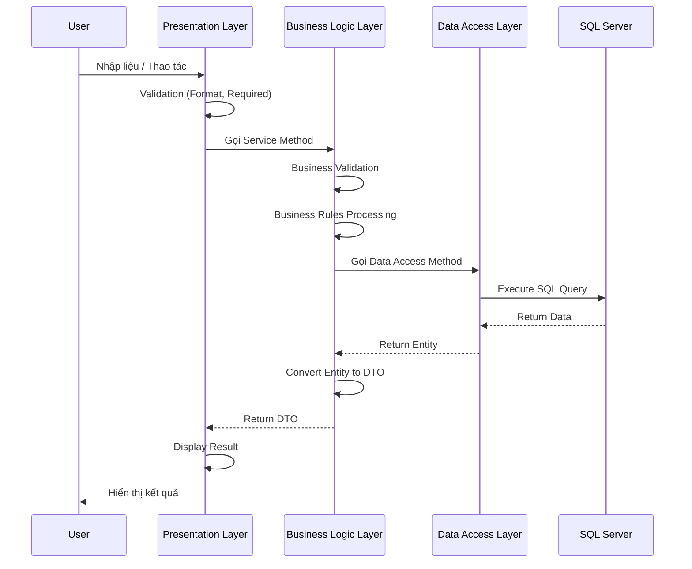
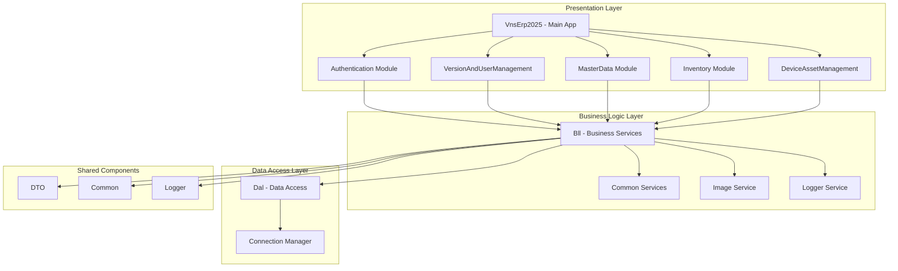
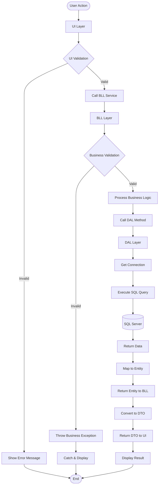

# VNS ERP 2025

## Tên Dự Án & Mô Tả Ngắn

**VNS ERP 2025** là hệ thống quản lý doanh nghiệp (Enterprise Resource Planning) được xây dựng trên nền tảng **Windows Forms** với công nghệ **.NET Framework 4.8** và **DevExpress v25.2**. Hệ thống được thiết kế để quản lý toàn diện các hoạt động nghiệp vụ của doanh nghiệp, bao gồm:

- **Quản lý Kho**: Nhập/xuất kho, tồn kho, kiểm kê
- **Quản lý Dữ Liệu Master**: Công ty, đối tác, sản phẩm, nhân viên
- **Quản lý Người Dùng & Phân Quyền**: Hệ thống xác thực và phân quyền chi tiết
- **Quản lý Tài Sản & Thiết Bị**: Theo dõi tài sản, thiết bị, lịch sử chuyển giao
- **Báo Cáo & Thống Kê**: Các báo cáo nghiệp vụ và thống kê tổng hợp

Hệ thống được phát triển theo mô hình **kiến trúc phân lớp (Layered Architecture)**, đảm bảo tính tách biệt rõ ràng giữa các tầng và khả năng bảo trì, mở rộng lâu dài.

---

## Giới Thiệu

### Mục Tiêu Nghiệp Vụ

VNS ERP 2025 được phát triển để giải quyết các thách thức quản lý trong môi trường doanh nghiệp:

- **Tích hợp dữ liệu**: Tập trung hóa dữ liệu từ nhiều phòng ban (Kế toán, Kho, Nhân sự, Bán hàng) vào một hệ thống thống nhất
- **Tối ưu quy trình**: Tự động hóa các quy trình nghiệp vụ, giảm thiểu thao tác thủ công và sai sót
- **Kiểm soát chặt chẽ**: Quản lý tồn kho, tài sản, người dùng với phân quyền chi tiết và audit trail đầy đủ
- **Báo cáo thời gian thực**: Cung cấp thông tin nghiệp vụ kịp thời để hỗ trợ ra quyết định

### Phạm Vi Sử Dụng

- **Loại triển khai**: Hệ thống **on-premise** (triển khai tại chỗ)
- **Đối tượng sử dụng**: Người dùng nội bộ doanh nghiệp
- **Môi trường**: Windows Desktop Application
- **Kết nối**: Client-Server với SQL Server Database

---

## Tính Năng Chính

### Các Phân Hệ ERP Cốt Lõi

#### 1. **Authentication (Xác Thực)**
- Đăng nhập/đăng xuất hệ thống
- Quản lý session người dùng
- Cấu hình kết nối database
- Kiểm tra MAC address được phép
- Mã hóa thông tin kết nối (Registry)

#### 2. **VersionAndUserManagement (Quản Lý Phiên Bản & Người Dùng)**
- Quản lý phiên bản ứng dụng
- Quản lý người dùng hệ thống (ApplicationUser)
- Quản lý vai trò (Role) và phân quyền
- Hệ thống phân quyền theo Entity và Action
- Override permission cho từng người dùng
- Quản lý MAC address được phép truy cập

#### 3. **MasterData (Dữ Liệu Master)**
- **Company**: Quản lý công ty, chi nhánh, phòng ban (cây phòng ban)
- **BusinessPartner**: Quản lý đối tác kinh doanh (khách hàng, nhà cung cấp), danh mục đối tác, liên hệ
- **ProductService**: Quản lý sản phẩm/dịch vụ, danh mục, biến thể, thuộc tính, hình ảnh
- **Customer**: Quản lý thông tin khách hàng và lịch sử giao dịch

#### 4. **Inventory (Quản Lý Kho)**
- **StockIn (Nhập Kho)**:
  - Nhập kho đối bán
  - Nhập kho theo PO nhà cung cấp
  - Nhập kho theo PO khách hàng
  - In phiếu nhập kho
- **StockOut (Xuất Kho)**:
  - Xuất kho thương mại
  - Xuất bảo hành
  - Xuất lắp ráp
  - Xuất lưu chuyển kho
  - Xuất nội bộ
  - Xuất cho thuê mượn
- **Management**: Quản lý tồn kho (InventoryBalance), quản lý tài sản
- **Query**: Tra cứu lịch sử phiếu nhập/xuất, lịch sử sản phẩm, kiểm tra bảo hành

#### 5. **DeviceAssetManagement (Quản Lý Tài Sản & Thiết Bị)**
- Quản lý tài sản (Asset)
- Quản lý thiết bị (Device)
- Lịch sử thiết bị (DeviceHistory)
- Chuyển giao thiết bị (DeviceTransfer)

### Bảo Mật & Phân Quyền

- **Role-Based Access Control (RBAC)**: Phân quyền theo vai trò
- **Entity-Level Permissions**: Phân quyền chi tiết theo từng entity và action (Create, Read, Update, Delete)
- **Permission Override**: Cho phép gán quyền trực tiếp cho người dùng, override quyền từ role
- **MAC Address Control**: Kiểm soát truy cập theo địa chỉ MAC
- **Audit Logging**: Ghi nhận các thao tác quan trọng của người dùng

### Đảm Bảo Toàn Vẹn Dữ Liệu

- Validation ở nhiều tầng (UI, Business Logic, Database)
- Transaction management cho các thao tác phức tạp
- Kiểm tra ràng buộc nghiệp vụ trước khi lưu dữ liệu
- Hỗ trợ rollback khi có lỗi

### Khả Năng Mở Rộng

- Kiến trúc module hóa, dễ dàng thêm phân hệ mới
- Sử dụng DTO pattern để tách biệt giữa các layer
- Interface-based design cho các service
- Hỗ trợ plugin/extensibility cho các tính năng tùy chỉnh

---

## Kiến Trúc Tổng Thể

### Mô Hình Kiến Trúc Phân Lớp

Hệ thống được xây dựng theo mô hình **3-Layer Architecture** (Kiến trúc 3 lớp), đảm bảo tính tách biệt rõ ràng giữa các tầng:

```
┌─────────────────────────────────────────────────────────────┐
│              Presentation Layer (UI Layer)                  │
│                      VnsErp2025                             │
│  ┌──────────────┐  ┌──────────────┐  ┌──────────────┐      │
│  │   Windows    │  │  DevExpress  │  │   User       │      │
│  │    Forms    │  │   Controls   │  │  Controls    │      │
│  └──────────────┘  └──────────────┘  └──────────────┘      │
│  ┌──────────────┐  ┌──────────────┐  ┌──────────────┐      │
│  │   Forms      │  │   Events     │  │  Validation  │      │
│  │              │  │  Handling    │  │   (UI Level) │      │
│  └──────────────┘  └──────────────┘  └──────────────┘      │
└────────────────────────────┬─────────────────────────────────┘
                             │
                             │ Service Calls
                             ▼
┌─────────────────────────────────────────────────────────────┐
│           Business Logic Layer (BLL Layer)                  │
│                         Bll                                 │
│  ┌──────────────┐  ┌──────────────┐  ┌──────────────┐      │
│  │   Business   │  │   Services   │  │  Validators  │      │
│  │   Objects    │  │              │  │              │      │
│  └──────────────┘  └──────────────┘  └──────────────┘      │
│  ┌──────────────┐  ┌──────────────┐  ┌──────────────┐      │
│  │   Helpers    │  │   Utilities  │  │  Exceptions │      │
│  └──────────────┘  └──────────────┘  └──────────────┘      │
└────────────────────────────┬─────────────────────────────────┘
                             │
                             │ Data Access Calls
                             ▼
┌─────────────────────────────────────────────────────────────┐
│            Data Access Layer (DAL Layer)                    │
│                         Dal                                 │
│  ┌──────────────┐  ┌──────────────┐  ┌──────────────┐      │
│  │   LINQ to    │  │  Connection  │  │   Data      │      │
│  │    SQL       │  │   Manager    │  │   Access    │      │
│  └──────────────┘  └──────────────┘  └──────────────┘      │
│  ┌──────────────┐  ┌──────────────┐  ┌──────────────┐      │
│  │   Stored     │  │   Helpers    │  │   Cache      │      │
│  │ Procedures   │  │              │  │              │      │
│  └──────────────┘  └──────────────┘  └──────────────┘      │
└────────────────────────────┬─────────────────────────────────┘
                             │
                             │ SQL Queries
                             ▼
┌─────────────────────────────────────────────────────────────┐
│              Database Layer (SQL Server)                    │
│                  Microsoft SQL Server                       │
│  ┌──────────────┐  ┌──────────────┐  ┌──────────────┐      │
│  │   Tables     │  │    Views     │  │   Stored     │      │
│  │              │  │              │  │ Procedures  │      │
│  └──────────────┘  └──────────────┘  └──────────────┘      │
└─────────────────────────────────────────────────────────────┘
```

### Luồng Dữ Liệu Giữa Các Lớp



### Quan Hệ Giữa Các Phân Hệ



### Luồng Truy Cập Dữ Liệu



### Trách Nhiệm Của Từng Lớp

#### **Presentation Layer (UI Layer)**
- **Trách nhiệm**:
  - Hiển thị dữ liệu cho người dùng
  - Thu thập input từ người dùng
  - Xử lý các sự kiện UI (click, change, etc.)
  - Validation dữ liệu ở tầng presentation (format, required fields)
  - Gọi BLL layer để xử lý business logic
- **KHÔNG được**:
  - Chứa business logic
  - Truy cập database trực tiếp

#### **Business Logic Layer (BLL Layer)**
- **Trách nhiệm**:
  - Xử lý logic nghiệp vụ phức tạp
  - Validation dữ liệu nghiệp vụ (business rules)
  - Quản lý workflow và business rules
  - Chuyển đổi dữ liệu giữa DAL entities và DTOs
  - Gọi DAL layer để truy cập dữ liệu
- **KHÔNG được**:
  - Truy cập database trực tiếp
  - Chứa UI logic

#### **Data Access Layer (DAL Layer)**
- **Trách nhiệm**:
  - Kết nối cơ sở dữ liệu
  - Thực hiện các thao tác CRUD
  - Quản lý connection string và connection pooling
  - Xử lý stored procedures và SQL queries
  - Mapping giữa database tables và entities
- **KHÔNG được**:
  - Chứa business logic
  - Chứa UI logic

---

## Cài Đặt

### Yêu Cầu Hệ Thống

#### **Phần Mềm**
- **Visual Studio**: 2022 Enterprise hoặc Professional (khuyến nghị)
- **.NET Framework**: 4.8 hoặc cao hơn
- **SQL Server**: 2016 trở lên (hoặc SQL Server Express)
- **DevExpress**: v25.2 (yêu cầu license)
- **Windows**: Windows 10/11 hoặc Windows Server 2016 trở lên

#### **Phần Cứng (Khuyến Nghị)**
- **CPU**: Intel Core i5 hoặc tương đương trở lên
- **RAM**: Tối thiểu 8GB (khuyến nghị 16GB)
- **Ổ cứng**: Tối thiểu 10GB dung lượng trống
- **Màn hình**: Độ phân giải tối thiểu 1366x768

### Các Bước Thiết Lập Cơ Sở Dữ Liệu

1. **Tạo Database**
   ```sql
   CREATE DATABASE VnsErp2025Final;
   GO
   ```

2. **Chạy Migration Scripts**
   - Mở thư mục `Database/Migrations/`
   - Chạy các file SQL theo thứ tự số thứ tự (nếu có)
   - Hoặc chạy script tạo database ban đầu

3. **Cấu Hình Connection String**
   - Xem phần [Cấu hình môi trường](#cấu-hình-môi-trường) bên dưới

4. **Tạo User và Phân Quyền (Nếu cần)**
   ```sql
   -- Ví dụ: Tạo SQL Server user
   CREATE LOGIN [VnsErpUser] WITH PASSWORD = 'YourPassword';
   USE VnsErp2025Final;
   CREATE USER [VnsErpUser] FOR LOGIN [VnsErpUser];
   ALTER ROLE db_datareader ADD MEMBER [VnsErpUser];
   ALTER ROLE db_datawriter ADD MEMBER [VnsErpUser];
   ```

### Cấu Hình Ban Đầu

1. **Cấu hình Database Connection**
   - Mở ứng dụng lần đầu
   - Sử dụng form `FrmDatabaseConfig` để cấu hình kết nối database
   - Hoặc chỉnh sửa trực tiếp trong `App.config`

2. **Cấu hình NAS (Nếu sử dụng)**
   - Cấu hình đường dẫn lưu trữ hình ảnh trên NAS
   - Xem `App.config` section `ImageStorage`

3. **Tạo User Admin Đầu Tiên**
   - Sau khi kết nối database thành công
   - Sử dụng module `VersionAndUserManagement` để tạo user admin đầu tiên

---

## Chạy Dự Án

### Mở Solution trong Visual Studio

1. **Mở Visual Studio 2022**
2. **File → Open → Project/Solution**
3. **Chọn file**: `VnsErp2025.sln`
4. **Đợi Visual Studio restore packages** (nếu có)

### Build và Chạy Chương Trình

#### **Build Solution**
- **Phím tắt**: `Ctrl + Shift + B`
- **Menu**: `Build → Build Solution`
- **Hoặc**: Click phải vào Solution → `Build`

#### **Chạy Chương Trình**
- **Phím tắt**: `F5` (Debug) hoặc `Ctrl + F5` (Run without debugging)
- **Menu**: `Debug → Start Debugging` hoặc `Debug → Start Without Debugging`

#### **Chạy Project Cụ Thể**
- Click phải vào project `VnsErp2025` → `Set as StartUp Project`
- Sau đó nhấn `F5`

### Hành Vi Khi Chạy Lần Đầu

1. **Kiểm tra Database Connection**
   - Nếu chưa có cấu hình database, ứng dụng sẽ hiển thị form `FrmDatabaseConfig`
   - Người dùng cần nhập thông tin kết nối database

2. **Form Đăng Nhập**
   - Sau khi kết nối database thành công, hiển thị form `FrmLogin`
   - Nếu chưa có user, cần tạo user admin đầu tiên thông qua module quản lý user

3. **Form Chính**
   - Sau khi đăng nhập thành công, hiển thị form chính (`FrmMain`)
   - Menu và các chức năng sẽ được load dựa trên quyền của user

---

## Cấu Hình Môi Trường

### App.config

File `App.config` chứa các cấu hình của ứng dụng, bao gồm:

#### **Connection Strings**
```xml
<connectionStrings>
  <!-- Connection string có thể được lưu trong Registry -->
  <!-- Hoặc cấu hình trực tiếp tại đây -->
</connectionStrings>
```

**Lưu ý**: Hệ thống sử dụng Registry để lưu trữ connection string đã mã hóa:
- **Registry Path**: `HKEY_CURRENT_USER\Software\Software\VietNhatSolutions\VnsErp2025`
- **Encryption**: Sử dụng VntaCrypto để mã hóa/giải mã

#### **App Settings**
```xml
<appSettings>
  <!-- Image Storage Configuration -->
  <add key="ImageStorage.StorageType" value="NAS" />
  <add key="ImageStorage.NAS.ServerName" value="\\192.168.1.100" />
  <add key="ImageStorage.NAS.ShareName" value="ERP_Images" />
  
  <!-- Cache Configuration -->
  <add key="MemoryCacheSize" value="100" />
  <add key="CacheExpirationMinutes" value="60" />
  
  <!-- Logging Configuration -->
  <add key="EnableImageLogging" value="false" />
  <add key="ImageLogLevel" value="Info" />
</appSettings>
```

### Cấu Hình Chuỗi Kết Nối Cơ Sở Dữ Liệu

#### **Cách 1: Sử dụng Form Cấu Hình (Khuyến Nghị)**
1. Chạy ứng dụng
2. Form `FrmDatabaseConfig` sẽ hiển thị nếu chưa có cấu hình
3. Nhập thông tin:
   - **Server Name**: Tên server SQL Server (ví dụ: `localhost`, `.\SQLEXPRESS`)
   - **Database Name**: Tên database (ví dụ: `VnsErp2025Final`)
   - **Authentication**: Windows Authentication hoặc SQL Server Authentication
   - **User ID & Password**: (Nếu dùng SQL Server Authentication)

#### **Cách 2: Cấu Hình Trực Tiếp trong App.config**
```xml
<appSettings>
  <add key="DatabaseServer" value="localhost" />
  <add key="DatabaseName" value="VnsErp2025Final" />
  <add key="UseIntegratedSecurity" value="true" />
  <add key="DatabaseUserId" value="" />
  <add key="DatabasePassword" value="" />
</appSettings>
```

#### **Cách 3: Sử dụng Connection String trong App.config**
```xml
<connectionStrings>
  <add name="VnsErp2025ConnectionString" 
       connectionString="Data Source=localhost;Initial Catalog=VnsErp2025Final;Integrated Security=True;Connection Timeout=30" 
       providerName="System.Data.SqlClient" />
</connectionStrings>
```

### Phân Biệt Cấu Hình Theo Môi Trường

#### **Development (Phát Triển)**
```xml
<appSettings>
  <add key="Environment" value="Development" />
  <add key="EnableSqlLogging" value="true" />
  <add key="EnableSensitiveDataLogging" value="true" />
  <add key="EnablePerformanceMonitoring" value="true" />
</appSettings>
```

#### **Test (Kiểm Thử)**
```xml
<appSettings>
  <add key="Environment" value="Test" />
  <add key="EnableSqlLogging" value="true" />
  <add key="EnableSensitiveDataLogging" value="false" />
  <add key="EnablePerformanceMonitoring" value="true" />
</appSettings>
```

#### **Production (Sản Xuất)**
```xml
<appSettings>
  <add key="Environment" value="Production" />
  <add key="EnableSqlLogging" value="false" />
  <add key="EnableSensitiveDataLogging" value="false" />
  <add key="EnablePerformanceMonitoring" value="true" />
</appSettings>
```

**Lưu ý**: Có thể sử dụng **Configuration Transform** (`.config` transform files) để tự động chuyển đổi cấu hình theo môi trường build.

---

## Cấu Trúc Thư Mục

### Tổng Quan Cấu Trúc Solution

```
VnsErp2025/
├── VnsErp2025/                    # Main Application (UI Layer)
│   ├── Forms/                     # Windows Forms
│   ├── UserControls/              # User Controls
│   ├── Resources/                 # Images, Icons
│   └── Properties/                # Application Properties
│
├── Bll/                           # Business Logic Layer
│   ├── BusinessObjects/           # Business Objects
│   ├── Services/                  # Business Services
│   ├── Validators/                # Business Validators
│   ├── Helpers/                   # Helper Classes
│   ├── Common/                    # Common Business Logic
│   │   ├── ImageService/          # Image Processing Service
│   │   └── ImageStorage/          # Image Storage Service
│   └── Exceptions/                # Business Exceptions
│
├── Dal/                           # Data Access Layer
│   ├── DataContext/               # LINQ to SQL Data Context
│   │   ├── VnsErp2025.dbml        # LINQ to SQL Designer
│   │   └── VnsErp2025.designer.cs # Auto-generated Entities
│   ├── DataAccess/                # Data Access Classes
│   ├── Connection/                # Connection Management
│   │   ├── ConnectionManager.cs
│   │   ├── ConnectionStringHelper.cs
│   │   └── DatabaseConfig.cs
│   ├── Configuration/             # DAL Configuration
│   └── Helpers/                   # DAL Helper Classes
│
├── Common/                        # Shared Common Components
│   ├── Validation/                # Validation Framework
│   ├── Appconfig/                 # Configuration DTOs
│   ├── Utilities/                 # Utility Classes
│   └── Extensions/                # Extension Methods
│
├── DTO/                           # Data Transfer Objects
│   ├── Inventory/                 # Inventory DTOs
│   ├── MasterData/                # MasterData DTOs
│   └── VersionAndUserManagementDto/ # User Management DTOs
│
├── Logger/                        # Logging Framework
│   ├── FileLogger.cs
│   ├── DatabaseLogger.cs
│   └── LoggerConfiguration.cs
│
├── Authentication/                # Authentication Module
│   ├── Form/
│   │   ├── FrmLogin.cs
│   │   └── FrmDatabaseConfig.cs
│   └── Bll/                       # Authentication Business Logic
│
├── VersionAndUserManagement/      # User & Permission Management
│   ├── ApplicationVersion/
│   ├── UserManagement/
│   ├── RoleManagement/
│   └── PermissionManagement/
│
├── MasterData/                    # Master Data Module
│   ├── Company/                   # Company, Branch, Department
│   ├── BusinessPartner/           # Business Partners
│   ├── ProductService/            # Products & Services
│   └── Customer/                  # Customers
│
├── Inventory/                     # Inventory Management Module
│   ├── StockIn/                   # Stock In Operations
│   ├── StockOut/                  # Stock Out Operations
│   ├── Management/                 # Inventory Management
│   └── Query/                     # Inventory Queries
│
├── DeviceAssetManagement/         # Device & Asset Management
│   ├── Forms/
│   └── BusinessLogic/
│
├── Database/                      # Database Scripts
│   ├── Migrations/                # Database Migration Scripts
│   └── Scripts/                   # Other SQL Scripts
│
├── Docs/                          # Documentation
│   ├── README.md
│   ├── System_Overview.md
│   ├── System_Architecture.md
│   └── Modules_Documentation.md
│
├── App.config                      # Application Configuration
└── VnsErp2025.sln                 # Visual Studio Solution File
```

### Vai Trò Của Từng Project

#### **VnsErp2025** (Main Application)
- **Vai trò**: Presentation Layer - Giao diện người dùng
- **Trách nhiệm**: 
  - Chứa các Windows Forms
  - Xử lý tương tác người dùng
  - Gọi các service từ BLL layer
- **Dependencies**: Bll, Common, DTO, Logger, các module UI

#### **Bll** (Business Logic Layer)
- **Vai trò**: Business Logic Layer - Xử lý logic nghiệp vụ
- **Trách nhiệm**:
  - Chứa business logic và business rules
  - Validation dữ liệu nghiệp vụ
  - Chuyển đổi giữa Entity và DTO
- **Dependencies**: Dal, DTO, Common, Logger

#### **Dal** (Data Access Layer)
- **Vai trò**: Data Access Layer - Truy cập dữ liệu
- **Trách nhiệm**:
  - Kết nối database
  - Thực hiện CRUD operations
  - Quản lý connection và transaction
- **Dependencies**: Common, Logger

#### **Common**
- **Vai trò**: Shared Components - Các component dùng chung
- **Trách nhiệm**:
  - Validation framework
  - Utility classes
  - Extension methods
  - Configuration DTOs
- **Dependencies**: Không có (hoặc chỉ .NET Framework)

#### **DTO**
- **Vai trò**: Data Transfer Objects - Đối tượng truyền dữ liệu
- **Trách nhiệm**:
  - Định nghĩa các DTO để truyền dữ liệu giữa các layer
  - Tách biệt giữa Entity và Business Object
- **Dependencies**: Không có (hoặc chỉ .NET Framework)

#### **Logger**
- **Vai trò**: Logging Framework - Hệ thống ghi log
- **Trách nhiệm**:
  - Ghi log vào file
  - Ghi log vào database
  - Quản lý log levels
- **Dependencies**: Common (nếu có)

#### **Authentication**
- **Vai trò**: Authentication Module - Module xác thực
- **Trách nhiệm**:
  - Xử lý đăng nhập/đăng xuất
  - Quản lý session
  - Cấu hình database connection
- **Dependencies**: Bll, Dal, Common, DTO

#### **VersionAndUserManagement**
- **Vai trò**: User & Permission Management - Quản lý người dùng và phân quyền
- **Trách nhiệm**:
  - Quản lý người dùng, vai trò, quyền
  - Quản lý phiên bản ứng dụng
- **Dependencies**: Bll, Dal, Common, DTO

#### **MasterData**
- **Vai trò**: Master Data Module - Module dữ liệu master
- **Trách nhiệm**:
  - Quản lý dữ liệu master (Company, BusinessPartner, ProductService, etc.)
- **Dependencies**: Bll, Dal, Common, DTO

#### **Inventory**
- **Vai trò**: Inventory Management Module - Module quản lý kho
- **Trách nhiệm**:
  - Quản lý nhập/xuất kho
  - Quản lý tồn kho
- **Dependencies**: Bll, Dal, Common, DTO

#### **DeviceAssetManagement**
- **Vai trò**: Device & Asset Management - Module quản lý thiết bị và tài sản
- **Trách nhiệm**:
  - Quản lý tài sản và thiết bị
  - Theo dõi lịch sử chuyển giao
- **Dependencies**: Bll, Dal, Common, DTO

---

## Hướng Dẫn Đóng Góp Phát Triển

### Quy Ước Coding

#### **Naming Conventions**
- **Classes**: PascalCase (ví dụ: `NhanVienService`, `StockInDataAccess`)
- **Methods**: PascalCase (ví dụ: `LayTatCa()`, `ThemMoi()`)
- **Properties**: PascalCase (ví dụ: `TenNhanVien`, `SoDienThoai`)
- **Private Fields**: camelCase với prefix `_` (ví dụ: `_dataContext`, `_service`)
- **Constants**: PascalCase (ví dụ: `MAX_RETRY_COUNT`, `DEFAULT_TIMEOUT`)
- **Interfaces**: Prefix `I` (ví dụ: `INhanVienService`, `IStockInService`)

#### **Code Organization**
- Sử dụng **regions** để tổ chức code:
  ```csharp
  #region Fields & Properties
  // Fields and properties here
  #endregion

  #region Constructors
  // Constructors here
  #endregion

  #region Public Methods
  // Public methods here
  #endregion

  #region Private Methods
  // Private methods here
  #endregion
  ```

#### **Comments & Documentation**
- Sử dụng **XML Documentation Comments** cho public methods và classes:
  ```csharp
  /// <summary>
  /// Lấy danh sách tất cả nhân viên
  /// </summary>
  /// <returns>Danh sách nhân viên</returns>
  public List<NhanVienDTO> LayTatCa()
  {
      // Implementation
  }
  ```

### Quy Tắc Phân Tầng

#### **Được Phép**

**UI Layer có thể:**
- ✅ Gọi các service từ BLL layer
- ✅ Sử dụng DTO để truyền dữ liệu
- ✅ Validation ở mức UI (format, required fields)
- ✅ Sử dụng Common utilities

**BLL Layer có thể:**
- ✅ Gọi các DataAccess từ DAL layer
- ✅ Sử dụng DTO và Entity
- ✅ Xử lý business logic và business rules
- ✅ Sử dụng Common utilities và Logger

**DAL Layer có thể:**
- ✅ Truy cập database trực tiếp
- ✅ Sử dụng LINQ to SQL
- ✅ Sử dụng Common utilities và Logger

#### **KHÔNG Được Phép**

**UI Layer KHÔNG được:**
- ❌ Gọi trực tiếp DAL layer
- ❌ Chứa business logic
- ❌ Truy cập database trực tiếp
- ❌ Sử dụng Entity trực tiếp (phải dùng DTO)

**BLL Layer KHÔNG được:**
- ❌ Truy cập database trực tiếp (phải qua DAL)
- ❌ Chứa UI logic
- ❌ Sử dụng Windows Forms controls

**DAL Layer KHÔNG được:**
- ❌ Chứa business logic
- ❌ Chứa UI logic
- ❌ Trả về DTO trực tiếp (trả về Entity, BLL sẽ convert)

### Cách Thêm Phân Hệ Mới An Toàn

#### **Bước 1: Tạo Cấu Trúc Thư Mục**
```
NewModule/
├── Forms/                    # Windows Forms (nếu có UI)
├── BusinessLogic/            # Business Logic (nếu cần)
└── Documentation/           # Tài liệu module
```

#### **Bước 2: Tạo DTO**
- Tạo các DTO trong project `DTO/NewModule/`
- Đảm bảo DTO không có business logic

#### **Bước 3: Tạo Data Access (DAL)**
- Tạo các DataAccess class trong `Dal/DataAccess/NewModule/`
- Tuân thủ pattern hiện có
- Sử dụng LINQ to SQL DataContext

#### **Bước 4: Tạo Business Service (BLL)**
- Tạo interface và implementation trong `Bll/Services/NewModule/`
- Implement business logic và validation
- Convert giữa Entity và DTO

#### **Bước 5: Tạo UI (Nếu cần)**
- Tạo Forms trong module UI project
- Gọi service từ BLL layer
- Sử dụng DTO để truyền dữ liệu

#### **Bước 6: Đăng Ký Module**
- Thêm module vào menu chính (nếu cần)
- Cấu hình phân quyền cho module mới

### Quy Ước Branch và Commit

#### **Branch Strategy**
- **main/master**: Branch chính, code ổn định, sẵn sàng production
- **develop**: Branch phát triển, tích hợp các feature
- **feature/**: Branch cho feature mới (ví dụ: `feature/inventory-management`)
- **bugfix/**: Branch cho bug fix (ví dụ: `bugfix/login-error`)
- **hotfix/**: Branch cho hotfix khẩn cấp (ví dụ: `hotfix/critical-bug`)

#### **Commit Message Convention**
Format: `[Type]: [Short Description]`

**Types:**
- `feat`: Tính năng mới
- `fix`: Sửa lỗi
- `docs`: Cập nhật tài liệu
- `style`: Format code, không ảnh hưởng logic
- `refactor`: Refactor code
- `test`: Thêm test
- `chore`: Cập nhật build, dependencies

**Ví dụ:**
```
feat: Thêm chức năng nhập kho đối bán
fix: Sửa lỗi validation số điện thoại
docs: Cập nhật tài liệu module Inventory
refactor: Refactor StockInService để tối ưu performance
```

---

## Giấy Phép Sử Dụng

### Phạm Vi Sử Dụng

**VNS ERP 2025** là hệ thống **độc quyền (Proprietary)** được phát triển bởi **Viet Nhat Solutions**.

- **Sử dụng nội bộ**: Dành cho sử dụng nội bộ trong tổ chức/doanh nghiệp
- **Không được phép**: 
  - Phân phối lại mã nguồn
  - Bán hoặc cho thuê hệ thống cho bên thứ ba
  - Reverse engineering hoặc decompile
  - Sử dụng cho mục đích thương mại mà không có sự cho phép

### License Components

- **DevExpress Controls**: Yêu cầu license DevExpress hợp lệ
- **.NET Framework**: Miễn phí, được cung cấp bởi Microsoft
- **SQL Server**: Yêu cầu license SQL Server (hoặc sử dụng SQL Server Express miễn phí)

**Lưu ý**: Vui lòng liên hệ **Development Team** hoặc **Project Manager** để biết thêm chi tiết về giấy phép và điều khoản sử dụng.

---

## Lộ Trình Phát Triển (Roadmap)

### Cải Tiến Ngắn Hạn (Q1-Q2 2025)

#### **Hoàn Thiện Các Module Hiện Tại**
- ✅ Hoàn thiện UI cho Permission Management
- ✅ Tối ưu performance cho các truy vấn dữ liệu lớn
- ✅ Cải thiện validation và error handling
- ✅ Bổ sung unit tests cho các service quan trọng

#### **Cải Tiến Kỹ Thuật**
- 🔄 Refactor một số service để tối ưu code reuse
- 🔄 Cải thiện logging và monitoring
- 🔄 Tối ưu connection pooling và database queries
- 🔄 Cải thiện error messages và user experience

### Các Phân Hệ ERP Dự Kiến

#### **Q3 2025: Financial Management (Quản Lý Tài Chính)**
- Quản lý tài khoản kế toán
- Quản lý công nợ (phải thu, phải trả)
- Báo cáo tài chính cơ bản
- Tích hợp với module Inventory và MasterData

#### **Q4 2025: Sales & Purchase Management (Quản Lý Bán Hàng & Mua Hàng)**
- Quản lý đơn hàng bán (Sales Order)
- Quản lý đơn hàng mua (Purchase Order)
- Quản lý giá bán và giá mua
- Tích hợp với module Inventory

#### **2026: Production Management (Quản Lý Sản Xuất)**
- Quản lý quy trình sản xuất
- Quản lý BOM (Bill of Materials)
- Quản lý lắp ráp và tháo rời (Assembly/Disassembly)
- Tích hợp với Inventory và MasterData

#### **2026: Reporting & Analytics (Báo Cáo & Phân Tích)**
- Hệ thống báo cáo động
- Dashboard và biểu đồ
- Export báo cáo (PDF, Excel)
- Báo cáo tùy chỉnh

### Mục Tiêu Tái Cấu Trúc Kỹ Thuật

#### **Kiến Trúc**
- 🔄 Xem xét chuyển sang Clean Architecture pattern
- 🔄 Implement Dependency Injection container
- 🔄 Tách biệt rõ ràng hơn giữa các layer

#### **Công Nghệ**
- 🔄 Đánh giá việc migrate lên .NET 6/8 (nếu phù hợp)
- 🔄 Cải thiện async/await patterns
- 🔄 Implement caching layer tốt hơn

#### **Database**
- 🔄 Tối ưu database schema và indexes
- 🔄 Implement database migration framework
- 🔄 Cải thiện backup và recovery strategy

### Tầm Nhìn Mở Rộng và Khả Năng Scale Dài Hạn

#### **Scalability**
- **Horizontal Scaling**: Thiết kế để hỗ trợ nhiều client kết nối đồng thời
- **Database Optimization**: Tối ưu queries và indexes cho dữ liệu lớn
- **Caching Strategy**: Implement distributed caching (nếu cần)

#### **Integration**
- **API Integration**: Xây dựng REST API để tích hợp với hệ thống khác
- **Third-party Integration**: Tích hợp với các hệ thống bên thứ ba (kế toán, bán hàng, etc.)
- **Data Import/Export**: Hỗ trợ import/export dữ liệu từ Excel, CSV

#### **Modernization**
- **Web Version**: Xem xét phát triển phiên bản web (nếu cần)
- **Mobile App**: Phát triển ứng dụng mobile cho một số chức năng cơ bản
- **Cloud Deployment**: Đánh giá khả năng triển khai trên cloud

#### **Quality & Maintenance**
- **Automated Testing**: Mở rộng coverage của unit tests và integration tests
- **CI/CD Pipeline**: Thiết lập Continuous Integration/Continuous Deployment
- **Documentation**: Duy trì và cập nhật tài liệu thường xuyên

---

## Tài Liệu Liên Quan

- **[System Overview](./Docs/System_Overview.md)**: Tổng quan về hệ thống
- **[System Architecture](./Docs/System_Architecture.md)**: Chi tiết về kiến trúc hệ thống
- **[Modules Documentation](./Docs/Modules_Documentation.md)**: Tài liệu các module
- **[Database Documentation](./Docs/Database_Documentation.md)**: Tài liệu database

---

## Liên Hệ & Hỗ Trợ

- **Development Team**: [Thông tin liên hệ]
- **Project Manager**: [Thông tin liên hệ]
- **Technical Support**: [Thông tin liên hệ]

---

**Phiên bản tài liệu**: 1.0  
**Ngày cập nhật**: 27/01/2025  
**Trạng thái**: Đang phát triển

---

*Tài liệu này được tạo và duy trì bởi Development Team. Vui lòng cập nhật tài liệu khi có thay đổi quan trọng trong hệ thống.*
